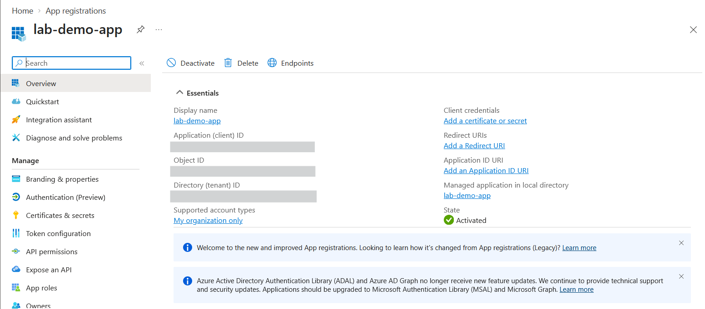
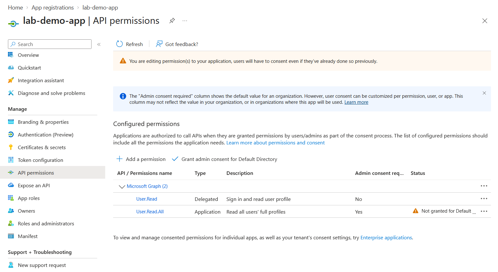
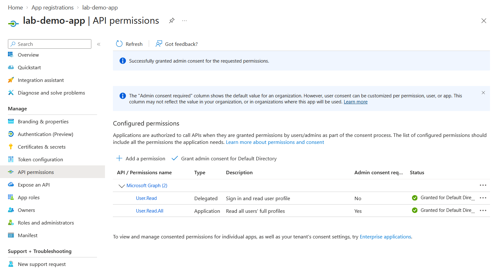
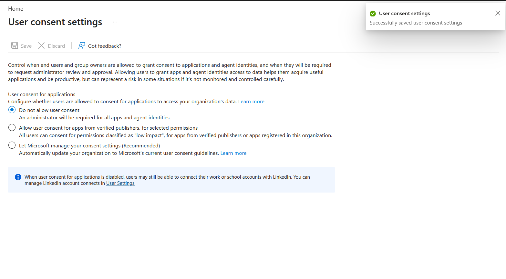
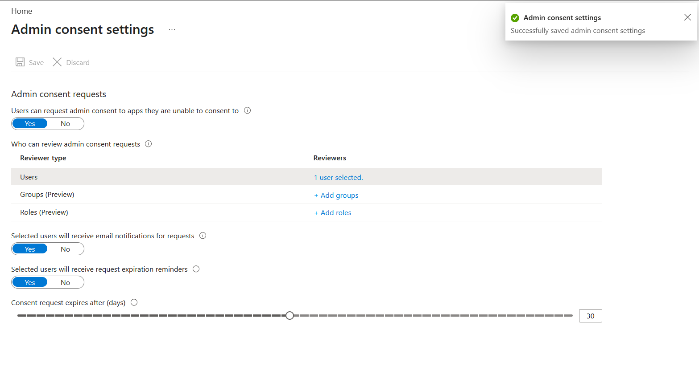

# Lab: Securing an App Registration & Consent (Entra ID)

> Register an application identity with least-privilege permissions and lock down
> tenant consent so users cannot authorize risky apps — defending against the
> illicit consent grant (consent-phishing) attack, while keeping a governed
> admin-consent request path.

**Domain:** SC-500 — Manage identity, access, and governance
**Services:** Microsoft Entra ID — App registrations, Enterprise applications (consent settings)
**Status:** Completed — app registered, permissions scoped, admin consent granted, user
consent restricted, admin consent workflow enabled.

---

## Objective

Show that an app registration is an **identity and authorization surface**, not just a
developer artifact. The security work is in *what the app is allowed to do* and *who can
authorize it* — permissions, consent, and credentials — none of which requires running
application code.

## The problem (insecure default)

By default, a tenant may allow **any user to consent** to applications requesting access
to their data. An attacker exploits this with a **consent-phishing** attack: send a user a
link to a malicious app requesting broad permissions, and if the user clicks "Accept," the
attacker gains standing access to that user's data — no password needed, and MFA does not
stop it. Unrestricted user consent turns every user into an approval point.

## What I built

Registered a single-tenant application with least-privilege Microsoft Graph permissions,
granted admin consent, restricted tenant-wide user consent, and enabled an admin consent
request workflow so users can still request access through a governed path.

| Setting | Value |
|---|---|
| App name | `lab-demo-app` |
| Supported account types | Single tenant (this directory only) |
| Delegated permission | `User.Read` — acts as the signed-in user (no admin consent required) |
| Application permission | `User.Read.All` — acts as the app itself (admin consent required) |
| Admin consent | Granted by administrator (both permissions show "Granted") |
| Tenant user consent | **Do not allow user consent** — only admins can authorize apps |
| Admin consent workflow | Enabled; reviewer = PDFMerge Administrator; 30-day expiry |
| Credentials | Certificate preferred over client secret; **no secret created or committed** |

### Design decisions (the "why")

- **Single-tenant account type.** The narrowest trust boundary — the app can't be used or
  consented to by identities outside this directory.
- **Least-privilege permissions.** Only the Graph scopes needed, with the
  delegated-vs-application choice made deliberately per use case.
- **Restricted user consent.** The core defense against consent-phishing — removing users'
  ability to self-authorize apps closes the attack path.
- **Admin consent workflow instead of a hard wall.** Users can *request* consent and an
  admin decides — security without an operational bottleneck. In production, the
  "verified publishers, low impact" option is a reasonable middle ground.
- **Certificate over secret, no secret in the repo.** Certificates are the preferred app
  credential; client secrets are never committed to source control.

## Steps

1. Registered `lab-demo-app` as a single-tenant application.
2. Added one delegated (`User.Read`) and one application (`User.Read.All`) Microsoft Graph
   permission to demonstrate the distinction and the admin-consent-required flag.
3. Granted admin consent as an administrator; both permissions moved to "Granted."
4. Restricted tenant-wide user consent to "Do not allow user consent."
5. Enabled the admin consent workflow with a designated reviewer and 30-day expiry.

## Evidence

*No sensitive identifiers appear in these captures; tenant IDs are blurred and no client
secret or certificate material is included.*

**App registration overview (single-tenant identity)**

**API permissions — delegated vs application, with admin-consent-required flag**

**Admin consent granted for both permissions**

**Tenant user consent restricted (consent-phishing defense)**

**Admin consent request workflow enabled (governed path)**

## SC-500 concepts demonstrated

- **Delegated vs application permissions** — acting as the signed-in user vs acting as the
  app itself; application permissions always require admin consent.
- **User consent vs admin consent** — who can authorize an app.
- **Illicit consent grant / consent-phishing** — the attack that restricting user consent
  defends against.
- **Restricting user consent + admin consent workflow** — the mitigation and its
  usability-preserving counterpart.
- **Client secret vs certificate** — certificates preferred; secrets never committed.
- **App registration vs service principal** — the app object (definition) vs its local
  identity (enterprise application) in this tenant.
- **Agent identities** — the same consent controls now also govern AI agent identities
  (Entra Agent ID), an AI-security tie-in.

## How I'd extend this

- Add **app-level Conditional Access** (workload identity policies) to restrict where/how
  the app can authenticate.
- Configure a **certificate** credential and eliminate secrets entirely.
- Periodically review **enterprise application** permissions with an access review.
- Detect risky OAuth apps with Defender for Cloud Apps / app governance.

## Cleanup

App registrations incur no cost. The app and its enterprise application can be deleted, and
the tenant consent settings returned to their prior values, to restore the original state.
