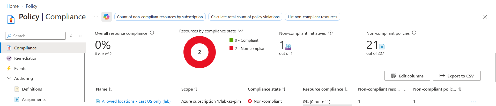
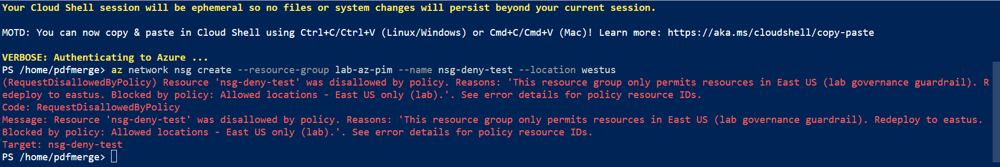

# Lab: Restrict Resource Locations (Azure Policy)

> Enforce a regional guardrail with the built-in **Azure Policy** "Allowed locations",
> rolled out **Audit-first then Deny**, scoped to a single resource group. Demonstrates
> governance of *what may exist* — independent of, and on top of, RBAC's *who may act* —
> and that a **Deny policy blocks even an Owner**.

**Domain:** SC-500 — Manage identity, access, and governance
**Services:** Azure Policy (built-in definition), Azure CLI + Portal. Azure Policy incurs no cost.
**Status:** Completed — assigned Audit-first, verified non-compliance, enforced with Deny, and confirmed the block.

---

## Objective

Show that Azure RBAC alone cannot keep resources compliant: a fully authorized user can
still deploy anything, anywhere. Azure Policy closes that gap by evaluating the *resource*
rather than the identity. This lab restricts the `lab-az-pim` resource group to East US
using the built-in **Allowed locations** policy, rolled out safely (Audit → Deny), and
proves the guardrail refuses a non-compliant deployment even for an Owner.

## The problem (insecure default)

With only RBAC in place, any principal holding **Contributor** or **Owner** can create
resources in any region or configuration. RBAC authorizes *who* may act but says nothing
about *what* is allowed to exist. So an authorized admin can deploy into an ungoverned
region — breaking data-residency, sovereignty, or cost controls — and nothing stops them.
Governance requires a separate control that assesses the resource itself.

## Lab environment

| Element | Value | Part in this lab |
|---|---|---|
| PDFMerge Administrator | Global Admin + Azure **Owner** (self-assigned) | Assigns the policy; also the account whose non-compliant create gets **blocked** (proves Policy overrides Owner) |
| Scope | Resource group `lab-az-pim` (East US) | Guardrail scope — resource group, not subscription-wide |
| Allowed region | `eastus` | The only permitted location |
| Probe resource | Network security group (region-bound, **free**) | Deployed to test Audit (permitted) and Deny (blocked) |

## What I built

Assigned the built-in **Allowed locations** policy to `lab-az-pim`, permitting only East US,
first with the **Audit** effect (flags, doesn't block) and then switched to **Deny**, with a
custom non-compliance message.

| Setting | Value |
|---|---|
| Policy (built-in) | `Allowed locations` (`e56962a6-4747-49cd-b67b-bf8b01975c4c`) |
| Assignment name | `allowed-locations-eastus` |
| Scope | Resource group `lab-az-pim` |
| `listOfAllowedLocations` | `["eastus"]` |
| `effect` | `Audit` → **`Deny`** |
| `enforcementMode` | `Default` (on) |
| Non-compliance message | Custom (names allowed region + fix + policy) |
| Method | Azure CLI (assign) + Portal (compliance, Deny flip, block test) |

Parameters file: [`al-eastus.params.json`](./al-eastus.params.json).

### Design decisions (the "why")

- **Scoped to the resource group, not the subscription.** Contains blast radius. The
  built-in also *excludes resource groups themselves* and `global`-region resources, so the
  RG won't self-block and region-agnostic services won't false-flag.
- **Built-in, not custom.** "Allowed locations" already expresses the rule exactly; a custom
  policy would add nothing here (custom authorization is covered in the `rbac-custom-role` lab).
- **Audit-first rollout.** The effect is a parameter (`Audit` / `Deny` / `Disabled`), so I
  assigned **Audit** first — it reports non-compliance without blocking — then switched to
  **Deny**. Same "non-enforcing first" discipline as the Conditional Access (report-only) and
  PIM (eligible-first) labs.
- **`enforcementMode` vs `effect` — two independent levers.** `enforcementMode = DoNotEnforce`
  is an assignment-level kill switch that suspends the whole policy; the `effect` parameter
  chooses what a *match* does. I kept enforcement `Default` and used the effect to stage the
  rollout.
- **Custom non-compliance message.** Names the allowed region, the fix ("redeploy to eastus"),
  and the blocking policy — actionable governance rather than a generic wall.

## Steps & output

**1. Inspect the built-in (confirm the parameterised effect and parameter name)**

```bash
az policy definition show --name "e56962a6-4747-49cd-b67b-bf8b01975c4c" \
  --query "{displayName:displayName, mode:mode, effect:policyRule.then.effect, parameters:keys(parameters)}"
```

```json
{
  "displayName": "Allowed locations",
  "effect": "[parameters('effect')]",
  "mode": "Indexed",
  "parameters": [ "listOfAllowedLocations", "effect" ]
}
```

The effect is a **parameter** (not hardcoded), which is what makes an Audit-first rollout a
clean flip rather than a workaround.

**2. Assign the policy in Audit mode, scoped to the resource group**

```bash
SUB=$(az account show --query id -o tsv)
SCOPE="/subscriptions/$SUB/resourceGroups/lab-az-pim"

az policy assignment create \
  --name "allowed-locations-eastus" \
  --display-name "Allowed locations - East US only (lab)" \
  --description "Restrict resources in lab-az-pim to East US. Audit-first, then Deny." \
  --policy "e56962a6-4747-49cd-b67b-bf8b01975c4c" \
  --scope "$SCOPE" \
  --params "@al-eastus.params.json"
```

Assignment created with `enforcementMode: Default`, `effect: Audit`,
`listOfAllowedLocations: ["eastus"]`, scoped to `.../resourceGroups/lab-az-pim`.

**3. Prove Audit does not block — deploy a resource in a disallowed region**

```bash
az network nsg create --resource-group lab-az-pim --name nsg-policy-test --location westus
```

```
"location": "westus",
"name": "nsg-policy-test",
"provisioningState": "Succeeded"
```

A resource in a **disallowed region deployed anyway** — Audit *detects but permits*.

**4. Trigger a compliance scan and read the result**

On-demand evaluation (compliance state is not real-time — see SC-500 concepts):

```bash
az policy state trigger-scan --resource-group lab-az-pim
```

Result (Portal → Policy → Compliance): the assignment shows **Non-compliant**, **0% (0 of 1)**,
with `nsg-policy-test` listed as the offending resource. See Evidence `01-compliance.png`.

**5. Flip the effect Audit → Deny and add a custom non-compliance message**

Portal → Policy → Assignments → *Allowed locations - East US only (lab)* → **Edit** →
**Parameters** tab → set **Effect** = `Deny` → **Non-compliance messages** tab → add the
message below → **Review + save**.

> This resource group only permits resources in East US (lab governance guardrail).
> Redeploy to eastus. Blocked by policy: Allowed locations - East US only (lab).

**6. Prove Deny blocks — retry the create in the disallowed region (new name)**

Deny only gates *new* create/update operations, so a new resource name is used (the
Audit-phase `nsg-policy-test` still exists — Deny does not delete it).

```bash
az network nsg create --resource-group lab-az-pim --name nsg-deny-test --location westus
```

```text
(RequestDisallowedByPolicy) Resource 'nsg-deny-test' was disallowed by policy. Reasons: 'This resource group only permits resources in East US (lab governance guardrail). Redeploy to eastus. Blocked by policy: Allowed locations - East US only (lab).'. See error details for policy resource IDs.
Code: RequestDisallowedByPolicy
Message: Resource 'nsg-deny-test' was disallowed by policy. Reasons: 'This resource group only permits resources in East US (lab governance guardrail). Redeploy to eastus. Blocked by policy: Allowed locations - East US only (lab).'. See error details for policy resource IDs.
Target: nsg-deny-test
```

The create is **refused at deployment time** — instantly, no evaluation lag — even though
the account is an **Owner**. See Evidence `02-deny-blocked.png`.

**7. Confirm the allow path still works — same create, allowed region**

```bash
az network nsg create --resource-group lab-az-pim --name nsg-allow-test --location eastus
```

```
"location": "eastus",
"provisioningState": "Succeeded"
```

Same action, one parameter (region) different, opposite outcome: the guardrail blocks the
non-compliant deploy and permits the compliant one.

## Evidence

*No sensitive identifiers appear in these captures.*

**Audit phase — non-compliant resource detected, not blocked**


**Deny phase — non-compliant create refused with the custom message**


## Policy assignment (redacted)

Parameters — [`al-eastus.params.json`](./al-eastus.params.json) (committable as-is; contains
no tenant identifiers). This is the file used for the initial CLI assignment, so its effect
is `Audit`; the switch to `Deny` was made in the portal (step 5).

```json
{
  "listOfAllowedLocations": { "value": ["eastus"] },
  "effect": { "value": "Audit" }
}
```

The live assignment's deployed state (scope, `enforcementMode: Default`, `effect: Deny`) is
captured in the Compliance evidence above and can be re-inspected at any time with:

```bash
az policy assignment show --name allowed-locations-eastus \
  --scope "/subscriptions/$SUB/resourceGroups/lab-az-pim"
```

Redaction note: the only well-known identifier kept intact in this lab is the
`policyDefinitionId` `e56962a6-…` — Microsoft's public built-in definition ID, identical in
every tenant (same rationale as keeping the public role-template GUIDs in the Conditional
Access lab). No tenant-specific values (subscription ID, object IDs, UPN / tenant domain)
appear in any committed file here.

## SC-500 concepts demonstrated

- **Azure Policy vs RBAC** — governance (*what may exist*) vs authorization (*who may act*).
  They evaluate independently and both must pass.
- **Deny overrides Owner** — Policy never consults identity, so a Deny effect blocks even a
  Global Admin / Owner. This is the headline distinction.
- **Policy effects** — `Audit`, `Deny`, `Disabled`, and the **Audit → Deny** rollout ladder.
- **`enforcementMode`** — `DoNotEnforce` vs `Default` as the assignment-level kill switch,
  distinct from the effect parameter.
- **Scope and exclusions** — resource-group scope; the built-in excludes resource groups
  themselves and `global`-region resources.
- **Evaluation timing** — enforcement (Deny) is **instant** at create time via the
  resource-provider hook, while compliance *reporting* is eventually-consistent (periodic
  ~24h scans / on-demand). This is why the compliance blade lags but the block does not.
- **Deny is a gate, not a cleanup** — resources created *before* Deny (the Audit-phase NSG)
  persist; Deny only stops new create/update. Existing non-compliant resources need
  remediation, exemption, or deletion.
- **Custom non-compliance messages** — actionable governance feedback at the point of failure.
- **Policy underpins Defender for Cloud** — the auto-assigned `ASC Default` initiative
  (Microsoft cloud security benchmark) *is* Azure Policy; Defender for Cloud surfaces its
  posture findings through Policy initiatives. (See the Domain 4 Defender lab.)

## How I'd extend this

- Add the companion **"Allowed locations for resource groups"** policy
  (`e765b5de-1225-4ba3-bd56-1ac6695af988`) — the resource policy excludes RGs, so governing
  where resource groups are created needs its own assignment.
- Raise the assignment to **subscription or management-group** scope for tenant-wide residency.
- Deliver the assignment as **Bicep / Terraform** in a pipeline (policy-as-code).
- Add a scoped **policy exemption** for a justified resource to demonstrate the exemption
  workflow and its audit trail.
- Group multiple guardrails into a **policy initiative (set definition)**.
- **AI extension:** restrict **Azure OpenAI / AI Services** deployments to approved regions
  (data-residency for AI workloads), or require diagnostic settings on AI resources via a
  `DeployIfNotExists` policy — governance for the AI estate. (Ties to Domain 3.)

## Cleanup

```bash
# remove the test resources
az network nsg delete --resource-group lab-az-pim --name nsg-policy-test
az network nsg delete --resource-group lab-az-pim --name nsg-allow-test   # only if the eastus allow-path proof was created
# (nsg-deny-test was refused by policy, so there is nothing to delete)

# remove the policy assignment
az policy assignment delete --name "allowed-locations-eastus" \
  --scope "/subscriptions/<SUBSCRIPTION_ID>/resourceGroups/lab-az-pim"
```

Azure Policy and network security groups incur no cost; no billable resources were deployed.
The `lab-az-pim` resource group is shared with the PIM and RBAC labs — leave it in place.
