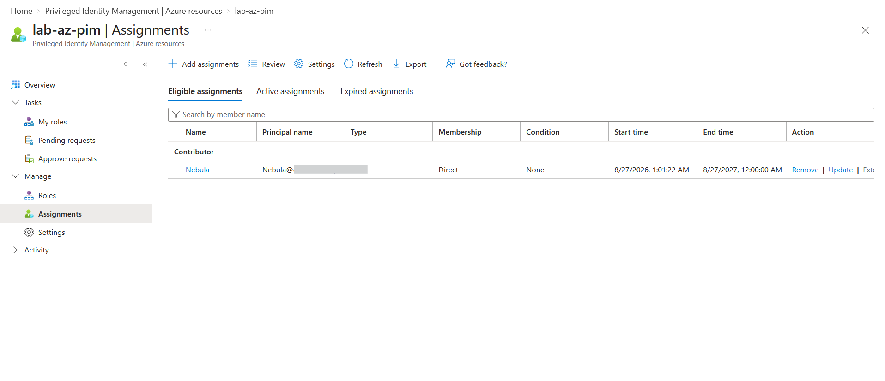
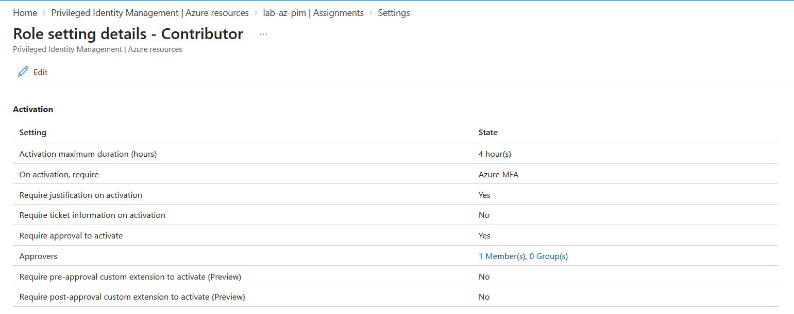

# Lab: Just-in-Time Access for an Azure Resource Role (PIM)

> Apply Privileged Identity Management to the **Azure resource plane** — making a user
> eligible for the **Contributor** role on a resource group, activated just-in-time with
> MFA, justification, and approval. Companion to the Entra-roles PIM lab; together they
> demonstrate the Azure RBAC vs Microsoft Entra roles distinction.

**Domain:** SC-500 — Manage identity, access, and governance
**Services:** Microsoft Entra ID Governance — PIM for Azure resources (requires Entra ID P2)
**Status:** Completed — eligible assignment created and activation policy configured.

---

## Objective

Show that PIM governs **two separate permission planes** with one consistent mechanism:
- **Microsoft Entra roles** — directory permissions (e.g. User Administrator) — covered in
  the companion `entra-roles` lab.
- **Azure RBAC roles** — resource permissions (e.g. Contributor) — covered here.

The goal is to convert standing resource access into just-in-time access on the Azure plane.

## The problem (insecure default)

A permanent **Contributor** assignment on a subscription or resource group is standing
privilege over *resources* — the holder can create, modify, and delete resources 24/7. If
the account is compromised, the attacker can manipulate infrastructure immediately. As with
directory roles, resource roles should be eligible and activated only when needed.

## Real-world lead-in (why this lab exists)

Setting this up surfaced the core distinction directly: my Global Administrator account
(an **Entra directory role**) had **no authority over Azure resources** and could not even
create a resource group — it returned `AuthorizationFailed`. Azure resource access is
governed by **Azure RBAC**, a separate system. I had to elevate access (Entra ID →
Properties → *Access management for Azure resources*) and self-assign **Owner** via the CLI
before I could manage resources. That is the Azure-RBAC-vs-Entra-roles distinction in
practice.

## Lab environment

| Account | Plane / role | Part in this lab |
|---|---|---|
| Nebula | Azure RBAC — Contributor | Made **eligible**; activates just-in-time |
| PDFMerge Administrator | Entra Global Admin + Azure Owner (self-assigned) | Manages PIM / approver |
| Scope | Resource group `lab-az-pim` (East US) | Least-privilege scope, not the whole subscription |

## What I built

Onboarded the `lab-az-pim` resource group to PIM and made Nebula eligible for the
Contributor role, governed by an activation policy identical to the Entra-roles lab.

| Setting | Value |
|---|---|
| Plane | Azure resources (Azure RBAC) |
| Role | **Contributor** |
| Scope | Resource group `lab-az-pim` (not subscription-wide) |
| Member | Nebula |
| Assignment type | **Eligible** (time-bound, ~1-year expiry) |
| Activation max duration | 4 hours |
| On activation require | Azure MFA |
| Require justification | Yes |
| Require approval | Yes (1 approver) |

### Design decisions (the "why")

- **Scoped to a resource group, not the subscription.** Tighter blast radius — the eligible
  role only grants control over `lab-az-pim`, nothing else in the subscription.
- **Contributor, not Owner.** Contributor can manage resources but not grant access to
  others; Owner would add role-assignment power. Contributor is the right least-privilege
  choice for "do work on resources."
- **Eligible + full guardrails.** MFA, justification, approval, and a 4-hour cap — the same
  activation policy as the directory-role lab, showing consistent controls across planes.

## Steps

1. Created resource group `lab-az-pim` (via Cloud Shell, after resolving the RBAC
   authorization issue above).
2. PIM → Azure resources → selected the `lab-az-pim` resource group → **Manage resource**.
3. Assignments → Add assignments → role **Contributor**, member **Nebula**, type
   **Eligible**, time-bound.
4. Reviewed the Contributor **role settings** (activation policy: MFA, justification,
   approval, 4-hour max).
5. Activation lifecycle (request → MFA → justification → approval → time-boxed active) is
   **identical to the Entra-roles PIM lab** and is documented there; not re-captured here.

## Evidence

*No sensitive identifiers appear in these captures; principal names/domains and IDs are blurred.*

**Eligible assignment — Nebula → Contributor, scoped to `lab-az-pim`**

**Activation policy — MFA, justification, approval, 4-hour max**

## SC-500 concepts demonstrated

- **Azure RBAC roles vs Microsoft Entra roles** — resource-plane vs directory-plane
  permissions; Global Admin does not grant resource access.
- **PIM for Azure resources** — the resource-plane scope of PIM (alongside Entra roles and
  PIM for Groups).
- **Eligible vs active assignments** and **just-in-time vs standing access** — on the
  resource plane.
- **Least-privilege scoping** — resource group scope over subscription scope; Contributor
  over Owner.
- **Elevate access** — how a Global Admin bootstraps Azure RBAC control, and why it should
  be removed afterward in production.

## How I'd extend this

- Remove the root-scope User Access Administrator (elevate-access) grant after bootstrapping
  and rely on scoped assignments — production hygiene.
- Add an **access review** for the eligible Contributor assignment.
- Add **PIM for Groups** so membership of a privileged resource group is itself JIT.
- Require a **ticket number** on activation for change traceability.

## Cleanup

PIM eligible assignments incur no direct cost (requires P2). The eligible assignment and the
`lab-az-pim` resource group can be deleted to restore the original state; no billable
resources were deployed.
