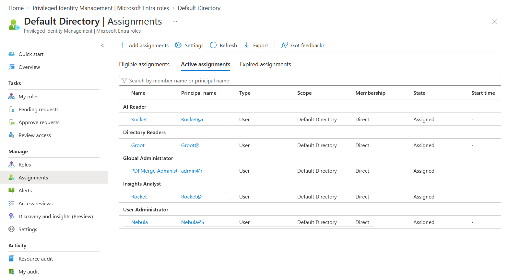

# Lab: Just-in-Time Admin with Privileged Identity Management (PIM)

> Remove standing administrative privilege by converting a permanent role assignment
> into an eligible, just-in-time assignment that must be activated with MFA,
> justification, and approval, for a limited time window.

**Domain:** SC-500 — Manage identity, access, and governance
**Services:** Microsoft Entra ID Governance — Privileged Identity Management (requires Entra ID P2)
**Status:** Completed — role converted to eligible, activation requested, approved, and time-boxed.

---

## Objective

Demonstrate the shift from *standing* privilege to *just-in-time* privilege. Instead of
holding an admin role permanently, the user holds it as **eligible** and must **activate**
it only when needed, for a limited time, subject to MFA, justification, and approval.

## The problem (insecure default)

A permanently assigned admin role is *standing privilege*: it is active 24/7, whether or
not the user is working. If the account is compromised at any hour, the attacker inherits
full administrative access immediately. Standing privilege maximises the attack surface
and the blast radius of a single compromised credential.

## Lab environment

| Account | Role | Part in this lab |
|---|---|---|
| Nebula | User Administrator | Converted to **eligible**; performs the just-in-time activation |
| PDFMerge Administrator | Global Administrator | Manages PIM and **approves** the activation request |
| Groot / Rocket | Reader | Not used in this lab |

## What I built

Converted the User Administrator role for Nebula from a permanent active assignment to a
time-bound eligible assignment, and configured an activation policy enforcing MFA,
justification, approval, and a shortened activation window.

| Setting | Value |
|---|---|
| Role | User Administrator |
| Assignment type | **Eligible** (was: Active / Permanent) |
| Eligibility duration | Time-bound (1-year expiry) |
| Require MFA on activation | Yes (Azure MFA) |
| Require justification | Yes |
| Require approval | Yes — approver: PDFMerge Administrator |
| Max activation duration | **4 hours** (reduced from the 8-hour default) |

### Design decisions (the "why")

- **Eligible, not active.** The role sits dormant until needed, so a compromised account
  does not automatically hold admin rights.
- **Time-bound eligibility.** The eligibility itself expires, so access is re-justified
  rather than assumed indefinitely.
- **Approval required.** A second person (the approver) gates activation, adding a control
  against a single compromised or rogue account.
- **Shortened activation window.** Reducing the max activation from 8 to 4 hours limits how
  long elevated rights exist even during legitimate use — a least-privilege refinement,
  not a default.

## Steps

1. Confirmed PIM is available (Entra ID P2).
2. Recorded the **before** state: User Administrator held as Active / Permanent.
3. Added Nebula as an **eligible** assignment for User Administrator (time-bound).
4. **Removed** the old permanent active assignment so no standing access remained.
5. Configured the role's **activation settings** (MFA, justification, approval, 4-hour cap).
6. Activated the role **just-in-time** as Nebula, providing a justification (MFA enforced,
   including first-time Authenticator registration).
7. **Approved** the activation request as PDFMerge Administrator, with an approval reason.
8. Confirmed the role became active for a time-boxed 4-hour window.

## Evidence

*No sensitive identifiers appear in these captures beyond lab personas; email domains and
tenant/object IDs are blurred.*

**Before — standing privilege (Active / Permanent)**

**After — converted to eligible (just-in-time)**

**Activation policy — MFA, justification, approval, 4-hour max**

**Just-in-time activation request with justification (as the eligible user)**

**Approval of the activation request (as the approver), showing the 4-hour window**

## SC-500 concepts demonstrated

- **Eligible vs active assignments** — the core PIM distinction.
- **Just-in-time vs standing access** — activation replaces permanent rights.
- **Time-bound assignments** — eligibility and activation both expire.
- **Activation requirements** — MFA, justification, and approval enforced on activation.
- **Approval workflow** — a second party gates elevation, with a recorded reason.
- **PIM scope** — this lab covers Entra roles; PIM also governs Azure resource roles
  and PIM for Groups.
- **Managing PIM** requires Global Administrator or Privileged Role Administrator.

## How I'd extend this

- Require a **ticket number** on activation for change traceability.
- Add an **access review** to periodically re-certify who remains eligible.
- Add PIM for an **Azure resource role** to show the resource-scope variant.
- Use **PIM for Groups** to make membership of a privileged group itself just-in-time.
- Pair with the Conditional Access lab: require **phishing-resistant MFA (authentication
  strength)** on privileged-role activation.

## Cleanup

PIM eligible assignments and role settings incur no direct cost (requires P2 licensing).
Assignments can be removed and the role returned to its prior state; no billable Azure
resources are created by this lab.
