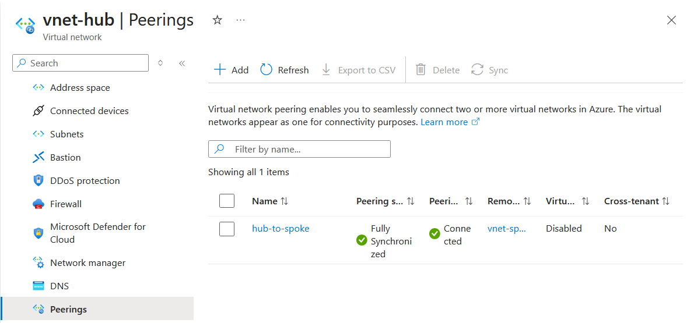
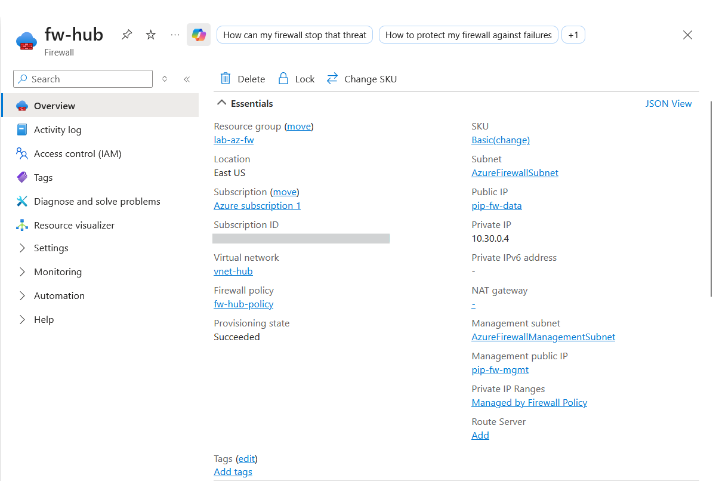
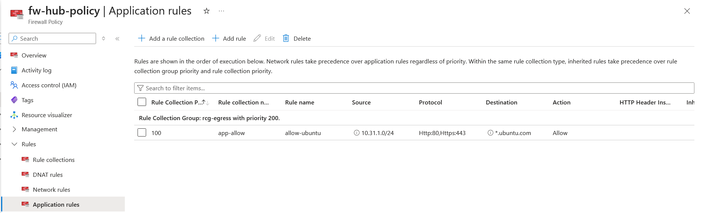
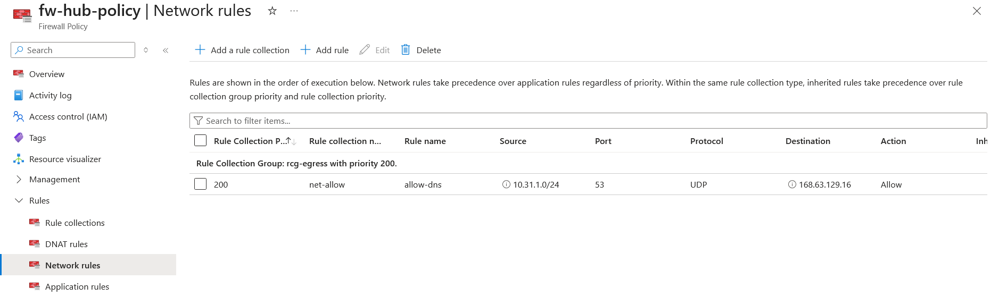
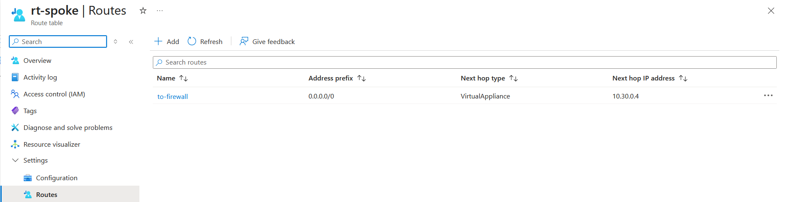
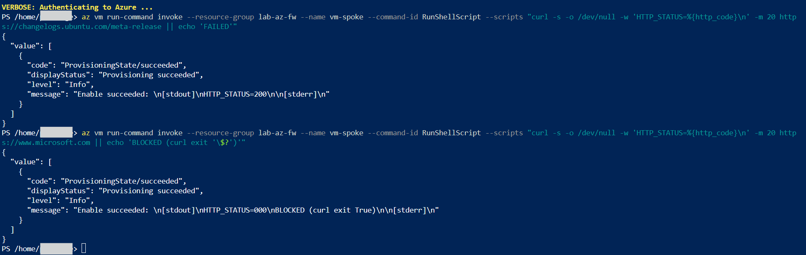

# Lab: Azure Firewall Hub-Spoke Egress Control (Basic tier, FQDN filtering)

> Built a hub-spoke network with an Azure Firewall (Basic) as the central egress chokepoint,
> then forced all spoke traffic through it with a User-Defined Route. An application rule allows
> only `*.ubuntu.com` at Layer 7; everything else hits the implicit deny. Proven live from a
> spoke VM: an allowed FQDN completes its TLS handshake, a blocked FQDN is torn down mid-handshake.

**Domain:** 2 — Storage, Databases & Networking (SC-500)
**Services:** Azure Firewall (Basic), Firewall Policy, VNet peering, User-Defined Routes, Azure VM
**Status:** Complete — evidenced and torn down

---

## Objective

Demonstrate centralized, identity-agnostic **egress control** for a workload subnet using Azure
Firewall in a hub-spoke topology — specifically the Layer-7 **FQDN filtering** that an NSG cannot
perform — and prove it works with a live allow-vs-deny traffic test.

## The problem (insecure default)

By default, a subnet's `0.0.0.0/0` route points at Azure's internet gateway: any VM can reach
**any** destination on the internet, unfiltered. NSGs can restrict this only by IP address and
port (Layer 3-4) — they have no concept of *which FQDN* a packet is bound for, so "allow the
Ubuntu repos but nothing else" is impossible with an NSG alone. The result is an unbounded egress
surface: a compromised or misconfigured workload can exfiltrate to, or pull payloads from, any
host on the internet.

## Lab environment

| Item | Value |
|---|---|
| Resource group | `lab-az-fw` (dedicated, East US) |
| Hub VNet | `vnet-hub` — `10.30.0.0/16` |
| Firewall data subnet | `AzureFirewallSubnet` — `10.30.0.0/26` |
| Firewall management subnet | `AzureFirewallManagementSubnet` — `10.30.0.64/26` |
| Spoke VNet | `vnet-spoke` — `10.31.0.0/16` |
| Workload subnet | `snet-workload` — `10.31.1.0/24` |
| Firewall | `fw-hub` — Azure Firewall **Basic**, non-zonal, private IP `10.30.0.4` |
| Firewall policy | `fw-hub-policy` (Basic) |
| Test VM | `vm-spoke` — `Standard_D2als_v7`, Ubuntu 22.04, private IP `10.31.1.4`, no public IP |

## What I built

A hub-spoke network where the hub holds a single Azure Firewall acting as the shared egress
perimeter, and the spoke workload subnet is forced to route all outbound traffic through it. The
firewall policy permits DNS (a network rule) and a single FQDN wildcard (an application rule);
all other egress is denied by default.

| Component | Role in the design |
|---|---|
| `vnet-hub` + `vnet-spoke`, peered both ways | Hub-spoke topology; spoke egress crosses the peering into the hub |
| `fw-hub` (Basic) | Central egress chokepoint; performs L7 FQDN inspection |
| Dual IP configs (data + management) | Basic tier mandates a separate management NIC/subnet/public IP |
| `fw-hub-policy` → `rcg-egress` | Policy → rule-collection-group hierarchy holding the rules |
| `net-allow` / `allow-dns` | Network rule permitting DNS (UDP 53) to Azure DNS `168.63.129.16` |
| `app-allow` / `allow-ubuntu` | Application rule allowing `*.ubuntu.com` over HTTP/HTTPS |
| `rt-spoke` UDR → `snet-workload` | Forced tunneling: `0.0.0.0/0` next-hop = firewall `10.30.0.4` |
| `vm-spoke` | Test workload used to prove allow vs deny |

### Design decisions (the "why")

- **Dedicated resource group `lab-az-fw`.** Kept the whole lab out of `lab-az-pim`, whose
  `allowed-locations-eastus` Azure Policy would `Deny` resources — the same cross-domain
  constraint that shaped the `azure-sql-security` lab. (Policy Deny ignores identity, so even an
  Owner can't override it — see the `azure-policy-allowed-locations` lab.)
- **Basic tier, non-zonal.** Basic is the low-cost tier for a lab. Its public IPs were created
  non-zonal, so the firewall had to be created non-zonal to match — Azure requires the firewall
  and its public IPs to share the same availability-zone configuration, and the portal wizard
  (which forces zone-redundant) can't express a non-zonal build; the CLI can.
- **Two subnets + two public IPs.** Firewall **Basic** requires a dedicated
  `AzureFirewallManagementSubnet` and a separate management public IP in addition to the data
  plane — the management NIC carries Microsoft's out-of-band control traffic. Standard/Premium
  hide this by default; Basic mandates it.
- **DNS allowed as a *network* rule.** Application rules filter on FQDN, but the VM must first
  resolve that FQDN — a UDP/53 flow that an application rule won't carry. Without an explicit DNS
  network rule, forced-tunnelled resolution fails and every application rule silently appears
  broken.
- **UDR applied to the spoke subnet only, never `AzureFirewallSubnet`.** Applying a
  `0.0.0.0/0 → firewall` route to the firewall's own subnet would loop its egress back to itself.
  The route table is bound to `snet-workload` alone.
- **Test VM with no public IP and no NSG.** No public IP keeps the test purely about *egress*;
  no NSG ensures the only thing filtering traffic is the firewall, so an observed deny can only
  be attributed to it. The VM is driven via `az vm run-command` over the control plane — no
  inbound access needed.

## Steps & output

Create the network and peering (trimmed):

```
az group create --name lab-az-fw --location eastus
az network vnet create -g lab-az-fw -n vnet-hub --address-prefixes 10.30.0.0/16 --subnet-name AzureFirewallSubnet --subnet-prefixes 10.30.0.0/26
az network vnet subnet create -g lab-az-fw --vnet-name vnet-hub -n AzureFirewallManagementSubnet --address-prefixes 10.30.0.64/26
az network vnet create -g lab-az-fw -n vnet-spoke --address-prefixes 10.31.0.0/16 --subnet-name snet-workload --subnet-prefixes 10.31.1.0/24
az network vnet peering create -g lab-az-fw -n hub-to-spoke --vnet-name vnet-hub --remote-vnet vnet-spoke --allow-vnet-access --allow-forwarded-traffic
az network vnet peering create -g lab-az-fw -n spoke-to-hub --vnet-name vnet-spoke --remote-vnet vnet-hub --allow-vnet-access --allow-forwarded-traffic
```

Public IPs (both Standard/Static — Basic firewall rejects Basic/Dynamic IPs):

```
az network public-ip create -g lab-az-fw -n pip-fw-data --sku Standard --allocation-method Static
az network public-ip create -g lab-az-fw -n pip-fw-mgmt --sku Standard --allocation-method Static
```

Firewall (Basic, non-zonal, both IP configs supplied together — the data-traffic group
`--conf-name`/`--public-ip`/`--vnet-name` plus the management group `--m-conf-name`/`--m-public-ip`):

```
az network firewall create -g lab-az-fw -n fw-hub --sku AZFW_VNet --tier Basic --vnet-name vnet-hub --conf-name fw-data-config --public-ip pip-fw-data --m-conf-name fw-mgmt-config --m-public-ip pip-fw-mgmt
# -> provisioningState: Succeeded ; sku.tier: Basic ; ipConfigurations[0].privateIPAddress: 10.30.0.4
```

Policy, association, and rule hierarchy:

```
az network firewall policy create -g lab-az-fw -n fw-hub-policy --sku Basic
az network firewall update -g lab-az-fw -n fw-hub --firewall-policy <POLICY_RESOURCE_ID>
az network firewall policy rule-collection-group create -g lab-az-fw --policy-name fw-hub-policy -n rcg-egress --priority 200
az network firewall policy rule-collection-group collection add-filter-collection -g lab-az-fw --policy-name fw-hub-policy --rule-collection-group-name rcg-egress -n app-allow --collection-priority 100 --action Allow --rule-name allow-ubuntu --rule-type ApplicationRule --source-addresses 10.31.1.0/24 --protocols Http=80 Https=443 --target-fqdns "*.ubuntu.com"
az network firewall policy rule-collection-group collection add-filter-collection -g lab-az-fw --policy-name fw-hub-policy --rule-collection-group-name rcg-egress -n net-allow --collection-priority 200 --action Allow --rule-name allow-dns --rule-type NetworkRule --source-addresses 10.31.1.0/24 --destination-addresses 168.63.129.16 --destination-ports 53 --ip-protocols UDP
```

Forced-tunnel route and association:

```
az network route-table create -g lab-az-fw -n rt-spoke
az network route-table route create -g lab-az-fw --route-table-name rt-spoke -n to-firewall --address-prefix 0.0.0.0/0 --next-hop-type VirtualAppliance --next-hop-ip-address 10.30.0.4
az network vnet subnet update -g lab-az-fw --vnet-name vnet-spoke -n snet-workload --route-table rt-spoke
```

Live traffic proof from the spoke VM (via run-command):

```
# ALLOWED - *.ubuntu.com -> TLS handshake completes
curl -v -m 20 https://changelogs.ubuntu.com/meta-release
# ... Connected to changelogs.ubuntu.com (185.125.190.48) port 443
# ... TLSv1.3 handshake: Client hello -> Server hello -> Certificate -> Finished  (SUCCESS)

# BLOCKED - www.microsoft.com -> connection torn down mid-handshake
curl -v -m 20 https://www.microsoft.com
# ... Connected to www.microsoft.com (23.48.10.36) port 443
# ... TLSv1.3 (OUT) Client hello -> TLS alert, decode error
# ... SSL routines::unexpected eof while reading
# curl: (35)   <-- firewall reset the session; no allow rule matched
```

DNS resolved in **both** cases (name -> IP succeeded); the difference is purely the firewall's
L7 decision on the FQDN. Same VM, same route, same DNS — only the target FQDN differs.

## Evidence

*No sensitive identifiers appear in these images (subscription/tenant/object IDs, UPNs, and public
IP addresses are redacted or cropped out).*

**01 — Hub and spoke VNets peered both directions (`Connected` / `FullyInSync`)**


**02 — Azure Firewall Basic: dual IP configuration (data + management planes), private IP 10.30.0.4**


**03 — Application rule: `app-allow` / `allow-ubuntu` filtering on FQDN `*.ubuntu.com` (Layer 7)**


**04 — Network rule: `net-allow` / `allow-dns` permitting UDP 53 to Azure DNS (so FQDN resolution works)**


**05 — Forced-tunnel UDR: `0.0.0.0/0` -> VirtualAppliance `10.30.0.4`, bound to snet-workload**


**06 — Live proof: allowed FQDN returns HTTP 200; blocked FQDN returns no response (HTTP 000)**


## Configuration & identifiers (redacted)

This lab was built entirely via Azure CLI. All resource IDs in raw output contain the
subscription ID, which is redacted as `<SUBSCRIPTION_ID>` wherever shown. Public IP *names*
(`pip-fw-data`, `pip-fw-mgmt`) are safe; their assigned public addresses are masked in
screenshots. Private addresses (`10.30.x` / `10.31.x`) and Azure's fixed platform DNS IP
`168.63.129.16` (a public constant, identical in every tenant) are kept as-is.

## SC-500 concepts demonstrated

- **L7 FQDN filtering vs. L3-4 NSG filtering.** The firewall allows/denies by *fully qualified
  domain name* — a capability NSGs (IP/port only) do not have. Directly completes the
  `network-segmentation` lab, which proved NSG/ASG L3-4 control with Network Watcher.
- **Hub-spoke topology.** Centralized security infrastructure in a hub, workloads in peered
  spokes routing egress through it.
- **Firewall Policy hierarchy.** Policy -> rule-collection-group -> rule collections
  (DNAT/Network/Application) -> rules; type-ordering (DNAT, then Network, then Application) is
  fixed regardless of priority numbers.
- **Forced tunneling with UDRs.** A `0.0.0.0/0` User-Defined Route redirects subnet egress to a
  network virtual appliance (the firewall) — the mechanism that makes the rules enforce.
- **Default-deny egress posture.** Explicit allow-list (DNS + one FQDN) with implicit deny for
  everything else.
- **Tier-specific requirements.** Basic mandates a dedicated management subnet + management
  public IP; firewall and public IPs must share zone configuration.

## How I'd extend this

- **DNAT for inbound publishing.** Add a DNAT rule collection to publish a spoke service to the
  internet via the firewall's data public IP — the inbound counterpart to this lab's egress focus.
- **Diagnostic logging to Log Analytics / Sentinel.** Stream firewall logs (application/network
  rule hits) to a workspace and hunt denied egress in Sentinel — the natural bridge to Domain 4
  (security posture & monitoring), where the deferred Defender/Sentinel labs live.
- **VPN Gateway + Entra ID P2S / Entra Private Access.** The remainder of the planned Lab C —
  point-to-site VPN authenticated with Entra ID (requires the OpenVPN protocol, so VpnGw1+, not
  Basic gateway), or Entra Private Access as the identity-centric successor. Documented rather
  than built here to avoid the ~40-minute gateway provisioning wait.
- **AI-security extension.** Place an AI inference workload (e.g. an Azure OpenAI-consuming app)
  in the spoke and use FQDN application rules to constrain its egress to *only* the approved model
  endpoint and telemetry hosts — preventing a compromised AI agent from reaching arbitrary
  command-and-control or exfiltration destinations. This is precisely the "secure AI workload
  egress" concern SC-500's Domain 3 emphasizes, and it reuses this exact firewall pattern.

## Cleanup

```
az group delete --name lab-az-fw --yes --no-wait
az group exists --name lab-az-fw    # -> false once complete
```

Deleting the resource group removes the firewall, both public IPs, the VM and its disk, both
VNets, the policy, and the route table in one operation.

**Cost note:** Azure Firewall Basic bills ~$0.395/hr (~₹33/hr) while provisioned, plus ~₹0.80/hr
for the two Standard public IPs and a few ₹/hr for the `D2als_v7` VM. This lab was built and torn
down in a single bounded session (~2 hours), for roughly **₹70-100** of credit burn. Because the
firewall bills whenever it exists (not per-traffic), same-session teardown is essential — do not
leave it provisioned.
