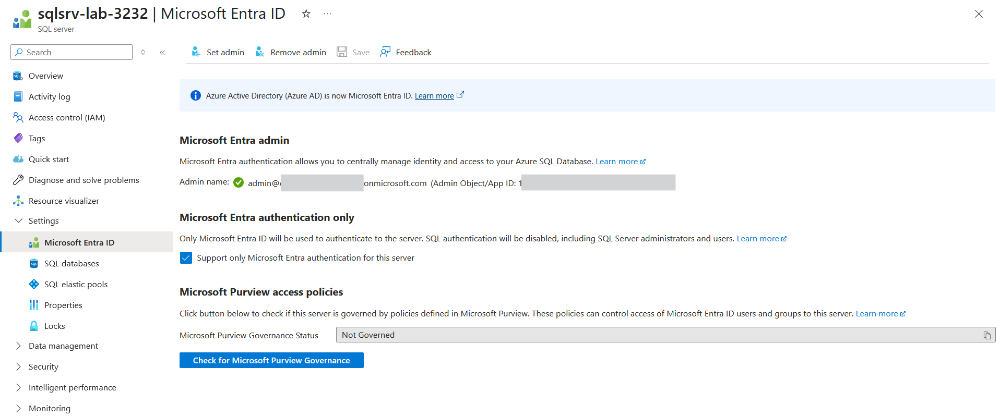
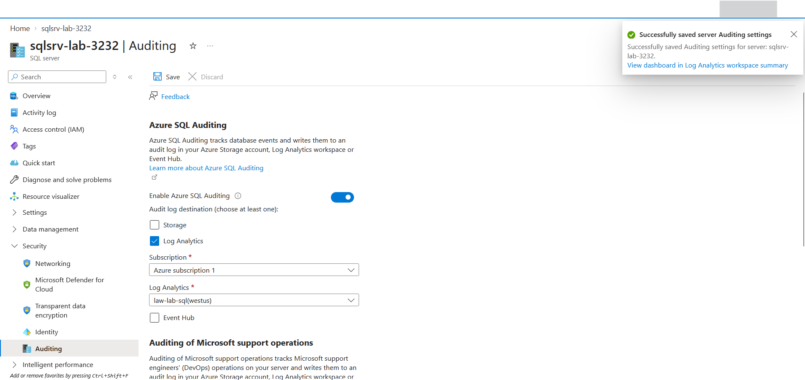
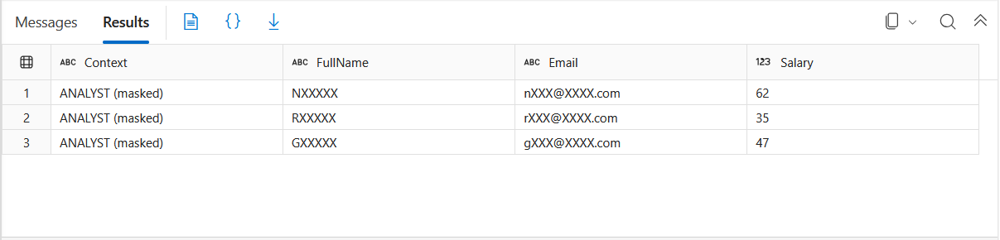
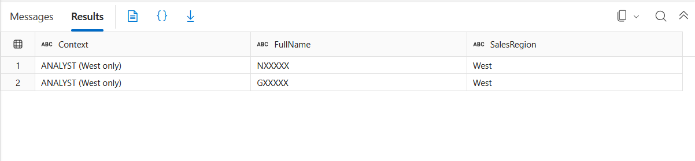

# Lab: Securing an Azure SQL Database — Entra Auth, Auditing, Masking & RLS

> Layer defence-in-depth on a single Azure SQL database: **Microsoft Entra-only
> authentication** (no SQL logins), **TDE** at rest, **auditing** to Log Analytics, and two
> query-time data-protection controls — **Dynamic Data Masking** (hide sensitive columns) and
> **Row-Level Security** (hide rows) — proven against a low-privilege user. Same
> identity-over-shared-secrets spine as the Storage and Key Vault labs, now on the database.

**Domain:** SC-500 — Secure storage, databases, and networking
**Services:** Azure SQL Database (serverless free offer), Microsoft Entra auth, Azure Monitor / Log Analytics, T-SQL. Portal + Query editor.
**Status:** Completed — Entra-only auth enforced, TDE confirmed, auditing streaming to Log Analytics, DDM and RLS proven via `EXECUTE AS`.

---

## Objective

Demonstrate how an Azure SQL database is *secured* across its layers — authentication,
encryption, detection, and data-access controls — rather than just deployed. The through-line
is least exposure: identity-only access to the platform, and at the data layer, non-privileged
callers see neither sensitive columns (masking) nor rows outside their scope (row-level
security), enforced transparently by the engine.

## The problem (insecure default)

Three defaults worth fixing:

1. **SQL authentication** — the classic `admin` + password login is a long-lived shared
   credential that can be phished, leaked in a connection string, or brute-forced, and it sits
   outside Entra's identity controls (no Conditional Access, no MFA, no central revocation).
2. **Everyone sees everything** — by default any user with `SELECT` reads every column and every
   row. A support analyst querying a customer table sees full PII and salaries, and all regions'
   records, with no restriction.
3. **No record of access** — without auditing there's no answer to "who queried this table, and
   when" for investigation or compliance.

## Lab environment

| Element | Value | Part in this lab |
|---|---|---|
| PDFMerge Administrator | Global Admin + Azure Owner; SQL server **Entra admin** | Provisions and manages; holds `UNMASK` and bypasses the row filter (why a low-priv user is needed to prove the controls) |
| SQL server | `sqlsrv-lab-3232` — **West US**, Entra-only auth | The platform being secured |
| SQL database | `free-sql-db-5310054` — serverless, free offer, auto-pause | Hosts the `dbo.Employees` table |
| Resource group | **`lab-az-sql`** (dedicated) | Separate RG — see the cross-domain note in Design decisions |
| `analyst` | Contained DB user, `WITHOUT LOGIN`, `SELECT` only | Low-privilege principal used to prove DDM + RLS |
| Log Analytics | `law-lab-sql` (West US) | Audit-log sink |

## What I built

| Layer | Control |
|---|---|
| Authentication | **Microsoft Entra-only** (`Support only Microsoft Entra authentication` = on) — SQL logins disabled entirely |
| Encryption at rest | **TDE** on (service-managed key) — default, confirmed |
| Detection | **Auditing** enabled at server scope -> **Log Analytics** (`law-lab-sql`) |
| Column protection | **Dynamic Data Masking** on `Email` (`email()`), `FullName` (`partial`), `Salary` (`random`) |
| Row protection | **Row-Level Security** — `SalesRegion` filter predicate scoping `analyst` to `West` |
| Cost | Free serverless offer, auto-pause when free limit reached (never billed) |

### Design decisions (the "why")

- **Entra-only authentication.** Chosen at server creation so no SQL login ever exists — the
  data-plane is governed entirely by Entra identity + RBAC. Same identity-over-shared-secrets
  move as disabling Shared Key on storage and requiring a data-plane role on Key Vault. It's
  also the prerequisite for Conditional Access on the database.
- **Dedicated resource group `lab-az-sql` (cross-domain highlight).** The first deploy attempt
  targeted `lab-az-pim` in West US and was **blocked by `RequestDisallowedByPolicy` — the
  "Allowed locations - East US only" Azure Policy from the Domain 1 governance lab.** East US
  had no SQL capacity on this subscription; West US did but violated the policy. Rather than
  weaken the guardrail, I deployed to a dedicated RG **outside the policy scope** — a live
  demonstration of a Domain 1 governance control constraining a Domain 2 deployment.
- **Auditing to Log Analytics, not Storage.** Queryable with KQL and the natural feed into
  Microsoft Sentinel (Domain 4), versus flat files in a storage account.
- **Masking functions matched to column type.** `email()` preserves address shape,
  `partial(1,"XXXXX",0)` keeps the first initial, `random(1,100)` hides a salary as a small int
  — showing the function catalogue, not one blanket mask.
- **RLS via predicate function + security policy.** A `FILTER PREDICATE` silently removes
  disallowed rows from reads (vs a `BLOCK PREDICATE`, which would stop writes) — the predicate
  keys on `USER_NAME()` so `analyst` sees only `West`.
- **Proving with a contained low-privilege user + `EXECUTE AS`.** Admins hold `UNMASK` and the
  predicate exempts them, so the controls are invisible from an admin session. A `WITHOUT LOGIN`
  user with only `SELECT`, impersonated via `EXECUTE AS`, demonstrates the real effect in one
  session with no second sign-in.
- **Defence in depth, observed.** Under `analyst`, DDM and RLS apply **together** — fewer rows
  *and* masked columns in the same query.
- **Provider-registration + region gotchas.** `Microsoft.KeyVault`-style: creating the SQL
  server failed until a capacity-allowed region was found, and saving auditing failed until
  **`Microsoft.Insights`** was registered on the subscription — resource providers are a
  subscription-level gate beneath RBAC and Policy.

## Steps & output

*Portal for provisioning and config; T-SQL via the portal Query editor (Entra sign-in). Outputs trimmed; synthetic data.*

**1. Deploy — free serverless DB, Entra-only auth (headline)**

Created via the portal free offer (serverless, auto-pause). Server authentication set to
**"Use Microsoft Entra-only authentication"** with the admin account as Entra admin — SQL
logins disabled. See Evidence `01-entra-only-auth.png`.

**2. Encryption at rest — TDE (default)**

Database -> Security -> Transparent data encryption: **Data encryption ON**, status
**Encrypted**, service-managed key. Not enabled as a fix — on by default.

**3. Auditing -> Log Analytics (detective control)**

Server -> Security -> Auditing: **Enabled**, destination **Log Analytics** (`law-lab-sql`).
(Required registering the `Microsoft.Insights` provider first.) See Evidence
`02-auditing-enabled.png`. CLI check:

```bash
az sql server audit-policy show -g lab-az-sql -n sqlsrv-lab-3232 \
  --query "{state:state, logAnalytics:isAzureMonitorTargetEnabled}" -o table
# state = Enabled
```

**4. Sample data (Query editor, Entra sign-in)**

```sql
CREATE TABLE dbo.Employees (
    EmpID INT IDENTITY PRIMARY KEY, FullName NVARCHAR(100),
    Email NVARCHAR(100), Salary INT, SalesRegion NVARCHAR(50));

INSERT INTO dbo.Employees (FullName, Email, Salary, SalesRegion) VALUES
('Nebula Titan','nebula@contoso.com',120000,'West'),
('Rocket Galaxy','rocket@contoso.com',95000,'East'),
('Groot Guardian','groot@contoso.com',88000,'West');
```

As admin, `SELECT *` shows full values (`nebula@contoso.com`, `120000`) — the "before".

**5. Dynamic Data Masking — mask sensitive columns**

```sql
ALTER TABLE dbo.Employees ALTER COLUMN Email    ADD MASKED WITH (FUNCTION = 'email()');
ALTER TABLE dbo.Employees ALTER COLUMN Salary   ADD MASKED WITH (FUNCTION = 'random(1, 100)');
ALTER TABLE dbo.Employees ALTER COLUMN FullName ADD MASKED WITH (FUNCTION = 'partial(1, "XXXXX", 0)');

SELECT c.name AS ColumnName, c.is_masked, c.masking_function
FROM sys.masked_columns c WHERE OBJECT_NAME(c.object_id) = 'Employees';
```

```text
ColumnName  is_masked  masking_function
----------  ---------  --------------------------
Email       True       email()
FullName    True       partial(1, "XXXXX", 0)
Salary      True       random(1, 100)
```

**6. Prove masking — query as a low-privilege user**

```sql
CREATE USER analyst WITHOUT LOGIN;
GRANT SELECT ON dbo.Employees TO analyst;

EXECUTE AS USER = 'analyst';
SELECT 'ANALYST (masked)' AS Context, FullName, Email, Salary FROM dbo.Employees;
REVERT;
```

The analyst (no `UNMASK`) sees masked values — see Evidence `03-ddm-masked.png`:
`NXXXXX / nXXX@XXXX.com / 62`, etc. Admin still sees clear values; only the mask-exempt
`UNMASK` permission makes the difference.

**7. Row-Level Security — filter rows by user**

```sql
CREATE SCHEMA sec;
GO
CREATE FUNCTION sec.fn_region_filter(@SalesRegion AS NVARCHAR(50))
    RETURNS TABLE WITH SCHEMABINDING
AS RETURN
    SELECT 1 AS allowed
    WHERE (@SalesRegion = 'West' AND USER_NAME() = 'analyst')  -- analyst -> West only
       OR USER_NAME() <> 'analyst';                            -- admin/others -> all rows
GO
CREATE SECURITY POLICY sec.EmployeeRegionPolicy
    ADD FILTER PREDICATE sec.fn_region_filter(SalesRegion) ON dbo.Employees
    WITH (STATE = ON);
GO

EXECUTE AS USER = 'analyst';
SELECT 'ANALYST (West only)' AS Context, FullName, SalesRegion FROM dbo.Employees;
REVERT;
```

The analyst now sees only the two `West` rows — the `East` row is gone entirely (filtered,
not masked). See Evidence `04-rls-filtered.png`. Note the columns are **still masked** in that
same result — DDM and RLS applying together (defence in depth).

## Evidence

*No sensitive identifiers appear in these captures; admin UPN/object ID blurred, synthetic table data.*

**Headline — Microsoft Entra-only authentication (SQL logins disabled)**


**Auditing enabled to Log Analytics (detective control)**


**Dynamic Data Masking — low-privilege user sees masked columns**


**Row-Level Security — same user sees only permitted rows (and still masked)**


## Configuration & identifiers (redacted)

This lab is portal + T-SQL, so the evidence is the screenshots and query output above. The
T-SQL is reproducible as-is. Redaction follows the repo convention: subscription ID, tenant
ID, and the admin UPN / object ID are placeholdered in captures; server, database, and
workspace names are kept (not sensitive); table data is synthetic.

## SC-500 concepts demonstrated

- **Azure SQL authentication models** — SQL auth vs Microsoft Entra auth, and **Entra-only**
  (disables SQL logins). Identity-based access as the secure posture.
- **Encryption at rest (TDE)** — service-managed key by default; customer-managed keys (CMK) as
  an option.
- **SQL auditing** — server- vs database-scope; Log Analytics / Storage / Event Hub sinks;
  detective control and SIEM feed.
- **Dynamic Data Masking** — masking functions (`email`, `partial`, `random`, `default`) and the
  `UNMASK` permission that governs who sees clear data.
- **Row-Level Security** — predicate functions and security policies; `FILTER` (reads) vs
  `BLOCK` (writes) predicates; `USER_NAME()`/`SESSION_CONTEXT` for per-user scoping.
- **Least privilege & impersonation** — contained users (`WITHOUT LOGIN`), `EXECUTE AS`/`REVERT`
  to validate controls.
- **Defence in depth** — RLS and DDM composing on the same query.
- **Resource providers & region capacity** — subscription-level gates beneath RBAC/Policy
  (`Microsoft.Insights` for auditing; SQL region availability).
- **Cross-domain interaction** — an Azure Policy (Domain 1) governing where a resource (Domain 2)
  can deploy.

## How I'd extend this

- **Always Encrypted** — client-side encryption so even a `db_owner`/admin can't read the
  plaintext (the level beyond DDM, which admins bypass).
- **Customer-managed TDE key** in Key Vault (cross-ref the `key-vault-secrets` lab) — BYOK for
  encryption at rest.
- **Microsoft Defender for SQL** — threat detection + vulnerability assessment (Domain 4,
  paid — cross-link to the Defender lab).
- **RLS block predicates** — prevent inserting/updating rows outside the caller's region, not
  just filter reads.
- **Data Discovery & Classification** — label sensitive columns; classifications surface in
  audit logs.
- **Private endpoint + disable public network access**, and **Conditional Access** on the DB
  (now possible thanks to Entra-only auth).
- **Sentinel** — route the audit logs from `law-lab-sql` into Sentinel for detection (Domain 4).
- **AI extension** — an AI application's managed identity gets a scoped SQL role, while DDM and
  RLS keep training/inference data compartmentalised per tenant or region. (Ties to Domain 3.)

## Cleanup

This lab lives in its own resource group, so teardown is one command (removes the SQL server,
database, and Log Analytics workspace together):

```bash
az group delete --name lab-az-sql --yes --no-wait
```

The `lab-az-pim` resource group (PIM / RBAC / Policy / Key Vault labs) is untouched. The free
serverless database auto-pauses when idle and never bills, but it's deleted here anyway. No
Defender plans were enabled.
