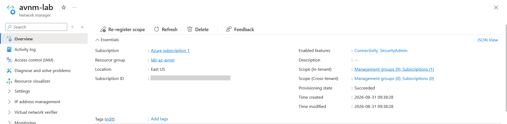
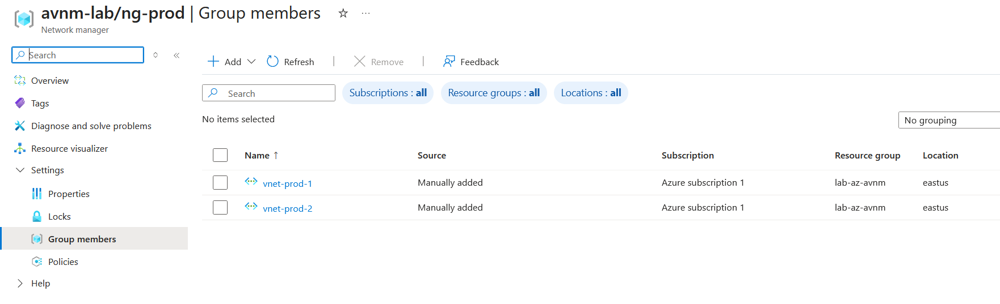
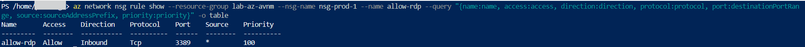
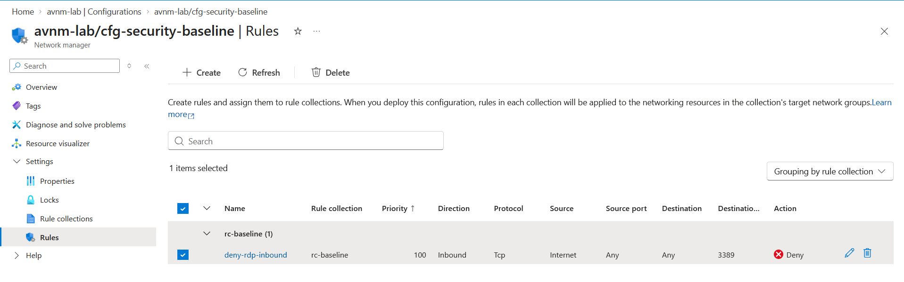
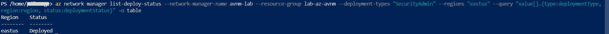
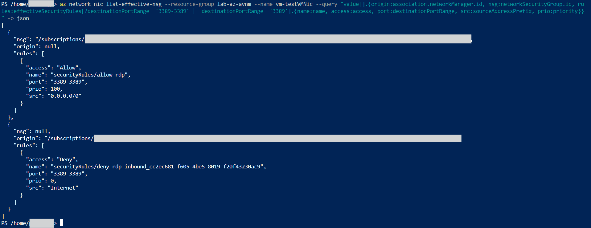
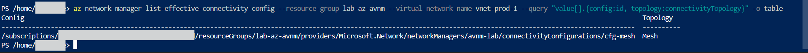
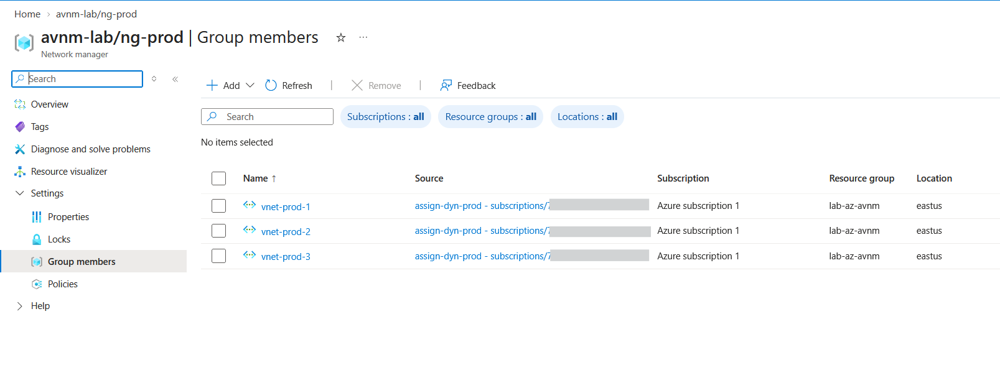

# Lab: Azure Virtual Network Manager — Security Admin Rules & Dynamic Governance (org-scale network control)

> Built a central Azure Virtual Network Manager (AVNM) that governs multiple VNets at once. A
> security admin rule blocks inbound RDP from the internet across a whole network group and
> **overrides** an NSG that explicitly allows it — proven on a live NIC. Added mesh connectivity
> with no manual peering, then converted membership from static to **Azure Policy-driven dynamic**,
> so a brand-new VNet auto-joins the group and inherits the baseline with no manual step.

**Domain:** 2 — Storage, Databases & Networking (SC-500)
**Services:** Azure Virtual Network Manager (security admin config, connectivity config), Azure Policy (`addToNetworkGroup`), NSG, VNet
**Status:** Complete — evidenced and torn down

---

## Objective

Demonstrate **centralized, org-scale network governance** with AVNM: security rules that sit above
and override per-team NSGs, automated topology, and self-enforcing dynamic group membership — the
governance layer that individual NSGs, Azure Policy (management plane), and Azure Firewall (data
path) each cannot provide on their own.

## The problem (insecure default)

Network security managed per-VNet doesn't scale and isn't enforceable. Each app team owns its own
NSGs, so a central security team has no way to guarantee a rule holds *everywhere* — any team can
edit their NSG and open a high-risk port (RDP/3389, SSH/22) to the internet, and there is no
central control that overrides them. At tens or hundreds of VNets, consistent connectivity and a
non-negotiable security baseline become impossible to maintain by hand.

## Lab environment

| Item | Value |
|---|---|
| Resource group | `lab-az-avnm` (East US) |
| Network manager | `avnm-lab` — scope: 1 subscription; features: Connectivity + SecurityAdmin |
| Network group | `ng-prod` (member type: VirtualNetwork) |
| VNets | `vnet-prod-1` (10.40.0.0/16), `vnet-prod-2` (10.41.0.0/16), `vnet-prod-3` (10.42.0.0/16) |
| NSG | `nsg-prod-1` — inbound `allow-rdp` (Allow 3389 from `*`), on `vnet-prod-1/snet-workload` |
| Security admin config | `cfg-security-baseline` → `rc-baseline` → `deny-rdp-inbound` (Deny 3389 from Internet) |
| Connectivity config | `cfg-mesh` — Mesh topology on `ng-prod` |
| Dynamic membership | Azure Policy `dyn-prod-vnets` (`addToNetworkGroup`, `Microsoft.Network.Data` mode) + assignment `assign-dyn-prod` |
| Test VM | `vm-test` — `Standard_D2als_v7`, in `vnet-prod-1`, used only to read effective rules |

## What I built

A central network manager scoped to the subscription, governing a group of "production" VNets with
two configuration dimensions (security + connectivity) and two membership models (static, then
dynamic).

| Component | Role in the design |
|---|---|
| `avnm-lab` (scope + features) | The central manager; scope bounds what it can govern, features enable each capability |
| `ng-prod` network group | The targeting unit — rules and topology apply to the group, not per-VNet |
| Static members | Explicit `static-member` objects (first membership model) |
| `nsg-prod-1` / `allow-rdp` | App-team layer permitting RDP — the rule the admin rule overrides |
| `cfg-security-baseline` → `rc-baseline` → `deny-rdp-inbound` | Governance layer: Deny 3389 from Internet, applied to the group |
| SecurityAdmin deployment | Commits the config to East US — rules are inert until deployed |
| `cfg-mesh` (Mesh) | Auto-connectivity across the group — replaces manual peering |
| `dyn-prod-vnets` + `assign-dyn-prod` | Azure Policy that dynamically populates `ng-prod` by VNet name |

### Design decisions (the "why")

- **Dedicated RG, subscription-scoped manager.** AVNM operates above individual RGs; subscription
  scope matches where the VNets live and keeps the lab self-contained.
- **Both features enabled (Connectivity + SecurityAdmin).** Features are least-privilege toggles on
  the manager's own capabilities — the same scope+capability pattern as a custom RBAC role or PIM.
- **RDP/3389 as the test port.** Blocking high-risk management ports from the internet is the
  canonical central-governance use case; it makes the "app team allows it, central team forbids it"
  conflict legible.
- **NSG on one subnet, admin rule on the whole group.** Deliberate scope contrast: an NSG governs
  one subnet/NIC; one admin rule governs every VNet in the group at once (and any that join later).
- **Proven on a live NIC.** The effective-security-rules view on a NIC is the authoritative merged
  verdict across all layers — the only place the admin Deny and NSG Allow are both visible with the
  Deny winning. A small `D2als_v7` VM provides the NIC; it is not otherwise used.
- **Static first, then dynamic.** Built explicit membership for a clear baseline, then converted to
  Azure Policy-driven membership to demonstrate self-enforcing governance (new VNets auto-join).

## Steps & output

Manager, group, static members (trimmed):

```
az network manager create -n avnm-lab -g lab-az-avnm --location eastus --scope-accesses "Connectivity" "SecurityAdmin" --network-manager-scopes subscriptions="/subscriptions/<SUBSCRIPTION_ID>"
az network manager group create -n ng-prod --network-manager-name avnm-lab -g lab-az-avnm
az network manager group static-member create -n sm-prod-1 --network-group-name ng-prod --network-manager-name avnm-lab -g lab-az-avnm --resource-id <vnet-prod-1 id>
# (repeat for vnet-prod-2)
```

NSG that allows RDP (the app-team layer), associated to the spoke subnet:

```
az network nsg create -g lab-az-avnm -n nsg-prod-1
az network nsg rule create -g lab-az-avnm --nsg-name nsg-prod-1 -n allow-rdp --priority 100 --direction Inbound --access Allow --protocol Tcp --destination-port-ranges 3389 --source-address-prefixes "*" --destination-address-prefixes "*"
az network vnet subnet update -g lab-az-avnm --vnet-name vnet-prod-1 -n snet-workload --network-security-group nsg-prod-1
```

Security admin config → collection (targets the group) → Deny rule → deploy:

```
az network manager security-admin-config create --configuration-name cfg-security-baseline --network-manager-name avnm-lab -g lab-az-avnm
az network manager security-admin-config rule-collection create --configuration-name cfg-security-baseline --network-manager-name avnm-lab -g lab-az-avnm --rule-collection-name rc-baseline --applies-to-groups network-group-id=<ng-prod id>
az network manager security-admin-config rule-collection rule create --configuration-name cfg-security-baseline --network-manager-name avnm-lab -g lab-az-avnm --rule-collection-name rc-baseline --rule-name deny-rdp-inbound --kind Custom --protocol Tcp --access Deny --priority 100 --direction Inbound --sources address-prefix-type=ServiceTag address-prefix="Internet" --destinations address-prefix-type=IPPrefix address-prefix="*" --dest-port-ranges 3389
az network manager post-commit --network-manager-name avnm-lab -g lab-az-avnm --commit-type "SecurityAdmin" --target-locations "eastus" --configuration-ids <cfg id>
```

Proof on a NIC — the admin Deny and the NSG Allow, both present, admin evaluated first:

```
az network nic list-effective-nsg -g lab-az-avnm -n vm-testVMNic
# NSG layer:            allow-rdp        Allow  3389  src 0.0.0.0/0  prio 100
# Network-manager layer: deny-rdp-inbound Deny   3389  src Internet   prio 0   <-- evaluated first, wins
```

Mesh connectivity (no manual peering), then verify it's effectively applied:

```
az network manager connect-config create --configuration-name cfg-mesh --network-manager-name avnm-lab -g lab-az-avnm --connectivity-topology Mesh --applies-to-groups "[{'networkGroupId':'<ng-prod id>','groupConnectivity':'None'}]"
az network manager post-commit --network-manager-name avnm-lab -g lab-az-avnm --commit-type "Connectivity" --target-locations "eastus" --configuration-ids <mesh id>
az network manager list-effective-connectivity-config -g lab-az-avnm --virtual-network-name vnet-prod-1
# -> cfg-mesh, topology Mesh (applied via connected group; no classic peering objects created)
```

Static → dynamic membership via Azure Policy (`addToNetworkGroup`):

```
# policyrule.json: if type==virtualNetworks AND name like 'vnet-prod*'  ->  effect addToNetworkGroup -> ng-prod
az policy definition create -n dyn-prod-vnets --mode "Microsoft.Network.Data" --rules policyrule.json
az policy assignment create -n assign-dyn-prod --policy dyn-prod-vnets --scope "/subscriptions/<SUBSCRIPTION_ID>"
az network manager group static-member delete -n sm-prod-1 ...   # remove static members
az network vnet create -g lab-az-avnm -n vnet-prod-3 --address-prefixes 10.42.0.0/16 --subnet-name snet-workload --subnet-prefixes 10.42.1.0/24
az policy state trigger-scan -g lab-az-avnm --no-wait
# Group members blade then shows vnet-prod-1/2/3, Source = assign-dyn-prod (policy), none manually added
```

## Evidence

*No sensitive identifiers appear in these images (subscription ID, tenant ID, object IDs, and UPNs
are masked or cropped).*

**01 — AVNM instance: subscription scope, features Connectivity + SecurityAdmin**


**02 — Network group `ng-prod` with static members (Source: "Manually added")**


**03 — NSG `allow-rdp`: the app-team rule allowing inbound RDP (the insecure default)**


**04 — Security admin rule `deny-rdp-inbound`: Deny 3389 from Internet, applied to the group**


**05 — SecurityAdmin configuration deployed to East US (definition ≠ enforcement)**


**06 — Effective rules on the NIC: admin Deny (prio 0) evaluated before NSG Allow (prio 100)**


**07 — Effective connectivity: mesh applied to the VNet (via connected group, no manual peering)**


**08 — Dynamic membership: all three VNets auto-joined by Azure Policy (Source = assignment)**


## Configuration & identifiers (redacted)

Built via Azure CLI. Subscription IDs in resource paths are shown as `<SUBSCRIPTION_ID>`; the
tenant ID, admin object ID, and UPN are masked in screenshots. Private address spaces (10.40–10.42)
and resource names are retained. Note the Azure Policy definition and assignment
(`dyn-prod-vnets`, `assign-dyn-prod`) are created at **subscription scope** and live *outside* the
resource group — they are cleaned up separately (see Cleanup).

## SC-500 concepts demonstrated

- **Security admin rules override NSGs.** Admin rules are evaluated *before* NSGs; a Deny stops
  traffic before NSG evaluation, so a central rule cannot be undone by an app team's NSG. Rendered
  on a NIC at effective priority 0, below any NSG number. Directly extends the `network-segmentation`
  lab (NSG L3-4) with the governance layer above it.
- **The three admin-rule actions.** Deny (block, NSG never reached), Allow (permit but hand off to
  NSG), Always Allow (force through, bypass NSG) — richer than an NSG's binary Allow/Deny because
  admin rules must define how they interact with the layer below.
- **Network groups + membership models.** Static (manual `static-member` objects) vs dynamic
  (Azure Policy `addToNetworkGroup` effect, `Microsoft.Network.Data` mode). Dynamic membership is
  self-enforcing: new matching VNets join automatically and inherit the baseline.
- **AVNM vs Azure Policy vs Azure Firewall.** Azure Policy governs the management plane (can a
  resource be created/configured); AVNM governs the network (traffic + topology across VNets);
  Azure Firewall sits in the data path. All three are central governance on different planes — the
  same Azure Policy engine even powers AVNM dynamic membership (`addToNetworkGroup` instead of Deny).
- **Connectivity automation.** Mesh topology auto-connects the group via a *connected group* — no
  classic peering objects — which scales past the manual peering built in the Azure Firewall lab.
- **Definition ≠ enforcement.** Configs do nothing until deployed to a region; policy definitions
  do nothing until assigned to a scope — the recurring Azure pattern (also seen with Azure Policy
  assignment and firewall policy association).

## How I'd extend this

- **Tag-based dynamic membership.** Swap the name-prefix condition for a tag condition
  (`environment=production`) — the more common real-world pattern; same `addToNetworkGroup` effect.
- **Hub-and-spoke connectivity with `DirectlyConnected`.** Use a HubAndSpoke topology and set group
  connectivity to `DirectlyConnected` to let spokes reach each other — a richer topology than mesh.
- **Management-group scope.** Scope the manager to a management group to govern many subscriptions,
  the true enterprise pattern.
- **Diagnostic logging → Sentinel.** Stream AVNM/NSG flow data to Log Analytics and hunt policy
  violations — the bridge to Domain 4 (posture & monitoring).
- **AI-security extension.** Place AI inference VNets under a dynamic `env=ai-prod` network group
  with a security admin baseline that denies all egress except approved model/telemetry endpoints —
  so every new AI workload is *automatically* governed the moment it's created, with no chance of a
  team spinning up an ungoverned AI VNet. This applies AVNM's self-enforcing governance to the
  "secure AI workload" concern SC-500's Domain 3 emphasizes.

## Cleanup

```
# 1. Delete the resource group (VNets, manager, group, configs, NSG, VM, disk, NIC)
az group delete --name lab-az-avnm --yes --no-wait
az group wait --name lab-az-avnm --deleted

# 2. Remove the subscription-scoped Azure Policy objects (they live OUTSIDE the RG)
az policy assignment delete --name assign-dyn-prod --scope "/subscriptions/<SUBSCRIPTION_ID>"
az policy definition delete --name dyn-prod-vnets
```

**Cost note:** AVNM (manager, network groups, both configuration types, deployments) and Azure
Policy definitions/assignments are **free**. NSGs, VNets, and route tables are free. The only
billable resource was one `Standard_D2als_v7` VM used briefly to read effective rules — a few ₹/hr,
torn down same session. Total lab cost: on the order of **₹10–20** of credit burn. The Azure Policy
definition and assignment do not bill, but must be deleted separately since they are
subscription-scoped and survive the resource-group deletion.
