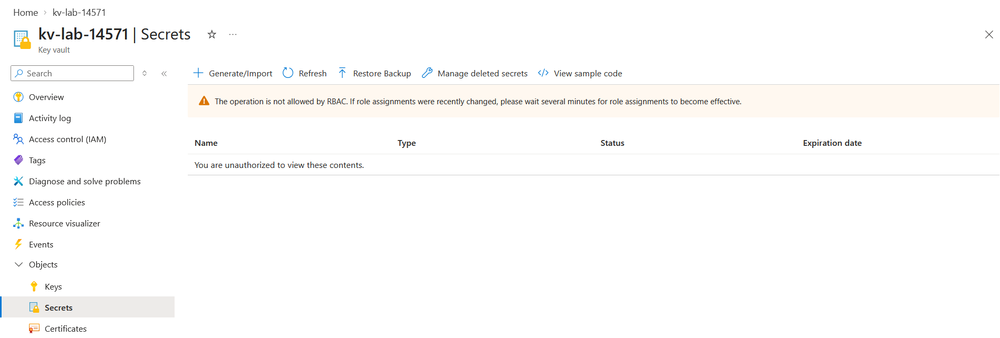
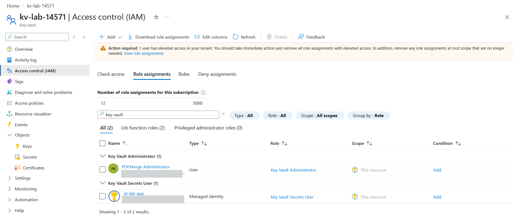
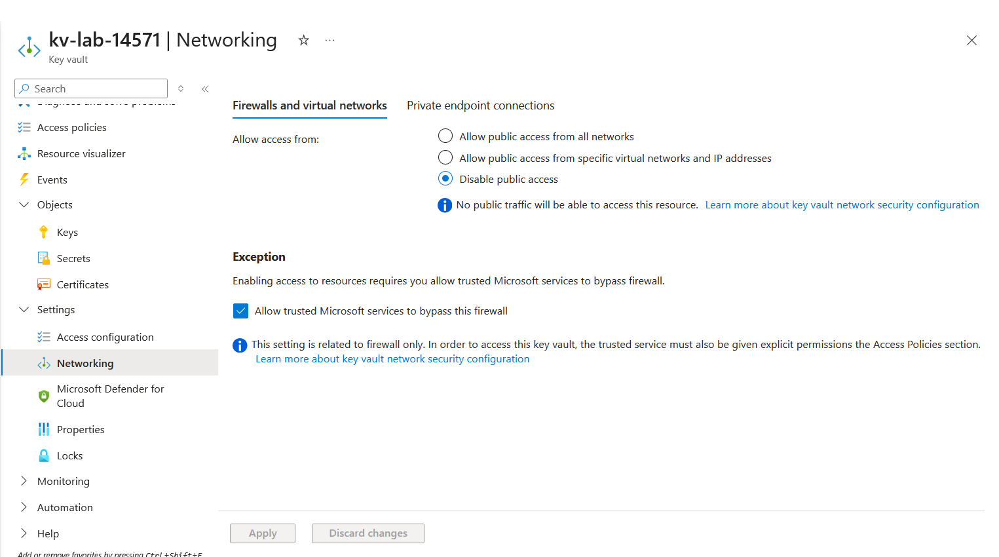

# Lab: Secure Secrets with Azure Key Vault (RBAC Data-Plane Model)

> Stand up a Key Vault on the **Azure RBAC** authorization model, prove that **control-plane
> ownership grants no data-plane access** (a subscription Owner is refused a secret until
> explicitly granted a Key Vault role), then build the full access model: least-privilege
> roles, a **managed identity** for credential-free retrieval, secret rotation, all three
> object types, and network isolation.

**Domain:** SC-500 — Secure storage, databases, and networking
**Services:** Azure Key Vault (Standard), managed identity, Azure RBAC, Azure CLI + Portal. No hourly cost (transaction-billed; a lab is fractions of a cent).
**Status:** Completed — vault hardened, data-plane deny proven, RBAC access model built, network locked down.

---

## Objective

Show how Key Vault is *secured*, not just *used*. The lab builds a vault on the RBAC
permission model and demonstrates the security spine an SC-500 engineer is expected to reason
about: the control-plane/data-plane split, least-privilege data-plane roles (Officer vs User),
credential-free access via managed identity, secret lifecycle (versioning/rotation), and
network isolation — with soft-delete and purge protection on from creation.

## The problem (insecure default)

Two insecure defaults, one lab:

1. **Secrets in code/config.** The default way apps get a password or API key is to paste it
   into source, an environment variable, or a config file — where it leaks through version
   control, logs, backups, or a single compromised host. The fix is to keep the secret in a
   vault and let an app fetch it at runtime with an identity, never a stored credential.
2. **The legacy access-policy model.** With vault *access policies*, any principal holding
   `Contributor` (or another role with `Microsoft.KeyVault/vaults/write`) can call
   `set-policy` and **grant themselves data-plane access** — reading every secret — and it
   shows in the activity log as a routine config change, not a privilege escalation. The RBAC
   model closes that hole by separating who can *manage the vault* from who can *read its
   data*, and restricting the power to grant data-plane access to `Owner` / `User Access
   Administrator` only. As of API version 2026-02-01 RBAC is the default model for new vaults.

## Lab environment

| Element | Value | Part in this lab |
|---|---|---|
| PDFMerge Administrator | Global Admin + Azure **Owner** | Creates the vault; **refused** data-plane access until granted a Key Vault role (the headline) |
| Key vault | `kv-lab-14571` — RG `lab-az-pim`, East US, Standard | The resource being secured |
| `id-lab-app` | User-assigned **managed identity** | Stand-in for an application; least-privilege secret reader |
| Scope | Resource group `lab-az-pim` | All role assignments scoped to the vault, not the subscription |

## What I built

A Key Vault on the RBAC model with a two-tier least-privilege access model, all three object
types, rotation, and public network access disabled.

| Setting | Value |
|---|---|
| Vault | `kv-lab-14571` (Standard SKU) |
| Authorization model | **Azure RBAC** (`enableRbacAuthorization: true`) — not access policies |
| Data protection | Soft-delete (on, 7-day retention) + **purge protection** (on) |
| Network | Public access **Disabled**; trusted Microsoft services bypass = on |
| Objects | secret `db-password` (2 versions), key `lab-key` (RSA 2048), certificate `lab-cert` (self-signed) |
| Access — admin | PDFMerge Administrator -> **Key Vault Administrator** (vault scope) |
| Access — app | `id-lab-app` managed identity -> **Key Vault Secrets User** (vault scope) |
| Method | Azure CLI + Portal |

### Design decisions (the "why")

- **RBAC model, not access policies.** The access-policy model lets a `Contributor` self-grant
  data-plane access via `set-policy`; RBAC separates control plane from data plane and limits
  who can grant access to `Owner` / `User Access Administrator`. This is the primary security
  reason to choose RBAC, and it's now the default for new vaults.
- **Least privilege, split by job.** I hold **Key Vault Administrator** (build/manage all
  objects); the app identity holds **Key Vault Secrets User** (read secret *values* only — no
  write, no keys, no certs). Officer roles manage; User roles consume. Both are scoped to the
  vault, not the subscription.
- **Managed identity for retrieval.** The app authenticates as an Azure identity and reads the
  secret at runtime — no credential in code, config, or env var. This is the credential-free
  pattern the whole lab is built to enable.
- **Purge protection + soft-delete on from creation.** Data-protection control: a deleted
  vault (or object) is recoverable, and purge protection means it *cannot* be force-purged
  before the retention window — so an attacker can't delete a vault to destroy its secrets.
  Trade-off: teardown is not instant (see Cleanup); I set retention to the 7-day minimum to
  keep that window short.
- **Network isolation.** Public data-plane access is disabled (defence in depth for a vault
  holding real secrets). The "allow trusted Microsoft services to bypass" exception stays on
  so first-party services (e.g. Defender for Cloud, backup) can still reach it without opening
  a general hole.
- **Resource-provider registration (aside).** `Microsoft.KeyVault` had to be registered on the
  subscription before *anyone* — even an Owner — could create a vault. Resource providers are a
  subscription-level enablement gate that sits underneath both RBAC and Policy.

## Steps & output

*Outputs below are trimmed for readability; identifiers are redacted (see Configuration & identifiers).*

**1. Register the provider, then create the vault (RBAC + purge protection)**

```bash
az provider register --namespace Microsoft.KeyVault      # one-time per subscription

az keyvault create \
  --name kv-lab-14571 --resource-group lab-az-pim --location eastus --sku standard \
  --enable-rbac-authorization true --enable-purge-protection true --retention-days 7
```

```json
{
  "name": "kv-lab-14571",
  "properties": {
    "enableRbacAuthorization": true,
    "enablePurgeProtection": true,
    "enableSoftDelete": true,
    "softDeleteRetentionInDays": 7,
    "publicNetworkAccess": "Enabled",
    "sku": { "name": "standard" },
    "accessPolicies": [],
    "vaultUri": "https://kv-lab-14571.vault.azure.net/"
  }
}
```

`accessPolicies: []` is empty by design — the data plane is governed by RBAC, not policies.

**2. Try to write a secret as Owner — refused (the headline)**

```bash
az keyvault secret set --vault-name kv-lab-14571 --name "db-password" --value "<value>"
```

The operation is **denied**. In the portal, the Secrets blade shows it plainly (see Evidence
`01-owner-denied.png`):

```text
The operation is not allowed by RBAC. If role assignments were recently changed,
please wait several minutes for role assignments to become effective.
You are unauthorized to view these contents.
```

Nothing is wrong with the account — this is the point. Owner is a **control-plane** role; it
grants zero **data-plane** access under the RBAC model.

**3. Grant a data-plane role — Key Vault Administrator, scoped to the vault**

```bash
SUB=$(az account show --query id -o tsv)
VAULT_ID="/subscriptions/$SUB/resourceGroups/lab-az-pim/providers/Microsoft.KeyVault/vaults/kv-lab-14571"

az role assignment create \
  --role "Key Vault Administrator" \
  --assignee "admin@<tenant>.onmicrosoft.com" \
  --scope "$VAULT_ID"
```

```json
{
  "principalType": "User",
  "roleDefinitionId": ".../roleDefinitions/00482a5a-887f-4fb3-b363-3b7fe8e74483",
  "scope": ".../vaults/kv-lab-14571"
}
```

`00482a5a-...` is the built-in **Key Vault Administrator**. Data-plane grants are **not instant** —
allow a few minutes for propagation before the next step (the deny banner in step 2 warns of
exactly this).

**4. Rerun the write — now it succeeds; add a second version (rotation)**

```bash
az keyvault secret set --vault-name kv-lab-14571 --name "db-password" --value "<value-v1>"
az keyvault secret set --vault-name kv-lab-14571 --name "db-password" --value "<value-v2>"
az keyvault secret list-versions --vault-name kv-lab-14571 --name "db-password" \
  --query "[].{version:id, enabled:attributes.enabled, created:attributes.created}" -o table
```

```text
Version                                                               Enabled  Created
--------------------------------------------------------------------  -------  -------------------------
https://kv-lab-14571.vault.azure.net/secrets/db-password/106f7a0b...  True     2026-08-27T19:16:21+00:00
https://kv-lab-14571.vault.azure.net/secrets/db-password/cf67807c...  True     2026-08-27T19:19:25+00:00
```

Same command, opposite result from step 2 — the only change was the data-plane role. Writing
the same secret name again created a **new version** rather than overwriting; both stay
retrievable and revocable. (Secret values are never committed to this repo.)

**5. Add the other two object types — a key and a certificate**

```bash
az keyvault key create --vault-name kv-lab-14571 --name "lab-key" --kty RSA --size 2048
az keyvault certificate create --vault-name kv-lab-14571 --name "lab-cert" \
  --policy "$(az keyvault certificate get-default-policy)"
```

```json
{ "name": ".../keys/lab-key/<version>", "type": "RSA", "enabled": true }
{ "name": "lab-cert", "issuerParameters": { "name": "Self" }, "status": "completed" }
```

All three object types now exist. The RSA private key was generated **inside** the vault and
never leaves it. Each object type has its own Officer role (Secrets / Crypto / Certificates
Officer); Key Vault Administrator spans all three.

**6. Grant a managed identity least-privilege read — the credential-free pattern**

```bash
az identity create --name "id-lab-app" --resource-group lab-az-pim --location eastus
MI=$(az identity show --name "id-lab-app" --resource-group lab-az-pim --query principalId -o tsv)

az role assignment create \
  --role "Key Vault Secrets User" \
  --assignee-object-id "$MI" --assignee-principal-type ServicePrincipal \
  --scope "$VAULT_ID"
```

```json
{
  "principalType": "ServicePrincipal",
  "roleDefinitionId": ".../roleDefinitions/4633458b-17de-408a-b874-0445c86b69e6",
  "scope": ".../vaults/kv-lab-14571"
}
```

`4633458b-...` is the built-in **Key Vault Secrets User** — read secret *values* only; it cannot
write secrets or touch keys/certs. `--assignee-object-id` + `--assignee-principal-type
ServicePrincipal` is used deliberately (a managed identity resolves as a service principal),
which also avoids a Microsoft Graph lookup.

> **Scope of proof.** This step establishes the *authorization model* for credential-free
> access (an identity + a least-privilege role + no stored secret). Demonstrating the identity
> *actually retrieving* the secret requires attaching it to a compute resource (VM / Function /
> App Service) that calls the vault via IMDS — documented as an extension below rather than
> deployed here, to keep the lab free.

**7. Disable public network access**

```bash
az keyvault update --name kv-lab-14571 --public-network-access Disabled
```

```json
{ "name": "kv-lab-14571", "publicNetworkAccess": "Disabled" }
```

The vault's data endpoint is now private (see Evidence `03-network-disabled.png`). Note: this
also cuts off CLI/Cloud Shell data-plane calls, which aren't on an allowed network — expected,
and it demonstrates the lockdown. The "trusted Microsoft services" bypass remains on so
first-party services can still reach the vault.

## Evidence

*No sensitive identifiers appear in these captures.*

**Control plane != data plane — secret access refused to the vault Owner**


**RBAC data-plane access model — Administrator (me) + Secrets User (app identity), both scoped to the vault**


**Network isolation — public access disabled**


## Configuration & identifiers (redacted)

This lab is imperative (Azure CLI), so the evidence is the command output above rather than a
single config file. Redaction follows the repo convention: **subscription ID**, **tenant ID**,
**user/managed-identity object IDs**, the **managed-identity client ID**, and **UPN / tenant
domain** are placeholdered. **Kept intact:** the built-in role-definition GUIDs — Key Vault
Administrator `00482a5a-887f-4fb3-b363-3b7fe8e74483` and Key Vault Secrets User
`4633458b-17de-408a-b874-0445c86b69e6` — which are Microsoft's public identifiers, identical
in every tenant (same rationale as the public policy/role-template GUIDs in the Domain 1 labs).

## SC-500 concepts demonstrated

- **Control plane vs data plane** — management of the vault resource (RBAC on ARM) is separate
  from access to its data (secrets/keys/certs). Being **Owner is not enough** to read a secret.
  This is the headline distinction and the #1 Key Vault gotcha.
- **RBAC vs access-policy authorization models** — why RBAC is preferred (prevents
  `Contributor` self-granting via `set-policy`) and is now the default for new vaults.
- **Least privilege / Officer vs User roles** — Administrator to build, Secrets User to read;
  scoped to the vault (RBAC also supports scoping to an individual secret).
- **Managed identity** — credential-free access; the app holds an identity, never a secret.
- **Secret lifecycle** — automatic versioning and rotation; old versions retained/revocable.
- **Object types** — secrets, keys (private key never leaves the vault), certificates.
- **Data protection** — soft-delete + purge protection, and the recoverability guarantee.
- **Network isolation** — disabling public access; the trusted-Microsoft-services exception.
- **Eventual consistency** — RBAC role-assignment propagation lag (the deny banner's warning).
- **Resource-provider registration** — a subscription-level gate beneath RBAC and Policy.

## How I'd extend this

- **Live managed-identity retrieval** — attach `id-lab-app` to a VM/Function/App Service and
  read `db-password` via `DefaultAzureCredential` / IMDS, proving the end-to-end credential-free
  fetch (needs compute; minor cost).
- **Scope a role to a single secret** — assign Key Vault Secrets User at
  `.../vaults/kv-lab-14571/secrets/db-password` instead of the vault, for per-secret least
  privilege.
- **Private endpoint** — replace "public access disabled" with a private endpoint + private DNS
  for true network-private access from a VNet.
- **Automated rotation** — Event Grid `SecretNearExpiry` -> Function to rotate, closing the loop
  on the versioning shown here.
- **Diagnostic logging** — stream `AuditEvent` to Log Analytics to see who read which secret
  when (ties into the Domain 4 monitoring story).
- **AI extension** — the "secure AI workload" case: an Azure OpenAI-backed app keeps its API key
  in Key Vault and reads it via managed identity, so no model/endpoint credential ever lives in
  code. (Ties to Domain 3.)
- **Cross-link:** "Secret Scanning + Key Vault with Microsoft Defender for Cloud" is a Domain 4
  (posture) topic — covered in the Defender lab, not here.

## Cleanup

```bash
az identity delete --name "id-lab-app" --resource-group lab-az-pim
az keyvault delete --name kv-lab-14571 --resource-group lab-az-pim   # -> soft-delete, not purged
```

**Purge protection is intentionally not undoable:** the deleted vault stays in soft-delete for
the 7-day retention window and the name `kv-lab-14571` remains reserved until it expires;
`az keyvault purge` is **refused by design**. This costs **$0** (soft-deleted vaults aren't
billed) and is the correct security behaviour — purge protection exists precisely so a vault
can't be hard-deleted to destroy its secrets. Role assignments are removed automatically with
the vault and identity. The `lab-az-pim` resource group is shared with the PIM/RBAC/Policy labs
— leave it in place.

Key Vault Standard incurs no hourly cost (transaction-billed; this lab is fractions of a cent).
No Premium/Managed HSM resources were created.
