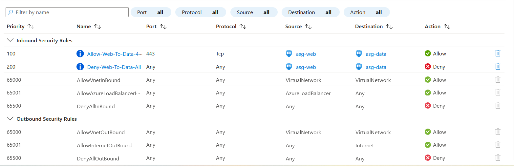
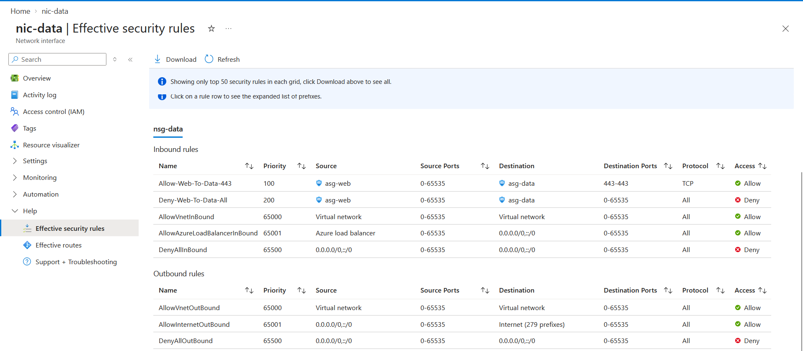
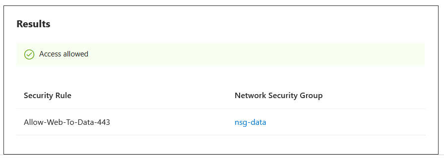
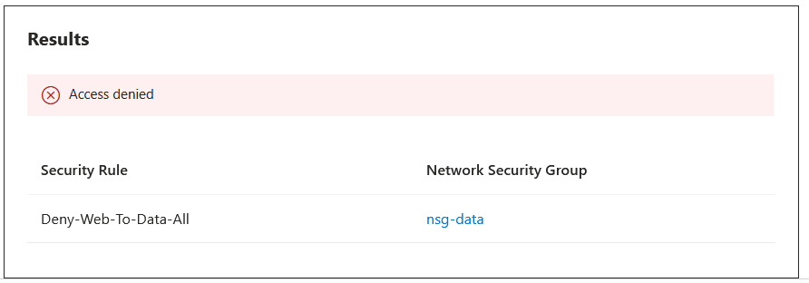

# Lab: Network Segmentation — NSGs, ASGs & Traffic Verification

> Segment a two-tier VNet so the web tier can reach the data tier **only on 443** and nothing
> else, using **NSG** rules written against **ASGs** (not IP addresses), then prove it live
> with **Network Watcher IP flow verify** — 443 allowed, 22 denied, each naming the deciding
> rule. Closes the flat-network insecure default, where all intra-VNet traffic is allowed by
> default.

**Domain:** SC-500 — Secure storage, databases, and networking
**Services:** Azure Virtual Network, NSG, ASG, Network Watcher, Azure CLI + Portal. VNet / NSG / ASG / NIC / Network Watcher are free; one small VM ran briefly for live verification, then was deleted.
**Status:** Completed — segmentation rules applied, effective rules confirmed on the NIC, live IP-flow verify showing 443 allowed / 22 denied.

---

## Objective

Demonstrate network micro-segmentation on Azure: split a workload into web and data tiers and
allow only the one legitimate flow between them (web → data on HTTPS), enforced by NSG rules
that target **Application Security Groups** rather than brittle IP ranges — then verify the
result both statically (effective rules) and dynamically (IP flow verify).

## The problem (insecure default)

A flat network — one subnet, or multiple subnets with only default NSG rules — leaves every
workload able to reach every other. The critical default is `AllowVnetInBound` (priority
65000, Allow): **all traffic within the VNet is permitted**. So a compromised web server can
freely reach the database tier on any port. Attaching an NSG does **not** fix this on its own;
the default allow is still in effect until you add a higher-precedence rule that overrides it.

## Lab environment

| Element | Value | Part in this lab |
|---|---|---|
| VNet | `vnet-ai-lab` (10.10.0.0/16), East US | The network |
| `snet-web` | 10.10.1.0/24 → `nsg-web` | Web (frontend) tier |
| `snet-data` | 10.10.2.0/24 → `nsg-data` | Data (backend) tier — the one locked down |
| `asg-web` / `asg-data` | Application Security Groups | Role labels the rules target |
| `nic-web` / `nic-data` | 10.10.1.4 / 10.10.2.4 | NICs in their subnets + ASGs; the verification endpoints |
| `vm-data` | `Standard_D2als_v7` (temporary) | Ran briefly so IP flow verify could execute; deleted at cleanup |

## What I built

Two subnets, an NSG per subnet, an ASG per tier, and a segmentation ruleset on `nsg-data`
permitting only `asg-web → asg-data` on 443.

| Setting | Value |
|---|---|
| VNet / subnets | `vnet-ai-lab`; `snet-web` (10.10.1.0/24), `snet-data` (10.10.2.0/24) |
| NSGs | `nsg-web` (web subnet), `nsg-data` (data subnet) |
| ASGs | `asg-web`, `asg-data` (NIC membership) |
| Rule 100 | **Allow** `asg-web → asg-data`, TCP **443** |
| Rule 200 | **Deny** `asg-web → asg-data`, all protocols/ports |
| Verification | Network Watcher **IP flow verify** + NIC **effective security rules** |

### Design decisions (the "why")

- **A deny rule that beats the default.** `AllowVnetInBound` (65000) permits all intra-VNet
  traffic. My **Deny at priority 200** (lower number = higher precedence) overrides it, so only
  the **Allow 443 at 100** gets through. This is the crux: an attached NSG isn't segmentation —
  a rule that outranks the default is.
- **ASGs, not IP addresses.** Rules reference `asg-web`/`asg-data`; membership lives on the NIC,
  so scaling out just means adding NICs to the ASG — no rule edits, no hardcoded IPs that drift.
  Same reference-by-role principle as the custom-RBAC and Key Vault labs.
- **Honest scope of the claim.** This lab restricts the **web→data path** to 443 only. It does
  not claim a total data-tier lockdown from *every* source (a non-web source would still match
  `AllowVnetInBound`). Tightening to "deny all inbound to data except `asg-web`:443" is listed
  under extensions.
- **Free resources wherever possible.** VNet, subnets, NSGs, ASGs, NICs, and Network Watcher
  are all free and carried the whole lab. The single metered resource — one small VM — was
  created only because **IP flow verify and effective-rules require a running VM behind the
  NIC**, and it was deleted immediately after the tests.
- **Region/SKU capacity reality.** East US VM capacity was gated for this subscription — the
  B-series and several D-series sizes returned `SkuNotAvailable`, so `D2als_v7` (the first
  unrestricted small size the SKU list returned) was used. An environmental constraint,
  recorded for honesty.

## Steps & output

*Azure CLI (Cloud Shell). Outputs summarised; only private IPs and resource names appear.*

**1. VNet + two subnets**

```bash
az group create --name lab-az-net --location eastus

az network vnet create -g lab-az-net -n vnet-ai-lab \
  --address-prefix 10.10.0.0/16 \
  --subnet-name snet-web --subnet-prefix 10.10.1.0/24
az network vnet subnet create -g lab-az-net --vnet-name vnet-ai-lab \
  -n snet-data --address-prefix 10.10.2.0/24
```

**2. NSG per subnet, attached**

```bash
az network nsg create -g lab-az-net -n nsg-web
az network nsg create -g lab-az-net -n nsg-data
az network vnet subnet update -g lab-az-net --vnet-name vnet-ai-lab -n snet-web  --network-security-group nsg-web
az network vnet subnet update -g lab-az-net --vnet-name vnet-ai-lab -n snet-data --network-security-group nsg-data
```

A fresh NSG already contains the defaults — note the two that matter:
`AllowVnetInBound` (65000, Allow) and `DenyAllInBound` (65500, Deny). So at this point web
can still reach data: attaching the NSG changed nothing yet.

**3. ASGs + NICs (NIC membership is what the rules target)**

```bash
az network asg create -g lab-az-net -n asg-web
az network asg create -g lab-az-net -n asg-data

az network nic create -g lab-az-net -n nic-web  --vnet-name vnet-ai-lab --subnet snet-web  --application-security-groups asg-web
az network nic create -g lab-az-net -n nic-data --vnet-name vnet-ai-lab --subnet snet-data --application-security-groups asg-data
# nic-web -> 10.10.1.4 (asg-web) ; nic-data -> 10.10.2.4 (asg-data)
```

**4. Segmentation rules on `nsg-data` (the fix)**

```bash
# 100: allow web -> data on HTTPS only
az network nsg rule create -g lab-az-net --nsg-name nsg-data \
  -n Allow-Web-To-Data-443 --priority 100 --direction Inbound --access Allow \
  --protocol Tcp --destination-port-ranges 443 \
  --source-asgs asg-web --destination-asgs asg-data

# 200: deny everything else web -> data
az network nsg rule create -g lab-az-net --nsg-name nsg-data \
  -n Deny-Web-To-Data-All --priority 200 --direction Inbound --access Deny \
  --protocol "*" --destination-port-ranges "*" \
  --source-asgs asg-web --destination-asgs asg-data
```

Result (see Evidence `01`): rules 100/200 sit **above** the defaults; the Deny at 200
overrides `AllowVnetInBound` at 65000.

**5. Verify — static (effective rules) and live (IP flow verify)**

A running VM is required for both, so a temporary `vm-data` was attached to `nic-data`:

```bash
az vm create -g lab-az-net -n vm-data --nics nic-data --image Ubuntu2204 \
  --size Standard_D2als_v7 --admin-username azureuser --generate-ssh-keys

az network watcher configure -g lab-az-net --locations eastus --enabled true

# 443 -> expect Allow (rule 100)
az network watcher test-ip-flow --vm vm-data -g lab-az-net \
  --direction Inbound --protocol TCP --local 10.10.2.4:443 --remote 10.10.1.4:443
# 22  -> expect Deny  (rule 200)
az network watcher test-ip-flow --vm vm-data -g lab-az-net \
  --direction Inbound --protocol TCP --local 10.10.2.4:22 --remote 10.10.1.4:22
```

- **Effective security rules** on `nic-data` (Evidence `02`) show the merged, priority-ordered
  set: Allow 443 (100), Deny all (200), then the defaults.
- **IP flow verify** (Evidence `03`, `04`): 443 → **Access allowed / Allow-Web-To-Data-443**;
  22 → **Access denied / Deny-Web-To-Data-All**. Because the tool resolved `10.10.1.4`→`asg-web`
  and `10.10.2.4`→`asg-data` to match the ASG-based rules, this also confirms the ASGs work.

## Evidence

*No sensitive identifiers appear in these captures — only private IPs (10.10.x.x) and resource names.*

**Segmentation rules on `nsg-data` — Allow 443 (100) and Deny all (200) above the defaults**


**Effective security rules on `nic-data` — the merged set the NIC actually enforces**


**IP flow verify — web → data on 443 is allowed (rule 100)**


**IP flow verify — web → data on 22 is denied (rule 200)**


## SC-500 concepts demonstrated

- **Network segmentation / micro-segmentation** — tiered subnets with least-privilege
  east-west rules.
- **NSG vs ASG** — the NSG is the stateful rulebook (priorities, first-match); the ASG is a
  group of NICs referenced *inside* rules so you express intent (`web → data`) instead of IPs.
  The exam's core network distinction.
- **NSG default rules & priority** — `AllowVnetInBound` (65000) permits intra-VNet traffic by
  default; a custom rule must use a lower priority number to override it (lower = higher
  precedence, first match wins).
- **Effective security rules** — the merged evaluation applied to a NIC, resolving custom and
  default rules together.
- **Network Watcher IP flow verify** — simulating a packet against the effective rules to get a
  definitive Allow/Deny and the deciding rule; the go-to connectivity diagnostic.
- **Subnet vs NIC NSG association**, and **stateful** NSG behaviour (return traffic
  auto-allowed).

## How I'd extend this

- **Full data-tier lockdown** — add a low-priority `Deny all inbound to asg-data` and allow only
  `asg-web`:443, so *no* source (not just web) can reach data on anything else.
- **Complete the web tier** — `nsg-web` rules (allow 443 from the load balancer / internet,
  deny the rest) for an end-to-end two-tier policy.
- **Azure Virtual Network Manager (AVNM)** — push these as **security admin rules** across many
  VNets, which users can't override, for org-scale consistency.
- **NSG flow logs → Log Analytics / Sentinel** for east-west traffic visibility (Domain 4).
- **Combine with the private-endpoint lab** so PaaS traffic (storage, SQL, Key Vault) also stays
  on this segmented VNet rather than the public internet.
- **AI extension** — place AI training and inference subnets under the same tiered NSG/ASG model;
  the inference tier reaches the data tier only on the one required port. (Ties to Domain 3.)
- **Permanent live verification** — IP flow verify was run against a temporary VM; in an
  unrestricted subscription that VM would be a real workload rather than a throwaway.

## Cleanup

```bash
az group delete --name lab-az-net --yes --no-wait
```

Deletes the VNet, subnets, NSGs, ASGs, NICs, the temporary VM, and the Network Watcher config
in one step. The VM (the only metered resource) is removed to stop compute charges; everything
else was free. Other resource groups (identity/governance and other Domain 2 labs) are
untouched.
