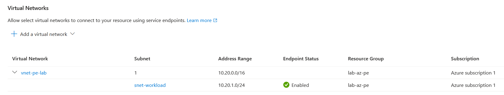
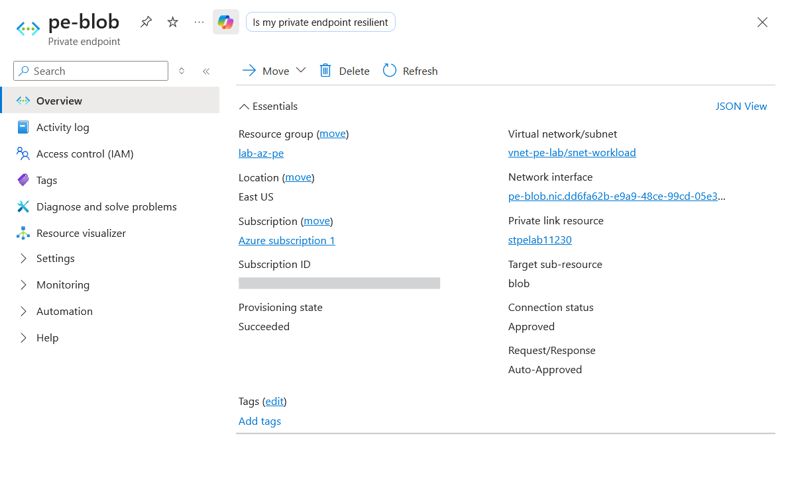
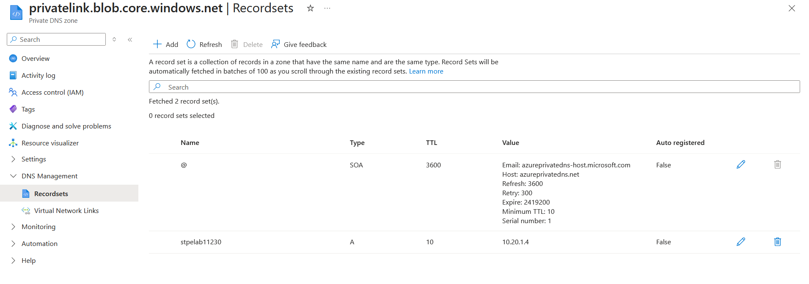
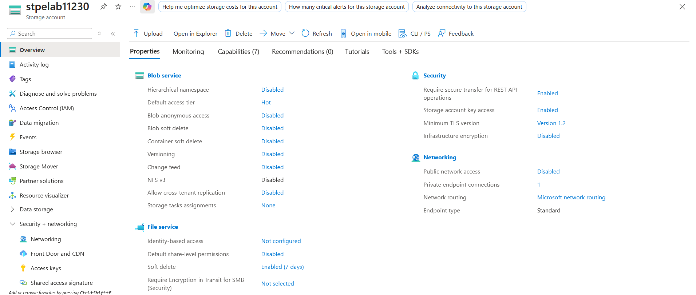

# Lab: Private Endpoint & Private DNS vs Service Endpoint (Private PaaS Connectivity)

> Reach a PaaS resource (blob storage) privately, two ways — a **service endpoint** (the subnet
> is trusted over the Azure backbone, but the resource keeps its public IP) and a **private
> endpoint** (the resource gets a **private IP inside the VNet**, resolved by **private DNS**) —
> then **disable public network access** so the account is reachable *only* through the private
> endpoint. Completes the "public access disabled" ending of the Storage and SQL labs.

**Domain:** SC-500 — Secure storage, databases, and networking
**Services:** Azure Private Link / Private Endpoint, Private DNS, VNet service endpoints, Azure Storage, Azure CLI + Portal. Private endpoint ~$0.01/hr; service endpoint / VNet / private DNS are free. **No VM.**
**Status:** Completed — service endpoint and private endpoint both configured, private DNS A record resolving the storage FQDN to the private IP, and public network access disabled.

---

## Objective

Demonstrate the two ways to keep PaaS traffic off the public internet — and the distinction
SC-500 tests between them — ending in a storage account that is reachable **only** privately.
The centrepiece is DNS: proving that the storage FQDN resolves to a **private IP inside the
VNet** rather than the public endpoint.

## The problem (insecure default)

PaaS resources — storage, SQL, Key Vault — are created with **public endpoints reachable from
anywhere on the internet**, protected only by keys or identity. Even with authentication fully
locked down (as in the Storage and SQL labs), the data plane still sits on a public IP exposed
to the internet's attack surface. Private networking removes that exposure: the resource is
reached over the Azure backbone or a private IP, and the public endpoint can be switched off
entirely.

## Lab environment

| Element | Value | Part in this lab |
|---|---|---|
| Storage account | `stpelab11230` — RG `lab-az-pe`, East US, StandardV2 / LRS | The PaaS resource secured (stand-in for any PaaS) |
| VNet / subnet | `vnet-pe-lab` (10.20.0.0/16) / `snet-workload` (10.20.1.0/24) | Where the workload lives; hosts the endpoints |
| Service endpoint | `Microsoft.Storage` on `snet-workload` | Approach 1 — trust the subnet |
| Private endpoint | `pe-blob` → blob, private IP **10.20.1.4** | Approach 2 — resource gets a VNet IP |
| Private DNS zone | `privatelink.blob.core.windows.net` (+ VNet link) | Resolves the FQDN to the private IP |

## What I built

Two private-access approaches on one storage account, ending with the public endpoint off.

| Step | Result |
|---|---|
| Service endpoint | `Microsoft.Storage` on `snet-workload` + storage firewall allowing that subnet; `defaultAction = Deny` → "Enabled from selected networks" |
| Private endpoint | `pe-blob` (group-id `blob`), **Approved**, private IP **10.20.1.4** in `snet-workload` |
| Private DNS | zone `privatelink.blob.core.windows.net`, VNet-linked; DNS zone group auto-created A record **`stpelab11230 → 10.20.1.4`** |
| Finale | `public-network-access = Disabled` — reachable only via the private endpoint (private endpoint connections: 1) |

### Design decisions (the "why")

- **Both approaches, to teach the distinction.** Service endpoint and private endpoint both keep
  traffic off the public internet, but a service endpoint only **trusts a subnet** (the resource
  keeps its public IP), while a private endpoint gives the resource a **private IP in the VNet**.
  Building both makes the exam contrast concrete rather than theoretical.
- **Private endpoint is the stronger default.** Only the private-endpoint path lets you disable
  the public endpoint entirely and reach the resource from on-premises (over VPN/ExpressRoute).
  The lab ends there.
- **DNS is the crux — and provable without a VM.** A private endpoint alone doesn't change name
  resolution; the storage FQDN still resolves to the public IP until a **private DNS zone** with
  the right A record overrides it. The DNS zone group **auto-creates** that record. Listing the
  record (`stpelab11230 → 10.20.1.4`) is exactly what an in-VNet `nslookup` would return, so the
  resolution is proven deterministically with no VM to spin up.
- **`registration-enabled false` on the VNet link.** The zone is for *resolution* of the private
  endpoint, not for auto-registering VM hostnames — so registration stays off.
- **Dedicated resource group.** `lab-az-pe` keeps this lab isolated and makes teardown a single
  command; it's also outside the Domain 1 "East US only" policy scope.
- **Completes the Storage and SQL labs.** Both ended by disabling public access and pointed to
  "reach it privately via a private endpoint." This lab is that private endpoint — the missing
  half of that story.

## Steps & output

*Azure CLI (Cloud Shell). Outputs summarised; only private IPs and resource names appear.*

**1. Storage + VNet**

```bash
az group create -n lab-az-pe -l eastus
az storage account create -n stpelab11230 -g lab-az-pe -l eastus \
  --sku Standard_LRS --kind StorageV2 --min-tls-version TLS1_2 --allow-blob-public-access false
az network vnet create -g lab-az-pe -n vnet-pe-lab \
  --address-prefix 10.20.0.0/16 --subnet-name snet-workload --subnet-prefix 10.20.1.0/24
```

**2. Approach 1 — Service endpoint + storage firewall**

```bash
az network vnet subnet update -g lab-az-pe --vnet-name vnet-pe-lab -n snet-workload \
  --service-endpoints Microsoft.Storage
az storage account network-rule add -g lab-az-pe --account-name stpelab11230 \
  --vnet-name vnet-pe-lab --subnet snet-workload
az storage account update -g lab-az-pe -n stpelab11230 --default-action Deny --bypass AzureServices
```

Result (Evidence `01`): the subnet's service-endpoint status is **Enabled**, and the storage
firewall now reads **"Enabled from selected networks."** The account is restricted to the
trusted subnet — but it still has a public IP/FQDN. That's the service-endpoint limitation the
private endpoint fixes.

**3. Approach 2 — Private endpoint for blob**

```bash
STORAGE_ID=$(az storage account show -g lab-az-pe -n stpelab11230 --query id -o tsv)
az network private-endpoint create -g lab-az-pe -n pe-blob \
  --vnet-name vnet-pe-lab --subnet snet-workload \
  --private-connection-resource-id $STORAGE_ID --group-id blob \
  --connection-name blob-connection
```

Result (Evidence `02`): the endpoint is **Approved (Auto-Approved)** with a NIC holding private
IP **10.20.1.4** from `snet-workload`. The resource now has an address *inside the VNet* — the
fundamental difference from a service endpoint.

**4. Private DNS — resolve the FQDN to the private IP**

```bash
az network private-dns zone create -g lab-az-pe -n privatelink.blob.core.windows.net
az network private-dns link vnet create -g lab-az-pe \
  -z privatelink.blob.core.windows.net -n link-pe-vnet \
  --virtual-network vnet-pe-lab --registration-enabled false
az network private-endpoint dns-zone-group create -g lab-az-pe \
  --endpoint-name pe-blob -n default \
  --private-dns-zone privatelink.blob.core.windows.net --zone-name blob

az network private-dns record-set a list -g lab-az-pe \
  -z privatelink.blob.core.windows.net \
  --query "[].{Record:name, IP:aRecords[0].ipv4Address}" -o table
```

```text
Record        IP
------------  ---------
stpelab11230  10.20.1.4
```

Result (Evidence `03`): the DNS zone group auto-created the A record. The resolution chain is
now `stpelab11230.blob.core.windows.net` → **CNAME** → `stpelab11230.privatelink.blob.core.windows.net`
→ **A** → `10.20.1.4`. Any client in the VNet resolving the storage FQDN lands on the private IP.

**5. Finale — disable public network access**

```bash
az storage account update -g lab-az-pe -n stpelab11230 --public-network-access Disabled
```

Result (Evidence `04`): storage properties show **Public network access: Disabled** and
**Private endpoint connections: 1**. The public path (including the service-endpoint route) is
severed; the account is reachable only through `pe-blob`. This is the fully-private end state
the Storage and SQL labs pointed to.

## Evidence

*No sensitive identifiers appear in these captures — subscription ID blurred where shown; only private IPs and resource names otherwise.*

**Approach 1 — service endpoint: subnet `snet-workload` trusted (Endpoint Status Enabled)**


**Approach 2 — private endpoint `pe-blob`: Approved connection to the blob sub-resource**


**Private DNS — the storage FQDN resolves to the private IP (headline)**


**Finale — public network access disabled; reachable only via the private endpoint**


## Configuration & identifiers (redacted)

Portal + CLI driven, so the evidence is the screenshots and CLI output above. The key artifact
is the private DNS A record (`stpelab11230 → 10.20.1.4`) — it *is* the proof of private
resolution. Redaction follows the repo convention: subscription ID is placeholdered in captures;
storage / VNet / endpoint / zone names and private IPs (10.20.x.x, not routable) are kept.

## SC-500 concepts demonstrated

- **Service endpoint vs private endpoint** — the core exam distinction:

  | | Service endpoint | Private endpoint |
  |---|---|---|
  | What | Extends **subnet identity** to the service over the backbone | Gives the service a **private IP in the VNet** |
  | Resource public IP | Retained (firewall-restricted) | Can be **disabled** |
  | DNS | Public FQDN / public IP | **Private DNS** → private IP |
  | Scope | The **subnet** | The **resource**, VNet-wide + on-prem |
  | On-prem access | No | Yes (VPN / ExpressRoute) |

- **Azure Private Link / Private Endpoint** — a NIC with a private IP that projects a PaaS
  resource into your VNet; connection approval states (auto-approved when you own the resource).
- **Private DNS zones** — `privatelink.blob.core.windows.net`, VNet links, and the DNS zone
  group that auto-manages the A record; the **CNAME → privatelink → private IP** resolution chain.
- **Storage firewall** — `defaultAction = Deny`, virtual-network rules, and the `AzureServices`
  bypass.
- **Public network access = Disabled** — the fully-private end state, and how it composes with
  the identity controls from the Storage and SQL labs (defence in depth: private network *and*
  identity-based auth).

## How I'd extend this

- **Live in-VNet resolution** — from a VM in `snet-workload`, `nslookup stpelab11230.blob.core.windows.net`
  returns `10.20.1.4` (the A record proves this deterministically here; a VM would show it live).
- **On-premises resolution** — an Azure DNS Private Resolver + conditional forwarder so on-prem
  clients over VPN/ExpressRoute also resolve to the private IP.
- **Private endpoints for the other services** — add `pe-sql`, `pe-vault` and disable their
  public access too, extending this pattern to the SQL and Key Vault labs.
- **Combine with network segmentation** — place these endpoints in a subnet governed by the
  NSG/ASG rules from the segmentation lab, so private *and* segmented.
- **Azure Policy enforcement** — deny creation of PaaS resources with public network access
  enabled, org-wide (cross-ref the Domain 1 Policy lab).
- **AI extension** — AI training data in blob, model endpoints, and the vector store all reached
  over private endpoints from the AI workload's subnet; no PaaS data plane on the public
  internet. (Ties to Domain 3.)

## Cleanup

```bash
az group delete --name lab-az-pe --yes --no-wait
```

Removes the storage account, VNet, private endpoint, private DNS zone, and links in one step.
The private endpoint (the only metered resource, ~$0.01/hr) is deleted; everything else was
free. Other resource groups are untouched.
