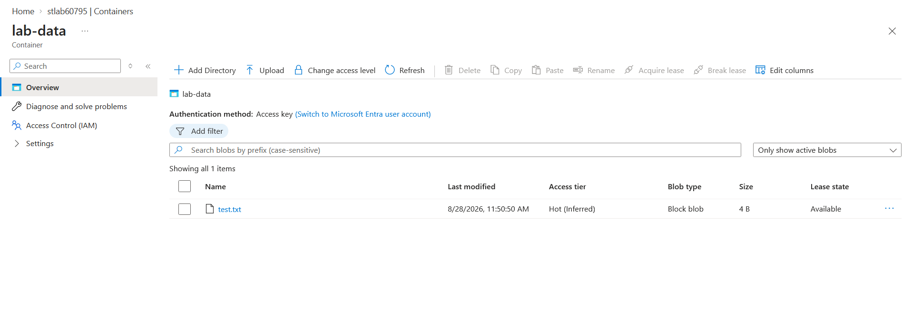
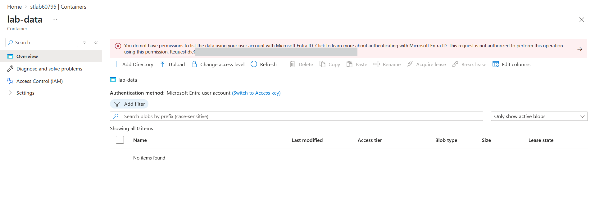
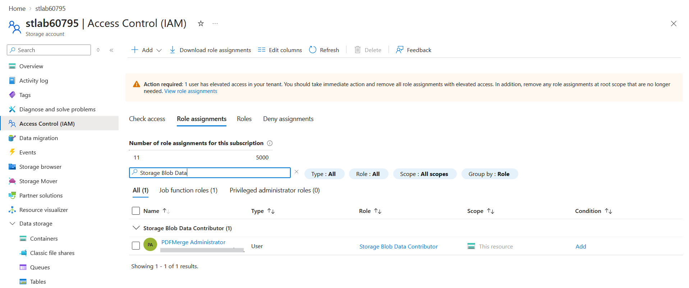
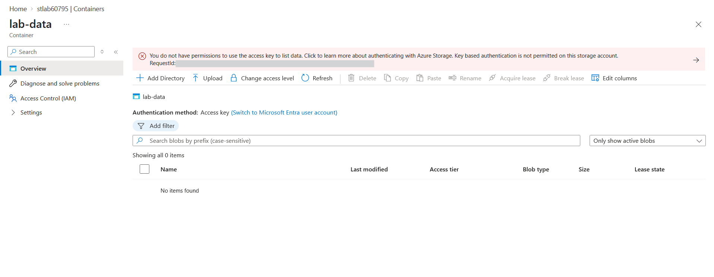
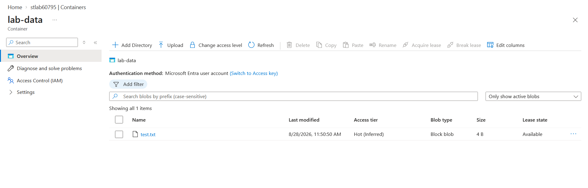

# Lab: Azure Storage Blob Authorization (Shared Key -> Entra RBAC)

> Walk the Azure Storage authorization ladder from its **insecure default** — Shared Key, a
> long-lived full-access account key — up to **zero-secret, identity-based access** (Entra
> RBAC + managed identity), then **disable shared-key access** to force Entra auth. Proves
> control plane != data plane (an Owner is refused blob data via Entra) and that a key-signed
> SAS dies while an Entra-signed user-delegation SAS survives.

**Domain:** SC-500 — Secure storage, databases, and networking
**Services:** Azure Storage (Blob), Azure RBAC, SAS, managed identity, Portal + Azure CLI. Standard / LRS — fractions of a cent.
**Status:** Completed — ladder walked end to end; shared-key access disabled; Entra RBAC and user-delegation SAS confirmed as the survivors.

---

## Objective

Demonstrate the full authorization model for Azure Blob Storage — the named SC-500 skill
"describe Azure Storage authorization models" — as a progression from worst to best:
Shared Key -> SAS (account-key-signed) -> user-delegation SAS (Entra-signed) -> Entra RBAC,
then enforce the best by disabling Shared Key entirely. The through-line is *where each
method's trust is rooted*, and the headline is that control-plane ownership grants no
data-plane access under Entra.

## The problem (insecure default)

The default way to reach blob data is the **account access key** (Shared Key). One key grants
**full access to everything** in the account, never expires until rotated, cannot be scoped,
and completely **bypasses RBAC**. Anyone who obtains it — from a config file, a connection
string in source control, a log — is effectively account-data admin. Worse, any principal
whose role includes `Microsoft.Storage/storageAccounts/listKeys/action` (Owner does) can
retrieve that key and use Shared Key to read data *regardless of their data-plane roles*. The
secure end state is to disable Shared Key and force every caller onto Entra identity + RBAC.

## Lab environment

| Element | Value | Part in this lab |
|---|---|---|
| PDFMerge Administrator | Global Admin + Azure **Owner** | Reads the blob via Shared Key (works); **refused** via Entra until granted a data role (the headline) |
| Storage account | `stlab60795` — RG `lab-az-pim`, East US, StandardV2 / LRS | The resource being secured |
| Container / blob | `lab-data` / `test.txt` (4 B) | The data accessed each way up the ladder |
| Scope | Storage account `stlab60795` | Data-role assignment scope (least privilege; could narrow to container/blob) |

## What I built

A hardened storage account, then a walk up the authorization ladder ending in Shared Key
disabled.

| Setting | Value |
|---|---|
| Storage account | `stlab60795` (StandardV2, LRS) |
| Baseline hardening | anonymous blob access **disabled**, **TLS 1.2**, HTTPS-only (secure transfer) |
| Container / blob | `lab-data` / `test.txt` |
| Data-plane role (me) | **Storage Blob Data Contributor**, scoped to the account |
| SAS demonstrated | service SAS (**account-key-signed**) and user-delegation SAS (**Entra-signed**) |
| Final hardening | **`allowSharedKeyAccess = Disabled`** — Shared Key + account/service SAS killed, Entra forced |
| Method | Azure Portal (CLI equivalents noted inline) |

### Design decisions (the "why")

- **Shared Key left on at first, disabled at the end.** The account is created hardened in every
  other respect, but shared-key access stays at its default (on) so the insecure default can be
  demonstrated — then it's disabled as the hardened target state.
- **Data role scoped to the account, least privilege by role.** I used **Storage Blob Data
  Contributor** to build; a read-only consumer should get **Storage Blob Data Reader**, and the
  scope can be narrowed to a single container or blob.
- **User-delegation SAS over service SAS.** A service SAS is signed by the account key (trust
  rooted in the master secret); a user-delegation SAS is signed by an Entra-issued key (trust
  rooted in identity + RBAC). Only the latter survives when Shared Key is disabled.
- **Disabling Shared Key is the gateway to identity controls.** With `allowSharedKeyAccess =
  false`, every request must use Entra — which is also the prerequisite for applying
  **Conditional Access** to the storage account.
- **Baseline hygiene.** Anonymous container access off and TLS 1.2 enforced from creation
  (not the lab's focus, but the right defaults).
- **Aside — the `listKeys` trap.** Owner can read data via Shared Key by pulling the account
  keys, bypassing RBAC entirely. That is precisely why disabling Shared Key matters, and why an
  Entra denial (step 3) coexists with full Shared Key access (step 2).

## Steps & output

*Portal was used (CLI token service was unstable); equivalent CLI shown for reference. SAS tokens are redacted — see Configuration & identifiers.*

**1. Create the storage account (hardened baseline, Shared Key still on)**

Basics: RG `lab-az-pim`, East US, Standard, LRS. Security tab: anonymous access **off**,
TLS **1.2**, secure transfer **on**, **storage account key access left Enabled** (studied
first, disabled at the finale), Defender for Storage **off** (paid / Domain 4).

```bash
az storage account create -n stlab60795 -g lab-az-pim -l eastus \
  --sku Standard_LRS --kind StorageV2 --min-tls-version TLS1_2 --allow-blob-public-access false
```

**2. Shared Key — the insecure default (rung 0)**

Created container `lab-data` and uploaded `test.txt`. The portal's **Authentication method:
Access key** shows the blob listing works with **no data-plane RBAC role assigned** — Shared
Key bypasses RBAC entirely. Evidence `01-sharedkey-access.png`.

**3. Control plane != data plane — Entra denied as Owner (the headline)**

Switched the same container view to **Microsoft Entra user account**. As subscription **Owner**
the listing is **refused**: *"You do not have permissions to list the data using your user
account with Microsoft Entra ID … not authorized."* Owner is a control-plane role; it grants no
blob-data access via Entra. Evidence `02-entra-denied.png`.

**4. Grant a data-plane role — Storage Blob Data Contributor**

Storage account -> Access control (IAM) -> add **Storage Blob Data Contributor** to the admin
user, scoped to this account. After ~2 min propagation, the Entra container view lists
`test.txt` — access now via **identity**, not the key. Evidence `03-iam-blob-role.png`.

```bash
az role assignment create --role "Storage Blob Data Contributor" \
  --assignee "<user>@<tenant>.onmicrosoft.com" \
  --scope "/subscriptions/<SUBSCRIPTION_ID>/resourceGroups/lab-az-pim/providers/Microsoft.Storage/storageAccounts/stlab60795"
```

**5. Service SAS — scoped and timed, but account-key-signed (rung 1)**

Generated a read-only, ~8-hour blob SAS with **Signing method: Account key**. It grants keyless
access to the *caller*, but is itself signed by the account key — leak the key and every such
SAS is forgeable, and an individual token can't be revoked without rotating the key. Token
shape (redacted):

```text
sp=r&st=<start>&se=<expiry>&spr=https&sv=2026-02-06&sr=b&sig=<REDACTED>
```

**6. Stored access policy — revocability (rung 2, documented)**

A container-level **stored access policy** lets a SAS inherit server-side constraints; deleting
the policy revokes every bound SAS instantly, without rotating the account key. (Covered as the
revocation mechanism; the primary path in this lab is the Entra rung below.)

**7. User-delegation SAS — Entra-signed (rung 3)**

Regenerated the SAS with **Signing method: User delegation key** (`--auth-mode login --as-user`).
The token now carries **`skoid` / `sktid` / `skt` / `ske` / `skv`** — the signing *identity* and
*tenant* — instead of a bare key signature. Trust is rooted in Entra + RBAC, not the account
key. Token shape (redacted):

```text
sp=r&st=<start>&se=<expiry>&skoid=<OBJECT_ID>&sktid=<TENANT_ID>&skt=<start>&ske=<expiry>&sks=b&skv=2026-02-06&spr=https&sv=2026-02-06&sr=c&sig=<REDACTED>
```

The presence of `skoid`/`sktid` (vs their absence in step 5) is the visible proof of an
identity-signed SAS. A managed identity uses this exact model — assign it a Storage Blob Data
role and it reads blobs with no stored secret (same pattern as the `key-vault-secrets` lab).

**8. Disable Shared Key — force Entra (the finale)**

Storage account -> Configuration -> **Allow storage account key access = Disabled** -> Save.

```bash
az storage account update -n stlab60795 -g lab-az-pim --allow-shared-key-access false
```

Then the divergence, same account, same moment:
- **Access key path -> refused:** the container view under *Access key* now errors, *"Key based
  authentication is not permitted on this storage account."* The step-5 service SAS is dead too.
  Evidence `04-sharedkey-disabled.png`.
- **Entra path -> still works:** switching to *Microsoft Entra user account* lists `test.txt`
  normally (the RBAC role is unaffected), and the step-7 user-delegation SAS still loads.
  Evidence `05-entra-still-works.png`.

That contrast is the whole thesis: Shared Key was never the real access control — Entra RBAC is.

## Evidence

*No sensitive identifiers appear in these captures (RequestIds and object IDs blurred).*

**Rung 0 — Shared Key default: full blob access with no RBAC role**


**Headline — same container via Entra as Owner: access denied**


**The fix — Storage Blob Data Contributor granted (RBAC data-plane model)**


**Finale — Shared Key disabled: account-key auth refused**


**Finale — Entra still works: identity path survives the lockdown**


## Configuration & identifiers (redacted)

This lab is portal/CLI-driven, so the evidence is the screenshots and the SAS token shapes
above rather than a config file. The two SAS tokens are the key artifact — note the contrast:
the service SAS (step 5) has no signing-identity parameters, while the user-delegation SAS
(step 7) carries `skoid`/`sktid`. **A live SAS is a working credential**, so only redacted token
*shapes* are recorded here — never the real `sig=` value or a full URL. Redaction otherwise
follows the repo convention: subscription ID, tenant ID, object IDs, and UPN / tenant domain are
placeholdered; well-known role names are kept as-is.

## SC-500 concepts demonstrated

- **Storage authorization models** — Shared Key, SAS (service/account vs user-delegation), and
  Entra RBAC, and where each roots its trust (master key vs identity).
- **Control plane vs data plane** — Owner/Contributor manage the account but grant **no** blob
  data access via Entra; explicit **Storage Blob Data** roles are required.
- **Data-plane roles** — Storage Blob Data Reader / Contributor / Owner, and Storage Blob
  Delegator (for the `generateUserDelegationKey` action).
- **The `listKeys` bypass** — a role that can read account keys can use Shared Key to bypass
  RBAC; disabling Shared Key closes it.
- **SAS signing** — account-key-signed vs Entra-signed (user delegation); `skoid`/`sktid` as the
  identity fingerprint; stored access policies for revocability.
- **`allowSharedKeyAccess = false`** — kills Shared Key and account/service SAS, forces Entra,
  and is the prerequisite for Conditional Access on storage.
- **Least privilege & scope** — role scoped to the account (narrowable to container/blob).
- **Eventual consistency** — RBAC role-assignment propagation lag.
- **Baseline hardening** — anonymous access off, TLS 1.2, HTTPS-only.

## How I'd extend this

- **Stored access policy in practice** — bind a SAS to a container policy and demo instant
  revocation by deleting the policy (the rung documented but not fully built here).
- **Scope a data role to one container/blob** for per-object least privilege.
- **Managed identity live retrieval** — attach a user-assigned identity to compute and read the
  blob via `DefaultAzureCredential` (cross-ref `key-vault-secrets`).
- **Private endpoint + disable public network access** for true network isolation.
- **Conditional Access on the storage account** — now possible because Shared Key is disabled.
- **Enforce org-wide with Azure Policy** — a policy denying `allowSharedKeyAccess = true`
  (cross-ref the Domain 1 `azure-policy-allowed-locations` lab: same governance engine).
- **AI extension** — AI training data / documents live in blob; the AI workload's managed
  identity reads them via a Storage Blob Data role, so no account key ever touches the app.
  (Ties to Domain 3.)
- **Cross-link:** "Storage Accounts and Defender for Storage" is a Domain 4 (posture) topic —
  covered in the Defender lab, not here.

## Cleanup

```bash
az storage account delete --name stlab60795 --resource-group lab-az-pim --yes
```

Deleting the account removes the container, blob, and role assignments in one step. The two SAS
tokens self-expire within hours (nothing to revoke). Standard/LRS storage with a 4-byte blob
cost fractions of a cent; Defender for Storage was never enabled. The `lab-az-pim` resource
group is shared with the PIM / RBAC / Policy / Key Vault labs — leave it in place.
