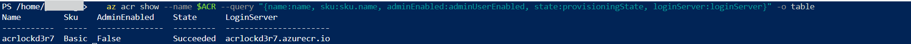
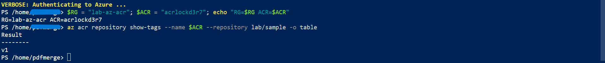
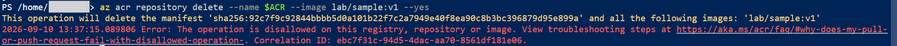

# Container Image Security in Azure Container Registry

## Objective

Demonstrate two registry side controls that protect the container supply chain: removing the shared registry credential so all access flows through Entra identity and role based access, and making a stored image immutable so a trusted artifact cannot be silently overwritten or deleted. The headline proof is a delete attempt against a locked image being refused by the registry.

## Exam domain

Domain 3, Secure compute and application platform services. This lab sits in the "Secure Azure Application Platform Services" section and pairs with the managed identity and Key Vault work as the supply chain half of application platform security.

## What I built

- An Azure Container Registry (`acrlockd3r7`) on the Basic tier with the admin account disabled at creation time, so no shared username and password ever exists on the registry.
- An image (`lab/sample:v1`) placed in the registry through my own Entra identity rather than a shared credential.
- A per image lock on that tag setting `writeEnabled` and `deleteEnabled` to false, leaving the image listable and pullable but frozen against change or removal.
- A deliberate delete attempt that the registry rejected, proving the immutability is enforced rather than merely configured.

## Why these controls matter

The registry admin account is a single shared credential baked into the registry. Anything holding it can push and pull with no individual attribution and no conditional access. Disabling it forces every operation through Entra and role based access control, which gives per identity permissions, auditability, and the ability to layer conditional access. I created the registry with the account already disabled so there was never a window in which the shared credential existed.

Image immutability protects against tampering after an image is trusted. Without a lock, an actor with push rights can overwrite `lab/sample:v1` with a different image under the same tag, and downstream deployments that pull `v1` would run the substituted image unknowingly. Locking the tag closes that path. The same lock also blocks deletion, which protects against destructive actions against a known good artifact.

## Build steps

Provider registration, run once and poll until Registered:

```
az provider register --namespace Microsoft.ContainerRegistry
az provider show --namespace Microsoft.ContainerRegistry --query registrationState -o tsv
```

Resource group and registry, admin disabled from the start:

```
az group create --name lab-az-acr --location centralindia
az acr create --resource-group lab-az-acr --name acrlockd3r7 --sku Basic --admin-enabled false
```

Verify the security relevant properties:

```
az acr show --name acrlockd3r7 --query "{name:name, sku:sku.name, adminEnabled:adminUserEnabled, state:provisioningState, loginServer:loginServer}" -o table
```

Place an image in the registry through Entra identity, then confirm the tag:

```
az acr import --name acrlockd3r7 --source mcr.microsoft.com/hello-world:latest --image lab/sample:v1
az acr repository show-tags --name acrlockd3r7 --repository lab/sample -o table
```

Lock the image and read the attributes back:

```
az acr repository update --name acrlockd3r7 --image lab/sample:v1 --write-enabled false --delete-enabled false
az acr repository show --name acrlockd3r7 --image lab/sample:v1 --query "changeableAttributes" -o json
```

Attempt the delete, which the registry refuses:

```
az acr repository delete --name acrlockd3r7 --image lab/sample:v1 --yes
```

## Evidence

Registry created on the Basic tier with the admin account disabled and provisioning succeeded:



Tag `v1` present in the `lab/sample` repository, placed through Entra identity rather than a shared credential:



The image locked, with `writeEnabled` and `deleteEnabled` both false while `listEnabled` and `readEnabled` remain true:


The delete attempt refused by the registry with "The operation is disallowed on this registry, repository or image":



A useful detail visible during the run: when the registry token was not yet available, the CLI fell back to admin credentials and reported "Admin user is disabled." That confirms the shared account really is off and that access depends on Entra identity.

## Notes and honest caveats

- The image was placed with `az acr import` rather than built with `az acr build`. ACR Tasks compute is disallowed on this subscription (`TasksOperationsNotAllowed`), so the server side build path is unavailable here. Import copies an existing public image into the registry through the same Entra authentication and produces a real, lockable artifact, so the security objective is unaffected. Only the origin of the bytes differs.
- This lab uses the per image lock, which is available on the Basic tier. Automatic, policy driven immutable tag rules that apply repository wide are a Premium tier feature and were not used here. They are described under how I would extend.
- Public network access on the registry is left Enabled for the lab. Restricting it is covered under how I would extend.

## Cross links to other labs

- `key-vault-secrets` (Domain 2): removing standing secrets from application configuration. This lab is the registry equivalent, removing the standing shared credential and protecting the artifact itself.
- `foundry-ai-workload-security` (Domain 3): the AI workload guardrail lab. Registry immutability is the supply chain complement to runtime guardrails, since a model serving or inference container is only as trustworthy as the image it runs.
- The managed identity and Key Vault application platform lab (same course section) uses identity to reach secrets at runtime. This lab protects the image those workloads are built from, so the two together cover both the identity and the artifact side of application platform security.

## How I would extend

- Enable Defender for Containers to scan pushed images for known vulnerabilities and surface findings in Defender for Cloud, tying registry hygiene into the Domain 4 posture story.
- Add image signing and content trust so consumers can verify provenance, not only that an image is unchanged since it was locked.
- On a Premium registry, replace the manual per image lock with policy driven immutable tag rules that apply automatically across a repository, and add a quarantine policy so newly pushed images are held until scanned and approved.
- Place the registry behind a private endpoint and disable public network access, combining with the `private-endpoint-dns` and `network-segmentation` labs so pushes and pulls stay on the private network.
- AI security angle: lock the container images that host AI model serving and inference workloads so a tampered image cannot be substituted into the pipeline, and pair that with the Foundry guardrail lab for defense in depth across the AI supply chain from image to prompt.

## Teardown

The lab image was removed during the exercise, which is the expected end state once the lock was demonstrated and then released. Remove the registry and its resource group when evidence is saved:

```
az group delete --name lab-az-acr --yes --no-wait
```

The registry is a flat Basic tier resource with no soft delete retention configured, so deletion is clean with no lingering soft deleted state to track.
