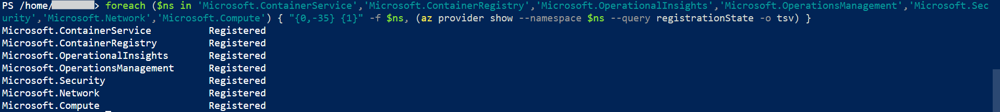
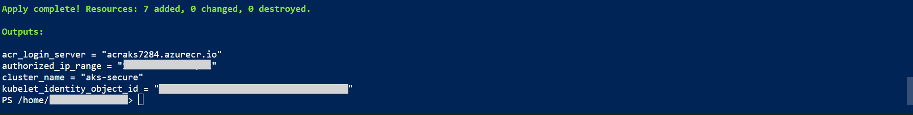
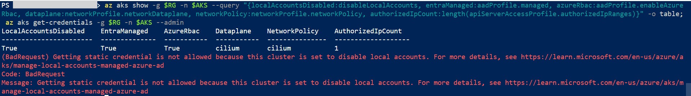
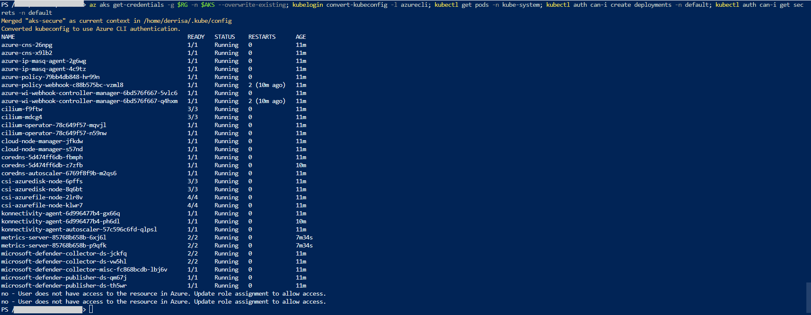
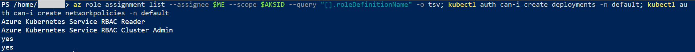
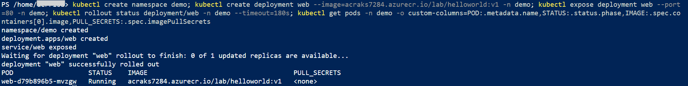
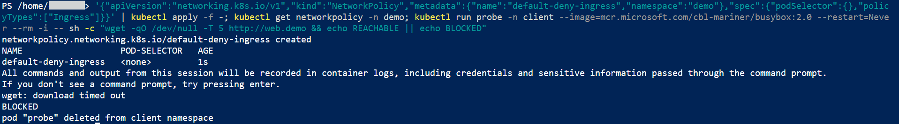
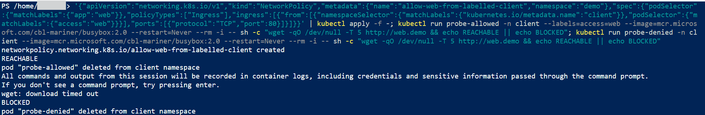
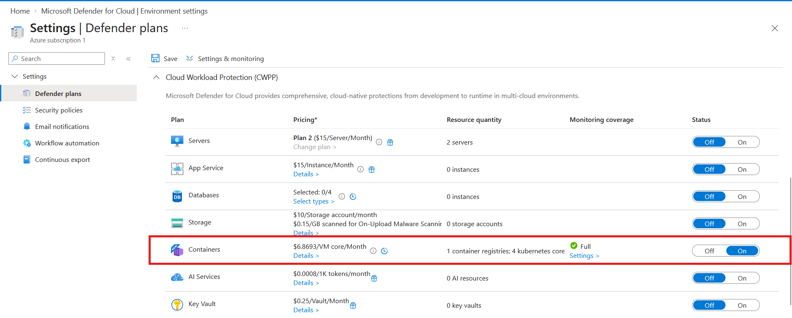
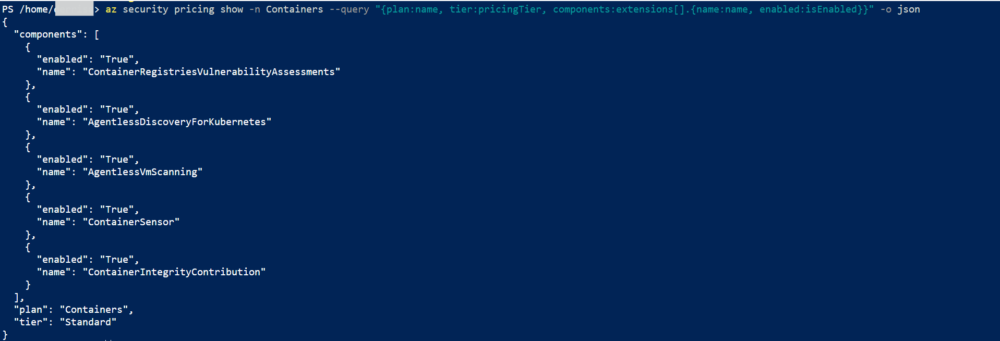

# Lab: Secure AKS Cluster (Entra ID, Azure RBAC, Network Policy, Defender for Containers)

> A default AKS cluster hands out a shared admin certificate, exposes its API server to the whole
> internet, and lets every pod talk to every other pod. This lab builds the opposite with Terraform:
> a cluster where sign in goes through Entra ID, permissions live in Azure RBAC, the local admin
> account is switched off, the API server answers one IP, images come from a private registry with
> no pull secret, pod traffic is denied by default, and Defender for Containers watches the result.
> Every control is then proven by trying to break it.

**Domain:** 3 (Compute and AI Security)
**Services:** Azure Kubernetes Service, Azure Container Registry, Microsoft Entra ID, Azure RBAC, Azure CNI powered by Cilium, Microsoft Defender for Containers, Log Analytics, Terraform
**Status:** Complete, evidenced, and torn down

---

## Objective

Deploy an AKS cluster as code with identity, network, supply chain and monitoring controls applied
at creation, then prove each one from the outside: the admin credential is refused, a read only
role cannot write, a private image runs without any stored secret, a default deny policy blocks pod
traffic until one labelled path is allowed, and Defender for Containers reports full coverage.

## The problem (insecure default)

An AKS cluster created with defaults has four weaknesses that matter for the exam and in practice:

| Default | Why it is a problem |
|---|---|
| Local accounts enabled | `az aks get-credentials --admin` downloads a cluster admin certificate. It is shared, long lived, bypasses MFA and Conditional Access, and leaves no per person audit trail |
| Public API server open to any IP | The front door for every Kubernetes command is reachable from the whole internet |
| Flat pod network | Any compromised pod can reach every other pod in every namespace |
| Registry access by secret | Pulling private images the old way means an imagePullSecret holding registry credentials inside the cluster |

## Lab environment

| Item | Value |
|---|---|
| Resource group | lab-az-aks (Central India) |
| AKS cluster | aks-secure, Free tier, 2 x Standard_D2s_v5 nodes, system assigned identity |
| Networking | Azure CNI Overlay, Cilium data plane and Cilium network policy, pod CIDR 192.168.0.0/16 |
| API server | Public endpoint restricted to one authorized IP (`<MY_PUBLIC_IP>/32`) |
| Container registry | acraks7284, Standard, admin account disabled |
| Log Analytics workspace | law-aks-secure, 30 day retention |
| Defender | Defender for Containers plan on the subscription, all components on |
| Built with | Terraform (azurerm 4.x) from Azure Cloud Shell, proofs with az and kubectl |

## What I built

| Component | Role here |
|---|---|
| Entra ID integration with Azure RBAC | Users sign in with Entra through kubelogin and are authorized by Azure role assignments |
| `local_account_disabled = true` | Removes the admin certificate back door entirely |
| Authorized IP range | The API server stays public but only answers my Cloud Shell IP |
| Kubelet identity with AcrPull | Nodes pull from the private registry with a managed identity, no secret stored anywhere |
| Cilium network policy | eBPF enforcement of Kubernetes NetworkPolicy, used for default deny between namespaces |
| Azure Policy add-on | Gatekeeper admission control, so Defender recommendations can be enforced |
| OIDC issuer and workload identity | Plumbing in place for pods to reach Key Vault later without secrets |
| Defender for Containers | Vulnerability assessment, agentless discovery and the runtime sensor |
| Auto upgrade channels | `patch` for Kubernetes, `NodeImage` for the node OS |

### Design decisions (the "why")

- **Terraform instead of a long `az aks create`.** The cluster has more than a dozen security
  settings. Declaring them in [`terraform/main.tf`](terraform/main.tf) makes them reviewable in one
  place and repeatable. The proofs still run with az and kubectl, because they are tests, not
  infrastructure.
- **Azure RBAC rather than Kubernetes RBAC.** Cluster permissions become ordinary Azure role
  assignments, managed in the same IAM blade as everything else and eligible for PIM. It also let me
  start with Reader and elevate later as a deliberate, visible step.
- **Start as Reader, elevate on purpose.** Terraform grants only Azure Kubernetes Service RBAC
  Reader. A `grant_cluster_admin` variable gates Cluster Admin, so the lab can first prove that
  Reader cannot write.
- **Cilium over Azure Network Policy Manager.** Cilium is the engine Microsoft now recommends for
  Linux, and Azure NPM on Linux reaches end of support in September 2028. Building a new cluster on
  the older engine would mean planning a migration on day one.
- **Authorized IPs, not a private cluster.** A private cluster needs a jump host, Bastion or VPN to
  reach the API server. For a lab driven from Cloud Shell, authorized IPs give real restriction
  without extra infrastructure. The exam distinction is covered below.
- **Every Defender component enabled explicitly.** See the finding under Steps and output.

## Steps and output

Register the resource providers once (Terraform is told not to register them):

```
foreach ($ns in 'Microsoft.ContainerService','Microsoft.ContainerRegistry','Microsoft.OperationalInsights','Microsoft.OperationsManagement','Microsoft.Security','Microsoft.Network','Microsoft.Compute') { az provider register --namespace $ns }
# all seven report Registered
```

Build the infrastructure from Cloud Shell:

```
$env:ARM_SUBSCRIPTION_ID = az account show --query id -o tsv
terraform init
terraform plan -out tfplan
terraform apply tfplan
# Apply complete! Resources: 7 added
```

Import a sample image into the private registry:

```
az acr import --name acraks7284 --source mcr.microsoft.com/azuredocs/aks-helloworld:v1 --image lab/helloworld:v1
```

**Proof 1: the admin credential is refused.**

```
az aks show -g lab-az-aks -n aks-secure --query "{localAccountsDisabled:disableLocalAccounts, entraManaged:aadProfile.managed, azureRbac:aadProfile.enableAzureRbac, dataplane:networkProfile.networkDataplane, networkPolicy:networkProfile.networkPolicy, authorizedIpCount:length(apiServerAccessProfile.authorizedIpRanges)}" -o table
az aks get-credentials -g lab-az-aks -n aks-secure --admin
# True  True  True  cilium  cilium  1
# (BadRequest) Getting static credential is not allowed because this cluster is set to disable local accounts.
```

**Proof 2: Reader can look but not touch.**

```
az aks get-credentials -g lab-az-aks -n aks-secure --overwrite-existing
kubelogin convert-kubeconfig -l azurecli
kubectl get pods -n kube-system
kubectl auth can-i create deployments -n default
kubectl auth can-i get secrets -n default
# pods listed, then: no - User does not have access to the resource in Azure (twice)
```

**Proof 3: elevation is an Azure role assignment.**

```
az role assignment create --assignee-object-id <MY_OBJECT_ID> --assignee-principal-type User --role "Azure Kubernetes Service RBAC Cluster Admin" --scope <AKS_RESOURCE_ID>
az role assignment list --assignee <MY_OBJECT_ID> --scope <AKS_RESOURCE_ID> --query "[].roleDefinitionName" -o tsv
kubectl auth can-i create deployments -n default
# Azure Kubernetes Service RBAC Reader, Azure Kubernetes Service RBAC Cluster Admin, yes, yes
```

**Proof 4: a private image runs with no pull secret.**

```
kubectl create namespace demo
kubectl create deployment web --image=acraks7284.azurecr.io/lab/helloworld:v1 -n demo
kubectl expose deployment web --port=80 -n demo
kubectl get pods -n demo -o custom-columns=POD:.metadata.name,STATUS:.status.phase,IMAGE:.spec.containers[0].image,PULL_SECRETS:.spec.imagePullSecrets
# Running, image from acraks7284.azurecr.io, PULL_SECRETS <none>
```

**Proof 5: default deny, then one labelled path.** Before any policy, a probe pod in a `client`
namespace reached `http://web.demo` (REACHABLE). Then:

```
kubectl apply -f k8s/01-default-deny-ingress.yaml
kubectl run probe -n client --image=mcr.microsoft.com/cbl-mariner/busybox:2.0 --restart=Never --rm -i -- sh -c "wget -qO /dev/null -T 5 http://web.demo && echo REACHABLE || echo BLOCKED"
# BLOCKED

kubectl apply -f k8s/02-allow-web-from-labelled-client.yaml
kubectl run probe-allowed -n client --labels=access=web --image=mcr.microsoft.com/cbl-mariner/busybox:2.0 --restart=Never --rm -i -- sh -c "wget -qO /dev/null -T 5 http://web.demo && echo REACHABLE || echo BLOCKED"
kubectl run probe-denied -n client --image=mcr.microsoft.com/cbl-mariner/busybox:2.0 --restart=Never --rm -i -- sh -c "wget -qO /dev/null -T 5 http://web.demo && echo REACHABLE || echo BLOCKED"
# probe-allowed REACHABLE, probe-denied BLOCKED
```

The allow rule puts `namespaceSelector` and `podSelector` in the same `from` entry, which means
both must match: the pod must be in the `client` namespace **and** carry `access=web`. Written as
two separate entries they would be an OR, and any pod in `client` would get through.

**Proof 6: Defender for Containers, and the finding it exposed.**

```
az security pricing show -n Containers --query "{plan:name, tier:pricingTier, components:extensions[].{name:name, enabled:isEnabled}}" -o json
```

The first check showed the plan on the Standard tier with every component reporting `False`. My
Terraform had set the tier but declared no `extension` blocks, so the subscription was paying for a
plan with registry scanning, agentless discovery and the sensor all switched off. The Defender
pods on the cluster came from the cluster's own `microsoft_defender` setting, which made it look
healthy at a glance. I enabled the components in the portal and fixed `main.tf` to declare each one,
after which the plan reported full monitoring coverage and every component returned `True`
(evidence 10).

**Finding: Cloud Shell is not a place to keep Terraform state.** Midway through, Cloud Shell
restarted in an ephemeral session and the home folder was wiped, taking `main.tf`, the local state
file and the kubeconfig with it. The cluster was unaffected, but Terraform no longer knew it owned
anything. The restart also changed the Cloud Shell public IP, which locked me out of the API server
until I updated the authorized range:

```
$MYIP = (Invoke-RestMethod https://api.ipify.org)
az aks update -g lab-az-aks -n aks-secure --api-server-authorized-ip-ranges "$MYIP/32"
```

The rest of the lab ran with az and kubectl, and teardown used `az group delete` instead of
`terraform destroy`. In a real team the state would live in a remote backend (an Azure Storage
container with locking), and the authorized range would point at a stable egress IP rather than a
shell session.

## Evidence

*No sensitive identifiers appear in these images. Subscription and tenant identifiers, object IDs,
user names and public IPs are masked or cropped. Resource names are retained as they are not
sensitive.*

**01. The seven resource providers registered**


**02. Terraform apply complete with the cluster, registry, workspace, roles and Defender plan**


**03. Local accounts disabled, and the admin credential request refused**


**04. Reader can list pods but cannot create deployments or read secrets**


**05. Cluster Admin granted through Azure RBAC, and can-i now returns yes**


**06. A private image from acraks7284 running with no imagePullSecret**


**07. Default deny applied, and the probe is blocked**


**08. Only the labelled client reaches the web service**


**09. Defender for Containers on for the subscription with full monitoring coverage**


**10. All five Defender for Containers components reporting True after the fix**


## Configuration and identifiers (redacted)

The full build is in [`terraform/main.tf`](terraform/main.tf) and the two policies are in
[`k8s/`](k8s/). Subscription and tenant IDs, my object ID, the kubelet identity object ID and the
Cloud Shell public IP are shown as placeholders such as `<MY_OBJECT_ID>` and `<MY_PUBLIC_IP>`. The
Terraform plan output was not captured as evidence because it prints the tenant ID, object ID and an
encoded client configuration that contains the subscription.

The core of the cluster definition:

```hcl
local_account_disabled = true

azure_active_directory_role_based_access_control {
  tenant_id          = data.azurerm_client_config.current.tenant_id
  azure_rbac_enabled = true
}

network_profile {
  network_plugin      = "azure"
  network_plugin_mode = "overlay"
  network_data_plane  = "cilium"
  network_policy      = "cilium"
}

api_server_access_profile {
  authorized_ip_ranges = [local.my_ip_cidr]
}
```

## SC-500 concepts demonstrated

- **Entra integration is not enough on its own.** Local accounts survive Entra integration until
  they are disabled. Only then is the admin certificate path closed.
- **Management plane versus data plane.** Azure Kubernetes Service Cluster User Role lets you
  download a kubeconfig and nothing else. The RBAC Reader, Writer, Admin and Cluster Admin roles
  decide what you can do inside the cluster. Contributor on the cluster changes the resource, not
  the workloads. This mirrors the Key Vault split.
- **Authorized IP ranges versus private cluster.** Authorized IPs filter who can connect, but the
  endpoint is still public. If a question says the API server must not be reachable from the
  internet, the answer is a private cluster.
- **Kubelet identity for registry pulls.** The kubelet identity with AcrPull replaces an
  imagePullSecret. Workload identity, not the deprecated pod managed identity, is how a pod itself
  reaches Azure services.
- **Network policy versus NSG.** An NSG filters by IP and port at the subnet or NIC. A network
  policy filters pod to pod by labels and namespaces. Isolating namespaces calls for network policy.
- **Defender detects, Azure Policy enforces.** Defender for Containers assesses and alerts. The Azure
  Policy add-on (Gatekeeper) blocks a non compliant pod at admission.
- **A plan can be on and still do nothing.** Enabling a Defender plan tier is not the same as
  enabling its components. Coverage has to be verified, not assumed.

## How I'd extend this

- Convert to a private cluster and manage it through `az aks command invoke` or a Bastion jump host,
  removing the public endpoint entirely.
- Move Terraform state to a remote backend in Azure Storage with state locking, so a lost shell
  session cannot orphan the infrastructure.
- Use workload identity with the Key Vault provider for Secrets Store CSI Driver, so a pod reads a
  secret from Key Vault as its own identity with nothing stored in the cluster.
- Assign the Kubernetes baseline Pod Security initiative through the Azure Policy add-on in Deny
  mode and show a privileged pod being rejected at admission.
- Route cluster egress through Azure Firewall with a user defined route, and add KMS etcd encryption
  with a customer managed key from Key Vault.
- AI security angle: run a model inference service on the cluster with workload identity to reach
  Azure OpenAI or Foundry, no API keys in the pod, a network policy that lets only the gateway
  namespace call it, and Defender runtime alerts on the inference pods.
- Send the AKS audit logs and Defender alerts to Microsoft Sentinel and write an analytics rule for
  a new cluster admin role assignment.

## Cross links

- [ACR image security](../acr-image-security/) disabled the registry admin account. This lab is the
  consuming side: the cluster pulls from a registry that has no shared credential, using a managed
  identity.
- [Key Vault secrets](../../2-storage-databases-networking/key-vault-secrets/) showed management
  plane versus data plane on a vault. The same split appears here between Cluster User Role and the
  RBAC data plane roles.
- [Network segmentation](../../2-storage-databases-networking/network-segmentation/) used NSGs to
  break up a flat subnet. Network policy does the same job one layer down, between pods.
- [VM secure access](../vm-secure-access/) turned on Defender for Servers. Defender for Containers
  is the equivalent plan for Kubernetes.
- [Azure Firewall egress](../../2-storage-databases-networking/azure-firewall-egress/),
  [Private endpoint DNS](../../2-storage-databases-networking/private-endpoint-dns/) and
  [CMK disk encryption](../cmk-disk-encryption/) are the building blocks for the egress, private
  cluster and etcd encryption extensions above.

## Cleanup

The Terraform state was lost with the Cloud Shell session, so the lab was removed by deleting the
resource group, which also removes the `MC_lab-az-aks_aks-secure_centralindia` node resource group:

```
az group delete --name lab-az-aks --yes --no-wait
az group exists --name lab-az-aks
az security pricing create -n Containers --tier free
```

The last command returns the Defender for Containers plan to Free, since it is billed per
subscription and would otherwise keep charging for any cluster created later.

**Cost note:** the AKS control plane is free on the Free tier, so the cost came from two
Standard_D2s_v5 nodes, the Standard registry, a small amount of Log Analytics ingestion and Defender
for Containers billed per vCPU, all for a few hours. Total cost was well under a dollar.
