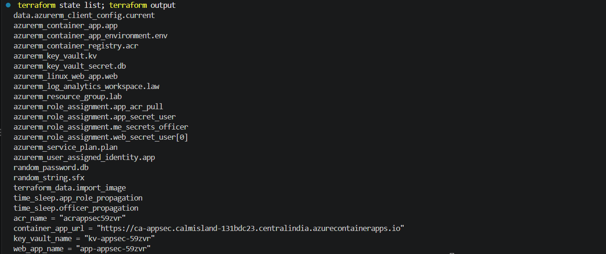
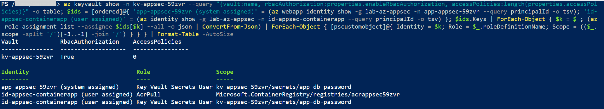
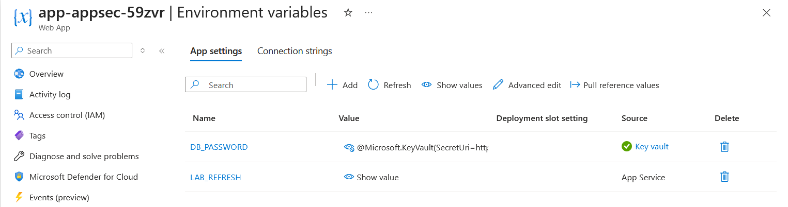
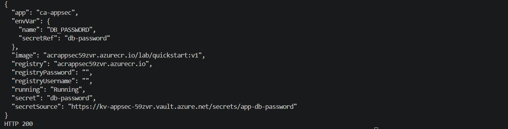
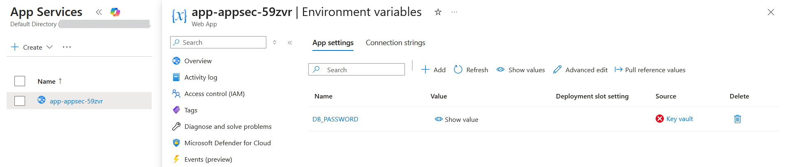

# Lab: App Platform Secrets with Managed Identity (App Service and Container Apps)

> Application secrets usually end up pasted into app settings or baked into a container definition,
> and private images are usually pulled with a registry password. This lab removes both. One Key
> Vault holds a secret, an App Service web app reads it through a Key Vault reference with its
> system assigned identity, and a Container App pulls its image from a private registry and reads
> the same secret with a user assigned identity. Neither app stores a secret value or a registry
> credential, and removing one role assignment is enough to cut an app off.

**Domain:** 3 (Compute and AI Security)
**Services:** Azure App Service, Azure Container Apps, Azure Key Vault, Azure Container Registry, Managed Identities, Azure RBAC, Terraform
**Status:** Complete, evidenced, and torn down

---

## Objective

Build two application platforms as code that consume the same Key Vault secret without holding it,
using a managed identity on each, then prove three things: the references resolve, each identity
has only the access it needs, and access stops the moment the role assignment is removed.

## The problem (insecure default)

| Common pattern | Why it is a problem |
|---|---|
| Secret value typed into App Service app settings | Anyone with read access to the app configuration sees it. It is copied into deployment scripts and never rotated |
| Secret value set directly on a Container App | Same exposure, plus the value lives in every revision of the app |
| Registry admin username and password on the Container App | A shared, long lived credential with push rights, stored in the app |
| Key Vault access policies granting broad "Get, List" on all secrets | Every app can read every secret in the vault |

## Lab environment

| Item | Value |
|---|---|
| Resource group | lab-az-appsec (Central India) |
| Key Vault | kv-appsec-59zvr, Azure RBAC authorization, 0 access policies |
| Secret | app-db-password (random 24 character value generated by Terraform) |
| Web App | app-appsec-59zvr on Linux B1 plan asp-appsec, system assigned identity, HTTPS only, TLS 1.2, FTPS disabled |
| Container App | ca-appsec in environment cae-appsec, Consumption workload profile |
| Container identity | id-appsec-containerapp (user assigned) |
| Container registry | acrappsec59zvr, Basic, admin account disabled |
| Built with | Terraform (azurerm 4.x) run from my PC, proofs with az and the portal |

## What I built

| Component | Role here |
|---|---|
| Key Vault with RBAC authorization | One vault for both apps, access controlled by role assignments instead of access policies |
| Web App system assigned identity | Resolves the `@Microsoft.KeyVault(...)` app setting at runtime |
| Key Vault Secrets User on the secret | Read access to this one secret only, not to the vault |
| User assigned identity | Pulls the image and resolves the secret for the Container App |
| AcrPull on the registry | Image pull without any registry credential |
| Container App Key Vault secret reference | The app secret points at the vault URL and is resolved with the identity |
| `webapp_secret_access` variable | Switches the Web App role on and off for the negative test |

### Design decisions (the "why")

- **One vault, two platforms.** The same secret consumed two ways shows the pattern is the point,
  not the service. It also shows where the two platforms differ, which is where exam questions sit.
- **System assigned for the Web App, user assigned for the Container App.** A system assigned
  identity is created and deleted with the app, which suits a single app that only reads a secret.
  The Container App must pull its image before it can start, so its identity has to exist and hold
  AcrPull first. A user assigned identity is created independently, granted its roles, and then
  attached.
- **Roles scoped to the secret, not the vault.** Both identities hold Key Vault Secrets User on
  `app-db-password` alone. If a second secret is added to the vault, neither app can read it until
  it is granted explicitly.
- **Versionless secret URI.** Both references point at the secret without a version, so a rotated
  value is picked up without changing either app.
- **Terraform run from my PC, not Cloud Shell.** In the AKS lab an ephemeral Cloud Shell session
  wiped the local state. Running locally kept the state file for the negative test and the clean
  `terraform destroy` at the end.

## Steps and output

Build everything from PowerShell on the lab PC:

```
$env:ARM_SUBSCRIPTION_ID = az account show --query id -o tsv
terraform init
terraform plan -out tfplan
terraform apply tfplan
# Apply complete! Resources: 19 added, 0 changed, 0 destroyed.
```

Check whether the Web App reference resolved:

```
$id = az webapp show -g lab-az-appsec -n app-appsec-59zvr --query id -o tsv
az rest --method get --url "$id/config/configreferences/appsettings?api-version=2022-03-01" --query "value[].{name:name, status:properties.status}" -o table
# DB_PASSWORD  AccessToKeyVaultDenied   (first check, see finding below)
# DB_PASSWORD  Resolved                 (after the app configuration changed)
```

**Finding: App Service caches a failed Key Vault reference.** Terraform can only grant a role to the
Web App's system assigned identity after the app exists, so the app tried to resolve the reference
before its role was in place and stored the failure. Restarting the app did not clear it. Changing
any app setting did, because App Service re-resolves references whenever the configuration changes.
I added a throwaway setting (`LAB_REFRESH`) to trigger it, and the next Terraform apply removed it
again. In production the fix is to give the Web App a user assigned identity created ahead of time,
or to accept the delay because App Service also retries failed references on its own schedule.

Confirm the vault model and every role the two identities hold:

```
az keyvault show -n kv-appsec-59zvr --query "{vault:name, rbacAuthorization:properties.enableRbacAuthorization, accessPolicies:length(properties.accessPolicies)}" -o table
# kv-appsec-59zvr  True  0
# app-appsec-59zvr (system assigned)      Key Vault Secrets User  kv-appsec-59zvr/secrets/app-db-password
# id-appsec-containerapp (user assigned)  AcrPull                 Microsoft.ContainerRegistry/registries/acrappsec59zvr
# id-appsec-containerapp (user assigned)  Key Vault Secrets User  kv-appsec-59zvr/secrets/app-db-password
```

Confirm the Container App holds no credential and is serving:

```
az containerapp show -g lab-az-appsec -n ca-appsec --query "{running:properties.runningStatus, image:properties.template.containers[0].image, registryUsername:properties.configuration.registries[0].username, registryPassword:properties.configuration.registries[0].passwordSecretRef, secretSource:properties.configuration.secrets[0].keyVaultUrl, envVar:properties.template.containers[0].env[0]}" -o json
# running Running, image acrappsec59zvr.azurecr.io/lab/quickstart:v1
# registryUsername "", registryPassword ""
# secretSource https://kv-appsec-59zvr.vault.azure.net/secrets/app-db-password
# envVar DB_PASSWORD from secretRef db-password
# HTTP 200 from the app URL
```

**Negative test: remove the Web App's role with Terraform.**

```
terraform apply -var webapp_secret_access=false
# Plan: 0 to add, 3 to change, 1 to destroy (the Key Vault Secrets User assignment)
# DB_PASSWORD  AccessToKeyVaultDenied
```

The Web App lost access straight away, while the Container App kept running because its own
identity still held its role. Each app's access depends only on its own role assignment.

**Finding: Container Apps adds a workload profile Terraform did not declare.** After the first
apply, every plan wanted to remove a `Consumption` workload profile that Azure adds to new
environments. Declaring that profile on the environment and the app made the plan come back with
no changes, which is the state a pipeline needs before anyone trusts it.

## Evidence

*No sensitive identifiers appear in these images. Subscription and tenant identifiers, object IDs,
user names and the tenant domain are masked or trimmed out of the output. Resource names are
retained as they are not sensitive.*

**01. Terraform state listing every managed resource, and the outputs**


**02. Vault on RBAC with no access policies, and each identity's roles scoped to one secret**


**03. Web App setting DB_PASSWORD sourced from Key vault and resolved**


**04. Container App running from the private registry with no registry credential, secret from Key Vault**


**05. Role removed by Terraform, and the Web App reference now fails**


## Configuration and identifiers (redacted)

The full build is in [`terraform/main.tf`](terraform/main.tf). The state file, the saved plan and
the provider lock file are excluded by [`terraform/.gitignore`](terraform/.gitignore), because the
state holds the generated secret value and every resource ID in the subscription.

The two consumers side by side:

```hcl
# App Service: a pointer, resolved by the system assigned identity
app_settings = {
  DB_PASSWORD = "@Microsoft.KeyVault(SecretUri=${azurerm_key_vault_secret.db.versionless_id})"
}

# Container Apps: image pull and secret, both through the user assigned identity
registry {
  server   = azurerm_container_registry.acr.login_server
  identity = azurerm_user_assigned_identity.app.id
}

secret {
  name                = "db-password"
  identity            = azurerm_user_assigned_identity.app.id
  key_vault_secret_id = azurerm_key_vault_secret.db.versionless_id
}
```

## SC-500 concepts demonstrated

- **Key Vault references in App Service.** The app setting holds
  `@Microsoft.KeyVault(SecretUri=...)` and the platform resolves it with the app's managed identity.
  The code reads an ordinary environment variable and never handles the vault.
- **System assigned versus user assigned identity.** System assigned shares the app's lifecycle and
  cannot exist before it. User assigned is a standalone resource that can be granted roles first and
  shared, which is required when the identity is needed to create the app, as with a registry pull.
- **Azure RBAC for Key Vault instead of access policies.** Roles can be scoped to a single secret,
  are managed in the same place as all other access, and work with PIM. Access policies apply to the
  whole vault.
- **Key Vault Secrets User is the read role.** It reads secret values and nothing else. Secrets
  Officer manages secrets. Key Vault Administrator manages everything in the data plane. Owner or
  Contributor on the vault grants none of these.
- **Managed identity for registry pulls.** AcrPull on the registry replaces the admin account, the
  same control as the kubelet identity in the AKS lab.
- **Access depends on the role assignment.** Removing one assignment cuts off one app without
  touching the vault, the secret or the other app.

## How I'd extend this

- Put the vault behind a private endpoint with public network access disabled, and integrate both
  apps with the virtual network so the secret is never fetched over the internet.
- Add a rotation policy to the secret and show both apps picking up the new version through the
  versionless URI.
- Give the Web App a user assigned identity created ahead of time with
  `key_vault_reference_identity_id`, which removes the cached failure seen on first deployment.
- Assign the built in policy that requires App Service apps to use managed identity, and the Key
  Vault policy that requires RBAC authorization, so the pattern is enforced rather than chosen.
- AI security angle: store an Azure OpenAI or Foundry key the same way, or better, remove it
  entirely by granting the app's identity Cognitive Services OpenAI User so a model endpoint is
  called with no key at all.
- Stream Key Vault audit logs to Log Analytics and alert in Microsoft Sentinel when a secret is read
  by an identity that is not one of the two expected apps.

## Cross links

- [Key Vault secrets](../../2-storage-databases-networking/key-vault-secrets/) introduced the
  management plane and data plane split on a vault. Here the same split decides what each app can
  read.
- [ACR image security](../acr-image-security/) disabled the registry admin account. The Container
  App is the consumer that pulls without it.
- [Secure AKS cluster](../aks-cluster-security/) used the kubelet identity with AcrPull for the same
  purpose on Kubernetes, and set up workload identity for pods to reach Key Vault.
- [CMK disk encryption](../cmk-disk-encryption/) used a vault to hold a key for a platform service
  identity. This lab uses it to hold a secret for application identities.
- [Private endpoint DNS](../../2-storage-databases-networking/private-endpoint-dns/) is the
  building block for the private vault extension above.

## Cleanup

Terraform state was kept locally, so the whole lab is removed with one command:

```
terraform destroy
az group exists --name lab-az-appsec
```

The provider is set to purge the soft deleted vault on destroy, so the vault name is released
straight away instead of waiting out its 7 day retention.

**Cost note:** the B1 App Service plan and the Basic registry are the only resources billed by the
hour. The Container App runs on the Consumption profile and the vault and identities cost nothing
at this scale. The lab ran for about an hour, so the total was well under a dollar.
