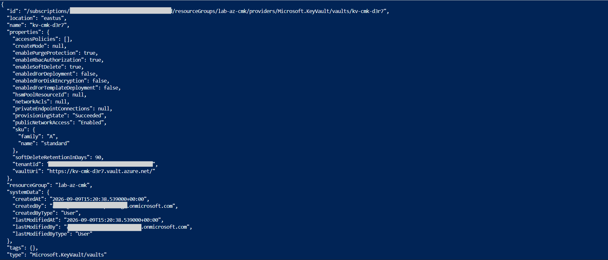
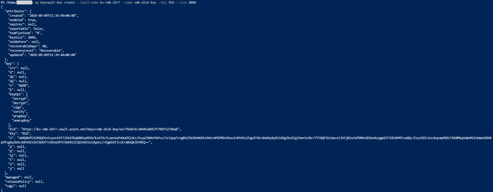
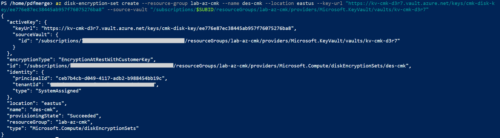
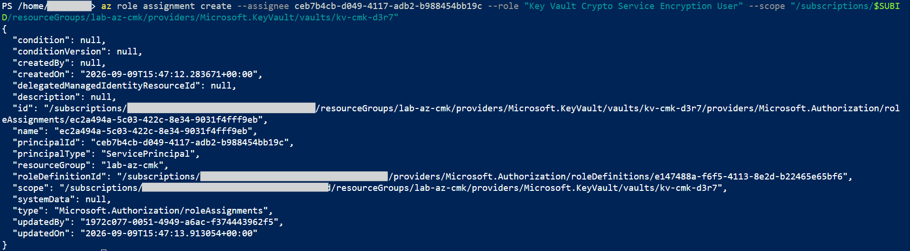
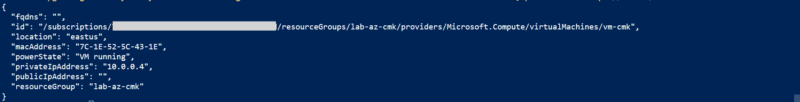
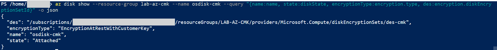

# Lab: Customer Managed Key Disk Encryption (Disk Encryption Set with Key Vault)

> Azure encrypts VM disks at rest by default, but with a key Microsoft holds. This lab moves that
> key into your own control. An RSA key lives in a purge protected Key Vault, a Disk Encryption Set
> links it to disk encryption, and a VM boots from an OS disk that is encrypted with that key rather
> than the platform key. The result is a disk you can crypto shred on demand by revoking access to
> the key, which is the control regulated workloads require.

**Domain:** 3 (Compute and AI Security)
**Services:** Azure Key Vault, Key Vault keys, Disk Encryption Set, Managed Disks, Azure VM
**Status:** Complete, evidenced, and torn down

---

## Objective

Encrypt a VM operating system disk with a customer managed key instead of the default platform
managed key, and prove the running VM is using it. This demonstrates control over the encryption key
lifecycle: the key lives in your vault, a dedicated identity is granted least privilege access to
use it, and revoking that access renders the disk unreadable.

## The problem (insecure default)

Every Azure managed disk is encrypted at rest, which sounds sufficient until you ask who holds the
key. By default Microsoft holds it. For many workloads that is fine, but regulated environments and
strong data sovereignty requirements need the customer to own the key: to rotate it, audit its use,
and be able to revoke it so the data becomes unreadable even to the platform. Relying on the default
platform managed key gives none of that control, and there is no way to prove or enforce separation
between the data and the key that protects it.

## Lab environment

| Item | Value |
|---|---|
| Resource group | lab-az-cmk (East US) |
| Key Vault | kv-cmk-d3r7, purge protection on, RBAC authorization |
| Key | cmk-disk-key, RSA 2048 |
| Disk Encryption Set | des-cmk, system assigned managed identity |
| Encrypted disk | osdisk-cmk, EncryptionAtRestWithCustomerKey |
| Virtual machine | vm-cmk, booted from the encrypted disk, no public IP |

## What I built

A Key Vault holding an RSA key, a Disk Encryption Set that binds the key to disk encryption, and a
VM whose operating system disk was created already encrypted with that key.

| Component | Role here |
|---|---|
| Key Vault with purge protection | Holds the key and guarantees it cannot be permanently deleted |
| RSA 2048 key | The customer managed key that wraps the disk encryption key |
| Disk Encryption Set | Binds the key to disk encryption and carries its own identity |
| Role assignment on the vault | Grants the Disk Encryption Set identity wrap and unwrap on the key |
| Encrypted OS disk plus VM | The disk is born encrypted with the key, and the VM boots from it |

### Design decisions (the "why")

- **Purge protection is mandatory, not optional.** A disk encrypted with a customer key becomes a
  single point of catastrophic failure: lose the key and the disk is unrecoverable. Azure refuses to
  back a Disk Encryption Set with a vault that allows permanent key deletion, so purge protection is
  enabled. It is a one way switch, which is acceptable here and correct in production.
- **RBAC authorization on the vault, not access policies.** This matches the approach in the Key
  Vault secrets lab and let me grant the Disk Encryption Set identity a single narrow role rather
  than a broad policy.
- **A dedicated least privilege role for the encryption identity.** The Disk Encryption Set gets a
  system assigned identity, and that identity was granted only Key Vault Crypto Service Encryption
  User, which allows wrap, unwrap, and get on keys and nothing else. The encryption service can use
  the key but cannot manage or export it.
- **The disk was created encrypted first, then the VM was built from it.** Applying a Disk
  Encryption Set to the OS disk of an already running VM is not allowed, and attempting it during VM
  creation failed with exactly that error. Creating the encrypted disk from the image first, then
  attaching it to a new VM, produces a clean customer key encrypted OS disk with no such conflict.

## Steps and output

Create a Key Vault with purge protection, which the Disk Encryption Set requires:

```
az keyvault create --name kv-cmk-d3r7 --resource-group lab-az-cmk --location eastus --enable-purge-protection true --enable-rbac-authorization true
# enablePurgeProtection true, enableRbacAuthorization true
```

Grant yourself a data plane role on the RBAC vault, then create the RSA key. Owner on the control
plane does not include key operations, so the first attempt returned Forbidden until the role was
assigned:

```
az role assignment create --assignee <MY_OBJECT_ID> --role "Key Vault Crypto Officer" --scope <VAULT_ID>
az keyvault key create --vault-name kv-cmk-d3r7 --name cmk-disk-key --kty RSA --size 2048
# kty RSA, keySize 2048, keyOps include wrapKey and unwrapKey
```

Create the Disk Encryption Set pointing at the key. It provisions with its own system assigned
identity:

```
az disk-encryption-set create --resource-group lab-az-cmk --name des-cmk --location eastus --key-url <KEY_URL> --source-vault <VAULT_ID>
# encryptionType EncryptionAtRestWithCustomerKey, identity.type SystemAssigned, identity.principalId <DES_OID>
```

Grant the Disk Encryption Set identity access to use the key. This is the dependency that makes the
whole thing work, and it uses the purpose built encryption role:

```
az role assignment create --assignee <DES_OID> --role "Key Vault Crypto Service Encryption User" --scope <VAULT_ID>
```

Create the OS disk already encrypted with the key, from the Ubuntu image, then boot a VM from it:

```
az disk create --resource-group lab-az-cmk --name osdisk-cmk --image-reference Canonical:0001-com-ubuntu-server-jammy:22_04-lts-gen2:latest --disk-encryption-set des-cmk --os-type Linux
# encryption.type EncryptionAtRestWithCustomerKey, diskEncryptionSetId des-cmk

az vm create --resource-group lab-az-cmk --name vm-cmk --attach-os-disk osdisk-cmk --os-type Linux --size Standard_D2als_v7 --nics vm-cmkVMNic
# powerState VM running, no public IP
```

Verify the running VM disk uses the customer key:

```
az disk show --resource-group lab-az-cmk --name osdisk-cmk --query "{state:diskState, encryptionType:encryption.type, des:encryption.diskEncryptionSetId}" -o json
# state Attached, encryptionType EncryptionAtRestWithCustomerKey, des .../des-cmk
```

## Evidence

*No sensitive identifiers appear in these images. Subscription and tenant identifiers, object IDs,
and user names are masked or cropped. Resource names and key URLs are retained as they are not
sensitive.*

**01. Key Vault created with purge protection and RBAC authorization enabled**


**02. RSA 2048 key created in the vault, with wrap and unwrap operations**


**03. Disk Encryption Set created with a system assigned identity, pointing at the key**


**04. The Disk Encryption Set identity granted Crypto Service Encryption User on the vault**


**05. VM created and running, booted from the encrypted disk, no public IP**


**06. The attached OS disk verified as EncryptionAtRestWithCustomerKey via the Disk Encryption Set**


## Configuration and identifiers (redacted)

Built with the Azure CLI. Subscription and tenant identifiers, and object identifiers for the admin
user and the Disk Encryption Set identity, are masked in the images. The key operations list on the
RSA key shows wrapKey and unwrapKey, which is the mechanism: the disk is encrypted with a symmetric
data encryption key, and that key is wrapped by the RSA key in the vault. The vault key never
touches disk data directly, it protects the key that does.

## SC 500 concepts demonstrated

- **Customer managed keys versus platform managed keys.** The disk is encrypted at rest with a key
  held in the customer vault and referenced through a Disk Encryption Set, rather than a key held by
  the platform. This is the control that data sovereignty and compliance requirements ask for.
- **Envelope encryption and crypto shredding.** The RSA key wraps the disk data encryption key.
  Revoking the Disk Encryption Set identity access to the vault key, or disabling the key, means the
  data encryption key can no longer be unwrapped and the disk becomes unreadable. This is a
  deliberate destruction capability, not just confidentiality.
- **Purge protection as a hard requirement.** Because the customer key becomes essential to the
  data, the vault must guarantee the key cannot be permanently deleted, so purge protection is
  required before a Disk Encryption Set will use it.
- **Control plane versus data plane, applied to a service identity.** The Disk Encryption Set exists
  as a resource but cannot use the key until its identity is granted a data plane role. This is the
  same distinction seen in the Key Vault secrets lab, where an Owner could not read a secret until
  granted a data plane role, now applied to a managed identity rather than a user.
- **Least privilege for the encryption service.** The identity received only Key Vault Crypto
  Service Encryption User, which permits wrap, unwrap, and get, and nothing that would let it manage
  or exfiltrate the key.

## How I'd extend this

- Rotate the key to a new version and confirm the Disk Encryption Set picks up the rotation, which
  is the operational reason to own the key in the first place.
- Extend customer key encryption to data disks and to the temp disk with encryption at host, so the
  entire disk footprint uses the customer key.
- Demonstrate crypto shredding directly by disabling the key or removing the identity role
  assignment and showing the VM can no longer start, then restoring access.
- Store the key in an HSM backed vault (Premium tier) for workloads that require keys never to exist
  in software.

## Cross links

This lab is the encryption counterpart to the Key Vault secrets lab. That lab used the vault to hold
application secrets and showed that managing the vault is separate from reading its contents. Here
the vault holds a disk encryption key, the same control plane and data plane separation appears for
a service identity rather than a user, and the vault becomes the pivot on which the disk data
depends. Together they show the two roles a vault plays: protecting secrets that applications read,
and protecting keys that encrypt data at rest.

## Cleanup

```
az group delete --name lab-az-cmk --yes --no-wait
az group exists --name lab-az-cmk
```

Deleting the resource group removes the VM, the encrypted disk, the Disk Encryption Set, the
networking, and the Key Vault in one operation. Because purge protection is enabled, the vault
enters a soft deleted state and cannot be purged until its retention period passes. This is expected
for a customer key vault and costs nothing while it waits to expire.

**Cost note:** every resource in this lab is free or negligible. The Key Vault, key, and Disk
Encryption Set carry no meaningful charge, and the VM ran only long enough to prove the disk was
encrypted before being torn down in the same session. Total cost was on the order of a few rupees.
