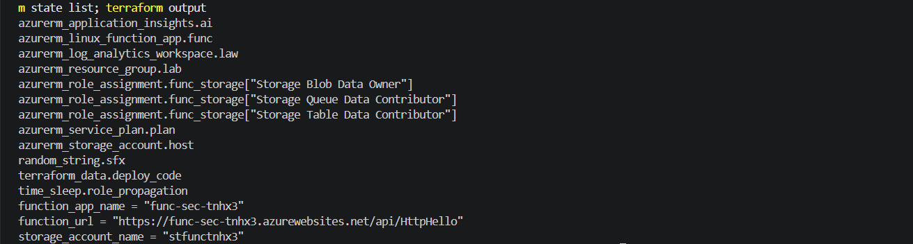
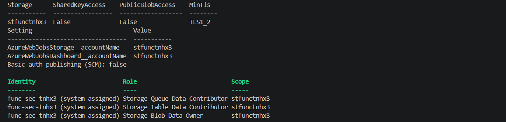
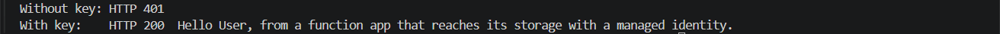
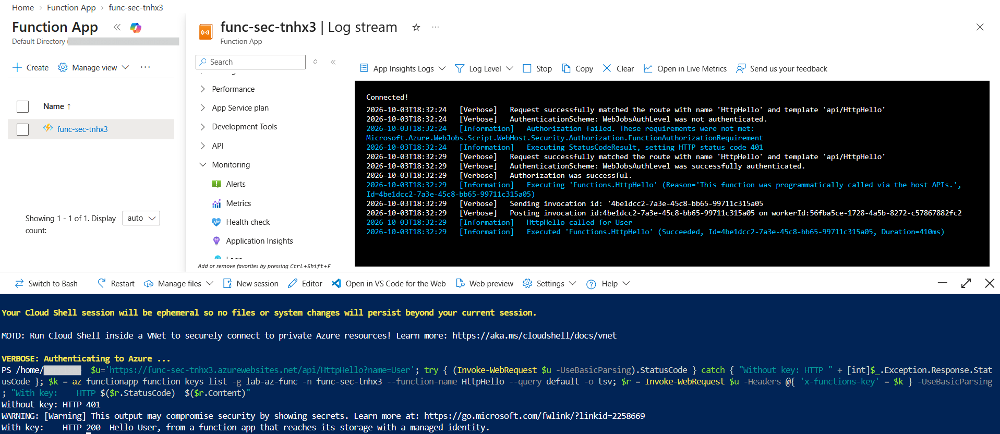

# Lab: Function App Security (Identity Based Storage, Function Keys, Live Monitoring)

> A function app created with defaults keeps a storage account key in its settings, accepts
> deployments with a shared publishing password, and is often published with anonymous HTTP
> triggers. This lab builds one with Terraform that holds no key at all: the host reaches its
> storage with its own managed identity on an account where shared key access is switched off,
> deployments go through Entra ID only, and the HTTP function refuses any caller without a function
> key. The result is then tested live, watching rejected and accepted calls arrive in the log stream.

**Domain:** 3 (Compute and AI Security)
**Services:** Azure Functions, Azure Storage, Managed Identities, Azure RBAC, Application Insights, Log Analytics, Terraform
**Status:** Complete, evidenced, and torn down

---

## Objective

Deploy a Linux function app as code that has no storage key, no basic authentication publishing
and no anonymous endpoint, then prove each point from outside: the storage account rejects key
access, the app settings contain only an account name, a call without a key gets 401 while a keyed
call gets 200, and both outcomes appear in real time in the log stream.

## The problem (insecure default)

| Default | Why it is a problem |
|---|---|
| `AzureWebJobsStorage` holds a full connection string with the account key | Anyone who can read the app settings holds a key to the whole storage account, which also stores the function keys and runtime state |
| Shared key access left on the storage account | Any leaked key or SAS works, and access is not tied to an identity or audited per caller |
| Basic authentication publishing enabled | Deployment accepts a shared username and password that bypasses Entra ID, MFA and Conditional Access |
| HTTP triggers set to `anonymous` | The function is callable by anyone who finds the URL |

## Lab environment

| Item | Value |
|---|---|
| Resource group | lab-az-func (Central India) |
| Function app | func-sec-tnhx3, Linux, Node.js 20, system assigned identity, HTTPS only, TLS 1.2, FTPS disabled |
| Plan | asp-func, Linux B1 |
| Storage account | stfunctnhx3, shared key access off, public blob access off, TLS 1.2 |
| Monitoring | appi-func (Application Insights) on workspace law-func |
| Function | HttpHello, HTTP GET, `authLevel: function` |
| Built with | Terraform (azurerm 4.x) run from my PC, code deployed with the Azure CLI |

## What I built

| Component | Role here |
|---|---|
| `storage_uses_managed_identity = true` | Writes `AzureWebJobsStorage__accountName` instead of a connection string |
| `shared_access_key_enabled = false` | The storage account refuses every request signed with an account key or SAS |
| Three storage data roles on the app identity | Blob Data Owner, Queue Data Contributor and Table Data Contributor, the set the Functions host needs |
| Basic auth publishing disabled | Both the SCM and FTP publishing endpoints refuse the shared publishing credential |
| `authLevel: function` | Each call must present the function key in the `x-functions-key` header |
| Application Insights | Carries the live log stream and the invocation history |
| `storage_use_azuread = true` on the provider | Terraform itself talks to storage with Entra ID, since key access is off |

### Design decisions (the "why")

- **Dedicated B1 plan rather than Consumption.** On the Linux Consumption plan the function code
  lives on an Azure Files share that still requires a key based connection string. A dedicated plan
  runs the code from the app itself, so the storage account can have key access switched off
  completely. Flex Consumption is the serverless option that also supports this.
- **Data roles on the account, not management roles.** Contributor on a storage account lets an
  identity read the account keys, which defeats the purpose. The host gets only data plane roles,
  and with key access off there are no keys to read anyway.
- **Function key, not anonymous.** A function key is the minimum control for an HTTP trigger. It is
  still a shared secret, so it travels in a header rather than the URL and is never printed in the
  evidence. Entra ID authentication in front of the app is the stronger option and is listed under
  How I'd extend.
- **Deployment through the Azure CLI.** With basic authentication off, Terraform's own zip deploy
  path cannot be used. The CLI deploys with an Entra ID token instead, called from a
  `terraform_data` resource so the whole build is still one `terraform apply`.

## Steps and output

Register the providers this lab adds, then build from PowerShell on the lab PC:

```
foreach ($ns in 'Microsoft.Storage','Microsoft.Insights','Microsoft.AlertsManagement') { az provider register --namespace $ns }
$env:ARM_SUBSCRIPTION_ID = az account show --query id -o tsv
terraform init
terraform plan -out tfplan
terraform apply tfplan
# Plan: 12 to add
```

**Finding: a zip made with Compress-Archive breaks on a Linux host.** The first deployment failed
with "Deployment Failed ... Extract zip". Windows PowerShell's `Compress-Archive` writes paths inside
the zip with backslashes, which the Linux host cannot unpack into folders. Packaging with the
built in `tar.exe -a -c -f function.zip` produces forward slash paths, and the redeploy succeeded.
The Azure CLI zip deploy also sets `SCM_DO_BUILD_DURING_DEPLOYMENT`, so that setting is declared in
`main.tf` to keep the plan clean.

Prove the host holds no key:

```
az storage account show -n stfunctnhx3 -g lab-az-func --query "{storage:name, sharedKeyAccess:allowSharedKeyAccess, publicBlobAccess:allowBlobPublicAccess, minTls:minimumTlsVersion}" -o table
az functionapp config appsettings list -g lab-az-func -n func-sec-tnhx3 --query "[?starts_with(name,'AzureWebJobs')].{setting:name, value:value}" -o table
az resource show --ids "<FUNCTION_APP_ID>/basicPublishingCredentialsPolicies/scm" --query properties.allow -o tsv
# sharedKeyAccess False, publicBlobAccess False
# AzureWebJobsStorage__accountName    stfunctnhx3
# AzureWebJobsDashboard__accountName  stfunctnhx3
# false
```

Call the function without and with its key:

```
$u = 'https://func-sec-tnhx3.azurewebsites.net/api/HttpHello?name=User'
try { (Invoke-WebRequest $u -UseBasicParsing).StatusCode } catch { "Without key: HTTP " + [int]$_.Exception.Response.StatusCode }
$k = az functionapp function keys list -g lab-az-func -n func-sec-tnhx3 --function-name HttpHello --query default -o tsv
$r = Invoke-WebRequest $u -Headers @{ 'x-functions-key' = $k } -UseBasicParsing
"With key: HTTP $($r.StatusCode) $($r.Content)"
# Without key: HTTP 401
# With key: HTTP 200 Hello User, from a function app that reaches its storage with a managed identity.
```

**Real time test.** With the portal log stream connected, the same two calls appear within seconds:
the first as `AuthenticationScheme: WebJobsAuthLevel was not authenticated` followed by
`Authorization failed` and status code 401, the second as `successfully authenticated`,
`HttpHello called for User` and `Executed 'Functions.HttpHello' (Succeeded, Duration=410ms)`.

## Evidence

*No sensitive identifiers appear in these images. Subscription and tenant identifiers, the tenant
domain, user names and the function key are masked or never printed. Resource names and invocation
IDs are retained as they are not sensitive.*

**01. Terraform state listing every managed resource, and the outputs**


**02. Shared key access off, host settings hold only the account name, basic auth publishing off, data roles on the app identity**


**03. HTTP 401 without the function key, HTTP 200 with it**


**04. Live log stream showing the rejected call and the successful invocation**


## Configuration and identifiers (redacted)

The full build is in [`terraform/main.tf`](terraform/main.tf) and the function is in
[`function-code/`](function-code/). The state file, saved plan and the packaged zip are excluded by
[`terraform/.gitignore`](terraform/.gitignore). Subscription and object IDs appear only as
placeholders such as `<FUNCTION_APP_ID>`.

The settings that remove every key:

```hcl
resource "azurerm_storage_account" "host" {
  shared_access_key_enabled       = false
  allow_nested_items_to_be_public = false
  min_tls_version                 = "TLS1_2"
}

resource "azurerm_linux_function_app" "func" {
  storage_account_name                           = azurerm_storage_account.host.name
  storage_uses_managed_identity                  = true
  ftp_publish_basic_authentication_enabled       = false
  webdeploy_publish_basic_authentication_enabled = false
}
```

## SC-500 concepts demonstrated

- **Identity based connections for the Functions host.** `AzureWebJobsStorage__accountName` with
  the app's managed identity replaces the connection string, and the identity needs storage data
  roles to work.
- **Disabling shared key authorization.** With `allowSharedKeyAccess` false, account keys and SAS
  tokens signed with them stop working, so every request is an Entra ID request that is attributed
  and governed by RBAC.
- **Function access levels.** `anonymous` needs nothing, `function` needs a function or host key,
  and `admin` needs the master key. Keys identify that a caller holds a secret, not who the caller
  is.
- **Function keys versus App Service authentication.** For user or service identity, put Entra ID
  authentication (Easy Auth) in front of the app and use access levels only as a second layer.
- **Basic authentication publishing.** Disabling it forces deployments through Entra ID, so MFA,
  Conditional Access and RBAC apply to whoever ships code.
- **Monitoring as a control.** Application Insights records each failed and successful invocation,
  which is the raw material for detection rules.

## How I'd extend this

- Put App Service authentication with Entra ID in front of the app, require a token for an app
  registration, and show an unauthenticated call failing before it ever reaches the function key
  check.
- Move to the Flex Consumption plan, which supports identity based deployment storage, to get the
  same no key design on a serverless plan.
- Add a private endpoint for the storage account and VNet integration for the app, then disable
  public network access on storage.
- Store a downstream API secret in Key Vault and read it through a Key Vault reference, as in the
  app platform secrets lab, or better, call the downstream service with the app's identity.
- AI security angle: use a function as a guarded gateway in front of an Azure OpenAI deployment,
  calling the model with the app's managed identity and Cognitive Services OpenAI User, so no model
  key exists anywhere and every prompt passes through code that can log and filter it.
- Send the function logs and storage diagnostic logs to Microsoft Sentinel and alert on a burst of
  401 responses, which suggests someone probing for a function key.

## Cross links

- [App platform secrets with managed identity](../app-platform-keyvault-identity/) covered Key Vault
  references on App Service. A function app uses exactly the same mechanism.
- [Storage blob authorization](../../2-storage-databases-networking/storage-blob-authorization/)
  worked through key, SAS and Entra ID access on storage. This lab removes keys from the one storage
  account that every function app depends on.
- [ACR image security](../acr-image-security/) and [Secure AKS cluster](../aks-cluster-security/)
  removed shared credentials from the container supply chain. Disabling basic authentication
  publishing does the same for code deployment.
- [Key Vault secrets](../../2-storage-databases-networking/key-vault-secrets/) introduced the
  management plane and data plane split that decides which storage roles the host receives.

## Cleanup

Terraform state was kept locally, so the lab is removed from the `terraform` folder with:

```
terraform destroy
az group exists --name lab-az-func
```

**Cost note:** the B1 plan is the only resource billed by the hour. The storage account,
Application Insights and the workspace cost a few cents at this volume. The lab ran for about an
hour, so the total was well under a dollar.
