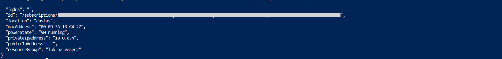
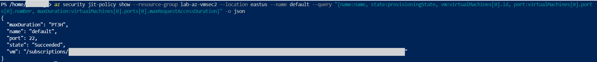
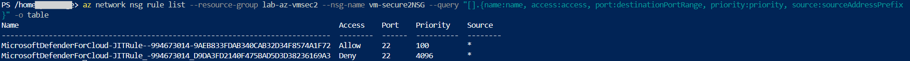
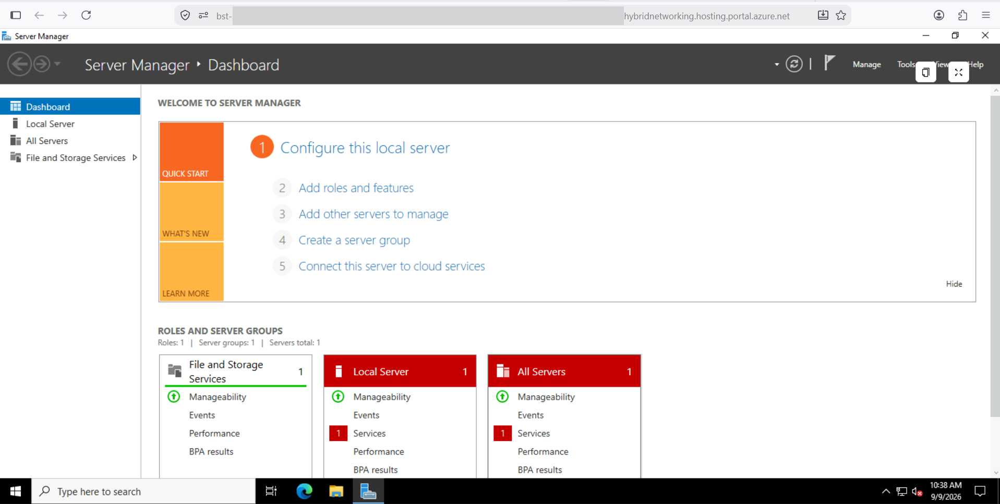
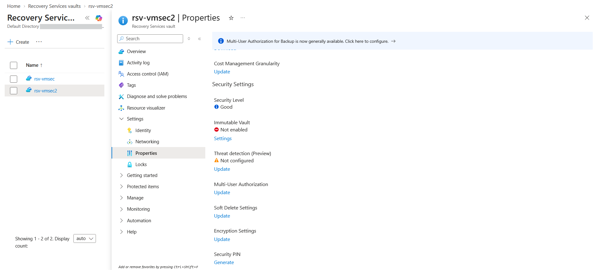

# Lab: Securing VM Access and Backups (Just in Time, Bastion, Multi User Authorization)

> A Windows or Linux VM with no public IP is only useful if an admin can still reach it safely, and
> only trustworthy if its backups cannot be quietly destroyed. This lab covers both. Just in Time
> access keeps management ports closed and opens them briefly on request, Azure Bastion brokers the
> connection so the VM never needs a public IP, and Multi User Authorization stops any single admin
> from deleting the backups. Every control was configured and proven live.

**Domain:** 3 (Compute and AI Security)
**Services:** Microsoft Defender for Servers, Just in Time VM access, Azure Bastion, Recovery Services vault, Azure Backup, Resource Guard
**Status:** Complete, evidenced, and torn down

---

## Objective

Demonstrate the three controls that make a virtual machine safe to operate: reach it without
exposing it (Bastion), open management ports only when genuinely needed (Just in Time), and protect
its backups from a rogue or compromised administrator (Multi User Authorization). Together these
cover secure access and recovery integrity, both squarely in the SC 500 compute security domain.

## The problem (insecure default)

The default way to manage a VM is to give it a public IP and leave RDP or SSH open. Bots scan for
exposed 3389 and 22 constantly, so that single choice is the most attacked configuration in Azure.
Two failures compound it. First, even when a port is opened only for legitimate work, it usually
stays open afterward and becomes standing attack surface. Second, backups are treated as safe by
default, yet a rogue admin or ransomware operator will delete them first so recovery is impossible.
Neither the network layer nor ordinary RBAC closes these gaps on its own.

## Lab environment

| Item | Value |
|---|---|
| Resource group | lab-az-vmsec2 (East US) |
| Virtual machine | vm-secure2, no public IP, NSG present, SSH closed by default |
| Defender plan | Defender for Servers Plan 2 (Standard), subscription scope |
| JIT policy | default, port 22, three hour maximum access window |
| Bastion | bastion host in a dedicated AzureBastionSubnet, browser based connection |
| Recovery Services vault | rsv-vmsec2 |
| Resource Guard | rg-guard-vmsec2 |
| Multi User Authorization | Enabled on the vault via the Resource Guard |

## What I built

A single VM protected by three independent controls, each addressing a different weakness in the
default setup.

| Control | What it does here |
|---|---|
| No public IP plus closed NSG | Removes the internet facing attack surface entirely |
| Defender for Servers | Provides the Just in Time capability and workload protection |
| Just in Time VM access | Keeps port 22 denied, injects a temporary allow rule only on an approved request |
| Azure Bastion | Brokers RDP or SSH in the browser over the private network, so no public IP is ever needed |
| Recovery Services vault plus backup | Holds the VM backups |
| Resource Guard plus Multi User Authorization | Requires a second authorization for destructive backup operations |

### Design decisions (the "why")

- **The VM has no public IP and starts with SSH closed.** This is the secure baseline. The rest of
  the lab exists to answer the obvious question it raises: if nothing is exposed, how does an admin
  still get in when they need to, and how are the backups kept safe.
- **Just in Time was configured through the Security REST API rather than the portal.** The portal
  Just in Time blade was unreliable in this environment and would not surface the VM as
  configurable. There is no CLI create verb for a JIT policy, only list and show, so the policy was
  written as JSON and applied with a PUT to the Security API. This turned out cleaner and more
  repeatable than the portal.
- **A short maximum access window (three hours) and per request source.** Access is granted for the
  minimum time and only when requested, so the port is closed almost all of the time and every grant
  is recorded.
- **Multi User Authorization was associated through the portal.** The CLI mapping command returned
  repeated internal server errors on this subscription, so the Resource Guard was associated with
  the vault from the vault Properties page, which completed cleanly.
- **The Resource Guard sits in the same subscription for this lab.** In production it belongs in a
  separate subscription or tenant owned by a different team, which is what makes the two person rule
  real. That production placement is noted rather than built, since the lab uses a single
  subscription.

## Steps and output

Create the VM with no public IP and no default inbound rule, so SSH is closed from the start:

```
az vm create --resource-group lab-az-vmsec2 --name vm-secure2 --image Ubuntu2204 --size Standard_D2als_v7 --admin-username azureuser --generate-ssh-keys --public-ip-address "" --nsg-rule NONE
```

Confirm Defender for Servers Plan 2 is enabled on the subscription (the Just in Time prerequisite):

```
az security pricing show --name VirtualMachines --query "{tier:pricingTier, plan:subPlan}" -o json
# tier Standard, plan P2
```

Create the Just in Time policy through the Security REST API. The policy governs port 22 with a
three hour maximum window:

```
# jitpolicy.json describes the VM, port 22, protocol *, source *, maxRequestAccessDuration PT3H
az rest --method PUT --uri "https://management.azure.com/subscriptions/<SUBSCRIPTION_ID>/resourceGroups/lab-az-vmsec2/providers/Microsoft.Security/locations/eastus/jitNetworkAccessPolicies/default?api-version=2020-01-01" --body '@jitpolicy.json'
# provisioningState Succeeded, port 22, maxRequestAccessDuration PT3H
```

Request time boxed access. Defender validates the request against RBAC and then opens the port for
the requested window:

```
# jitrequest.json requests port 22 for PT1H with a justification
az rest --method POST --uri "https://management.azure.com/subscriptions/<SUBSCRIPTION_ID>/resourceGroups/lab-az-vmsec2/providers/Microsoft.Security/locations/eastus/jitNetworkAccessPolicies/default/initiate?api-version=2020-01-01" --body '@jitrequest.json'
```

Inspect the NSG afterward. Defender has injected a temporary allow rule above its baseline deny:

```
az network nsg rule list --resource-group lab-az-vmsec2 --nsg-name vm-secure2NSG -o table
# MicrosoftDefenderForCloud-JITRule ...  Allow  22  priority 100    (temporary, added on request)
# MicrosoftDefenderForCloud-JITRule ...  Deny   22  priority 4096   (baseline, closed by default)
```

Backup protection: create the vault, create the Resource Guard, then associate the guard with the
vault to turn Multi User Authorization on:

```
az backup vault create --resource-group lab-az-vmsec2 --name rsv-vmsec2 --location eastus
az dataprotection resource-guard create --resource-group lab-az-vmsec2 --name rg-guard-vmsec2 --location eastus
# association done from the vault Properties page, Multi User Authorization, Select Resource Guard
az backup vault show --resource-group lab-az-vmsec2 --name rsv-vmsec2 --query "properties.securitySettings.multiUserAuthorization" -o tsv
# Enabled
```

Azure Bastion for connection without exposure: a dedicated AzureBastionSubnet, a Standard public IP
on the Bastion host, and a browser session to the VM which itself has no public IP.

## Evidence

*No sensitive identifiers appear in these images. Subscription and tenant identifiers, object IDs,
user names, and public IP addresses are masked or cropped. Private addresses in the 10.x range are
retained as they are not sensitive.*

**01. VM vm-secure2 running with no public IP**


**02. Defender for Servers Plan 2 enabled on the subscription**


**03. Just in Time policy on the VM, port 22, three hour maximum window**


**04. After an access request: a temporary allow rule sits above the baseline deny for port 22**


**05. Bastion session to the VM in the browser, with no public IP on the VM**


**06. Recovery Services vault security settings before Multi User Authorization**


**07. Multi User Authorization enabled on the vault**


## Configuration and identifiers (redacted)

Built with the Azure CLI and the portal. Subscription identifiers in resource paths are shown as
`<SUBSCRIPTION_ID>`. The Resource Guard operations list, which enumerates every destructive backup
operation the guard gates (delete protection, disable soft delete, reduce retention, remove MUA,
stop protection, weaken immutability, and more), was reviewed during the build and confirms what the
two person rule actually protects. Defender for Servers is a subscription scoped setting and was
returned to the Free tier after the lab.

## SC 500 concepts demonstrated

- **Just in Time as deny by default with allow on request.** The NSG holds a baseline deny on port
  22 and Defender injects a higher priority allow only for an approved, time boxed request, then
  removes it when the window closes. Access is audited and access surface is near zero the rest of
  the time.
- **Bastion as connection without exposure.** The VM keeps no public IP and no open inbound internet
  rule. Bastion proxies the session over the private network in the browser, so the connection path
  never crosses the public internet to the VM.
- **The two controls are complementary, not redundant.** Just in Time reduces how long a port is
  open. Bastion removes the public path entirely. Used together, and behind an organization wide
  deny such as an Azure Virtual Network Manager security admin rule, they give defense in depth for
  administrative access.
- **Multi User Authorization as separation of duties on recovery.** A Resource Guard gates
  destructive backup operations so that a single administrator, even a compromised one, cannot
  delete backups or weaken their protection without a second authorization. This protects the last
  line of defense against ransomware and insider threat.
- **Defender for Servers as the platform for workload protection.** Just in Time is one capability
  it provides, alongside threat detection and posture features.

## How I'd extend this

- Place the Resource Guard in a separate subscription or tenant owned by a security team, which is
  what makes the second authorization a genuine control rather than a formality.
- Use a tag based dynamic assignment so any new VM that carries a given tag inherits the Just in
  Time policy automatically.
- Stream Defender alerts, Just in Time activity, and backup operation logs to a Log Analytics
  workspace and hunt on them in Microsoft Sentinel, which connects this lab to the monitoring
  domain.
- Combine with the network labs so the VM sits behind a private endpoint and its egress is
  constrained by a firewall or an Azure Virtual Network Manager rule, giving control at the network
  and the access layers at once.

## Cross links

This lab completes the administrative access story that runs through the portfolio. The Azure
Virtual Network Manager lab denies RDP from the internet across every VNet as an organization wide
baseline. Just in Time then grants that access back, but only on request and only for a short
window. Bastion provides the connection method that needs no public IP at all. Multi User
Authorization protects the backups that are the final safeguard if any of the above is bypassed.
The theme is consistent: deny broadly, grant narrowly and briefly, connect without exposure, and
protect the recovery layer.

## Cleanup

```
az group delete --name lab-az-vmsec2 --yes --no-wait
az group wait --name lab-az-vmsec2 --deleted
az security pricing create --name VirtualMachines --tier Free
```

Deleting the resource group removes the VM, the Just in Time policy, the vault, the Resource Guard,
the Bastion host and its public IP, and the NSG in one operation. Defender for Servers is a
subscription level setting that survives the resource group deletion, so it is returned to Free
separately.

**Cost note:** Defender for Servers ran inside its thirty day free trial, so it cost nothing.
Azure Bastion is the one meaningful charge at roughly sixteen rupees per hour while provisioned, and
it was torn down in the same session. The VM, vault, and Resource Guard were negligible. The whole
lab cost on the order of a few tens of rupees.
