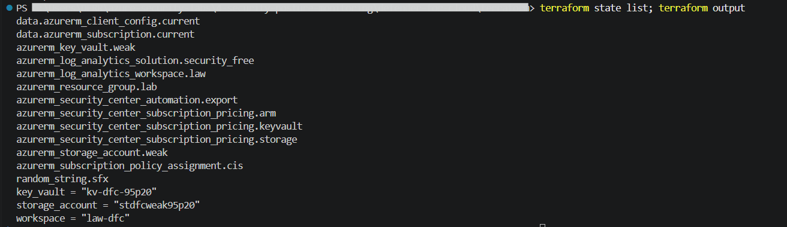
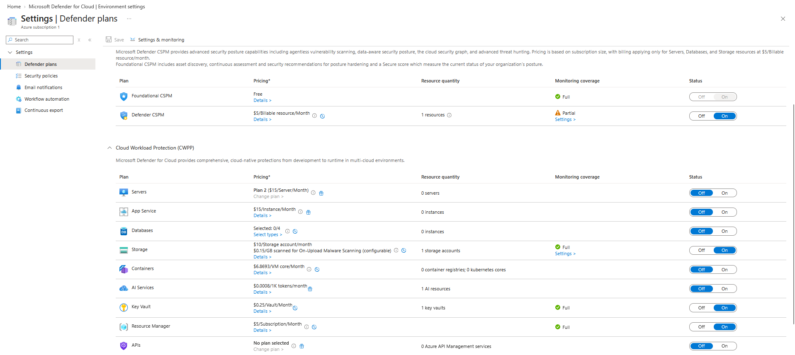
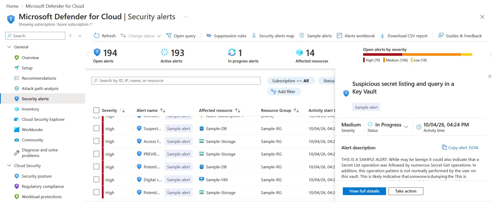
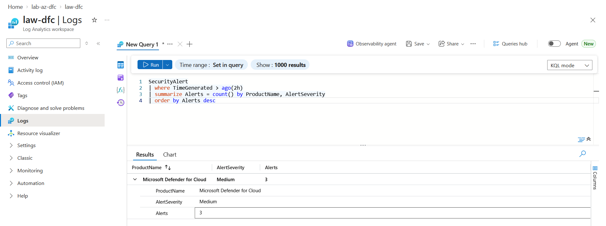
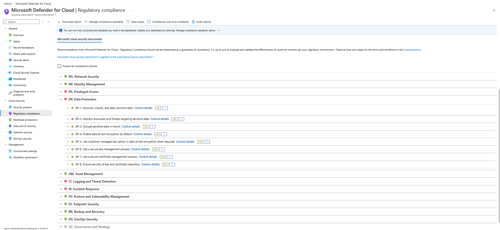
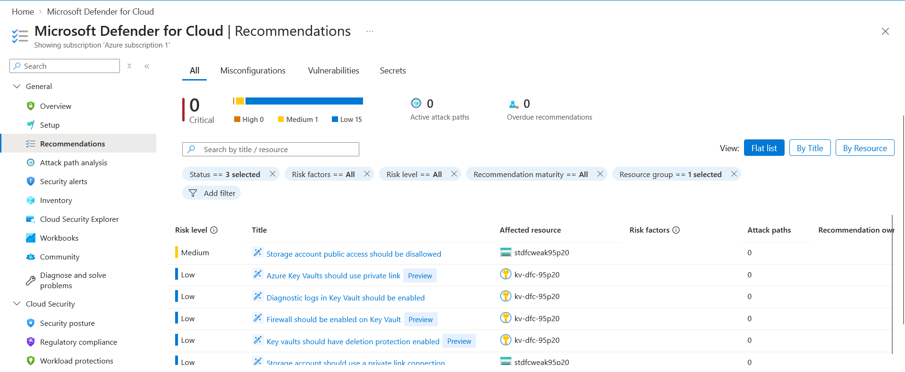

# Lab: Microsoft Defender for Cloud (Posture, Workload Protection, Alert Triage and Export)

> Defender for Cloud does two separate jobs that are easy to blur together. Posture management
> scores how resources are configured and maps that to compliance standards. Workload protection
> watches resources at runtime and raises threat alerts. This lab builds both with Terraform:
> three paid Defender plans, a compliance standard, a deliberately weak storage account and key
> vault for Defender to find, and continuous export of alerts and recommendations into a Log
> Analytics workspace that the Sentinel labs build on.

**Domain:** 4 (Security Posture and Monitoring)
**Services:** Microsoft Defender for Cloud, Defender CSPM, Defender for Storage, Defender for Key Vault, Defender for Resource Manager, Azure Policy, Log Analytics, Terraform
**Status:** Complete, evidenced, and torn down

---

## Objective

Turn on workload protection for storage, Key Vault and Resource Manager as code, give Defender
something worth reporting on, then prove each half of the product works: the plans are on,
alerts are raised and triaged, the compliance dashboard scores the subscription, the weak
settings surface as recommendations, and the security data reaches a workspace where a SIEM can
use it.

## The problem (insecure default)

| Default | Why it is a problem |
|---|---|
| Only Foundational CSPM is on | Recommendations and a secure score exist, but nothing detects an attack in progress against storage, vaults or the control plane |
| Alerts only live in the Defender portal | No correlation with other logs, no retention you control, nothing for a SOC to query |
| Compliance tracked by hand | No continuous mapping of resource settings to a benchmark auditors recognise |
| Storage and vaults created with defaults | Public network access, anonymous blob access allowed, no purge protection, no diagnostic logs |

## Lab environment

| Item | Value |
|---|---|
| Resource group | lab-az-dfc (Central India) |
| Defender plans (Terraform) | Storage (Defender for Storage, per storage account, with on upload malware scanning capped at 10 GB), Key Vault (per vault), Resource Manager (per subscription) |
| Defender CSPM | Already on for the subscription, left outside Terraform |
| Compliance | Microsoft cloud security benchmark (default), CIS Microsoft Azure Foundations Benchmark v2.0.0 assigned with Azure Policy |
| Weak resources | stdfcweak95p20 (storage), kv-dfc-95p20 (Key Vault) |
| Export target | law-dfc (Log Analytics) with the SecurityCenterFree solution |
| Export rule | export-dfc-to-law, streaming Alerts and Assessments |
| Built with | Terraform (azurerm 4.x) run from my PC, triage in the portal |

## What I built

| Component | Role here |
|---|---|
| `azurerm_security_center_subscription_pricing` x3 | Moves Storage, Key Vault and Resource Manager from Free to Standard |
| Storage plan extensions | Declares on upload malware scanning and sensitive data discovery so the plan matches what Azure applies |
| `azurerm_subscription_policy_assignment` | Assigns the CIS Azure 2.0 initiative to the subscription |
| Weak storage account and Key Vault | Public network access on, anonymous blob access allowed, purge protection off, no diagnostics |
| `azurerm_log_analytics_solution` SecurityCenterFree | Creates the SecurityAlert and SecurityRecommendation tables in the workspace |
| `azurerm_security_center_automation` | Continuous export of alerts and assessments to the workspace |

### Design decisions (the "why")

- **Three plans, not all of them.** Storage, Key Vault and Resource Manager are the plans that
  protect resources this lab actually creates, and each one produces sample alerts. Servers,
  SQL and Containers would add cost with nothing to protect.
- **Defender CSPM left unmanaged.** It was already on for the subscription. Managing it in this
  configuration would mean `terraform destroy` turns it off, which is a change outside the lab.
  Destroying a pricing resource returns that plan to Free, so the other three revert cleanly.
- **Weak resources on purpose.** A posture tool is only demonstrable if something fails. Every
  weak setting is a single line in `main.tf`, so each recommendation traces back to code.
- **Export to a workspace, not only the Sentinel connector.** Continuous export keeps the data
  in a workspace I own, alongside recommendations, which the Sentinel connector does not carry.
  The Sentinel labs use this same workspace.

## Steps and output

```
$env:ARM_SUBSCRIPTION_ID = az account show --query id -o tsv
terraform init
terraform plan -out tfplan
terraform apply tfplan
# Apply complete! Resources: 10 added, 0 changed, 0 destroyed.
# (11 after the export fix described below)
```

**Finding: Defender for Storage adds extension settings Terraform did not declare.** The first
plan after apply wanted to change the storage pricing resource. Azure fills in
`AutomatedResponse = None` and `BlobScanResultsOptions = BlobIndexTags` on the malware scanning
extension. Declaring both made the plan come back with no changes.

**Finding: continuous export created as code needs the SecurityCenterFree solution.** The export
rule was enabled and pointed at the workspace, but a query for `SecurityAlert` failed because the
table did not exist. When export is set up in the portal, Defender adds the SecurityCenterFree
(or Security) solution to the workspace automatically. Created through Terraform or the REST API
it is not added, and the data has nowhere to land. Adding `azurerm_log_analytics_solution` fixed
it, with one more catch: a batch of sample alerts raised two minutes after the solution was
created never arrived either. A fresh batch raised an hour later landed within ten minutes.
Export is event based and never back fills, so anything raised before the workspace is ready is
simply lost from the export, although it stays visible in Defender for Cloud.

Confirm the plans:

```
az security pricing list --query "value[?pricingTier=='Standard'].{plan:name, sub:subPlan}" -o table
# StorageAccounts  DefenderForStorageV2
# KeyVaults        PerKeyVault
# Arm              PerSubscription
# CloudPosture     (already on)
```

**Alert triage.** Sample alerts were generated from Security alerts for the three plans. The Key
Vault alert "Suspicious secret listing and query in a Key Vault" was opened, read and moved from
Active to In progress.

**Posture.** The regulatory compliance dashboard scored the subscription at 56 of 63 Microsoft
cloud security benchmark controls passed, with DP-2 (monitor anomalies and threats targeting
sensitive data) failing. Recommendations filtered to the lab resource group mapped one to one
onto the weak settings:

| Recommendation | Risk | Caused by |
|---|---|---|
| Storage account public access should be disallowed | Medium | `allow_nested_items_to_be_public = true` |
| Storage account should use a private link connection | Low | `public_network_access_enabled = true` |
| Key vaults should have deletion protection enabled | Low | `purge_protection_enabled = false` |
| Firewall should be enabled on Key Vault | Low | No network ACLs |
| Azure Key Vaults should use private link | Low | No private endpoint |
| Diagnostic logs in Key Vault should be enabled | Low | No diagnostic setting |

**Export.** The alerts reached the workspace and can be queried with KQL, which is the same data
a Sentinel analytics rule would run against:

```
SecurityAlert
| where TimeGenerated > ago(2h)
| summarize Alerts = count() by ProductName, AlertSeverity
| order by Alerts desc
# Microsoft Defender for Cloud   Medium   3
```

## Evidence

*No sensitive identifiers appear in these images. Subscription and tenant identifiers and local
paths are masked or never printed. "Azure subscription 1" is the default subscription display
name. Resource names are retained as they are not sensitive.*

**01. Terraform state listing every managed resource, and the outputs**


**02. Storage, Key Vault and Resource Manager plans On, Defender CSPM On**


**03. Sample alerts, with a Key Vault alert opened and moved to In progress**


**04. Exported alerts queried in the law-dfc workspace with KQL**


**05. Regulatory compliance, Microsoft cloud security benchmark with Data Protection expanded**


**06. Recommendations for the deliberately weak storage account and Key Vault**


## Configuration and identifiers (redacted)

The full build is in [`terraform/main.tf`](terraform/main.tf). State, plans and logs are excluded
by [`terraform/.gitignore`](terraform/.gitignore). The CIS initiative is referenced by its public
built in definition ID, which is the same in every tenant.

```hcl
resource "azurerm_security_center_subscription_pricing" "keyvault" {
  tier          = "Standard"
  resource_type = "KeyVaults"
  subplan       = "PerKeyVault"
}

resource "azurerm_security_center_automation" "export" {
  scopes = [data.azurerm_subscription.current.id]

  action {
    type        = "loganalytics"
    resource_id = azurerm_log_analytics_workspace.law.id
  }

  source { event_source = "Alerts" }
  source { event_source = "Assessments" }
}
```

## SC-500 concepts demonstrated

- **CSPM versus CWP.** Foundational CSPM (free) gives recommendations, secure score and the
  Microsoft cloud security benchmark. Defender CSPM (paid) adds attack paths, the cloud security
  graph and agentless scanning. The workload plans (CWP) are what raise threat alerts.
- **Plan billing units.** Storage bills per storage account, Key Vault per vault, Resource
  Manager per subscription, Servers per machine. Choosing plans is a cost and coverage decision.
- **Alert lifecycle.** Active, In progress, then Resolved or Dismissed. Suppression rules hide
  known benign alerts. Correlated alerts across resources become a security incident.
- **Regulatory compliance.** The Microsoft cloud security benchmark is assigned by default.
  Further standards such as CIS or NIST are added as Azure Policy initiatives or through Manage
  compliance standards. A passing control is evidence, not a guarantee of compliance.
- **Recommendations are policy results.** Each recommendation is an Azure Policy evaluation, so
  the same rule can be enforced with a Deny assignment instead of only reported.
- **Continuous export versus the Sentinel connector.** Export streams alerts, recommendations,
  secure score and compliance changes to a workspace or Event Hubs. The Sentinel Defender for
  Cloud connector carries alerts only. Export is event based, so it never back fills.

## How I'd extend this

- Fix the weak settings in `main.tf`, apply, and show the recommendations turn healthy and the
  secure score rise.
- Add a Deny assignment for "Storage account public access should be disallowed" so the weak
  storage account could not have been created at all.
- Turn on Defender for Servers on a VM and trigger a real detection with the EICAR test file,
  rather than a sample alert.
- Add a workflow automation that runs a Logic App on high severity alerts to post to Teams or
  open a ticket.
- AI security angle: turn on the Defender for AI Services plan for an Azure OpenAI or Foundry
  deployment and show prompt injection and jailbreak attempts raised as Defender alerts next to
  the storage and Key Vault alerts.
- Connect Defender for Cloud to Microsoft Sentinel and build an analytics rule over the exported
  `SecurityAlert` table, which is the next lab.

## Cross links

- [Azure Policy allowed locations](../../1-identity-access-governance/azure-policy-allowed-locations/)
  used Policy to deny. Here Policy is used to assess, and the results surface as
  recommendations and compliance controls.
- [Storage blob authorization](../../2-storage-databases-networking/storage-blob-authorization/)
  and [Key Vault secrets](../../2-storage-databases-networking/key-vault-secrets/) built these
  services securely. This lab builds them insecurely on purpose and lets Defender find out.
- [Private endpoint DNS](../../2-storage-databases-networking/private-endpoint-dns/) is the fix
  for the private link recommendations raised here.
- [Secure AKS cluster](../../3-compute-and-ai-security/aks-cluster-security/) turned on Defender
  for Containers, another workload plan of the same product.

## Cleanup

```
terraform destroy
az security pricing list --query "value[?name=='StorageAccounts' || name=='KeyVaults' || name=='Arm'].{plan:name, tier:pricingTier}" -o table
az group exists --name lab-az-dfc
```

Destroy removes the policy assignment and the resource group, and returns the three plans to
Free. Defender CSPM stays on because it was never part of this configuration. Sample alerts
remain in the alert list until they are dismissed or age out.

**Cost note:** Defender for Storage at $10 per storage account per month, Key Vault at $0.25 per
vault per month and Resource Manager at $5 per subscription per month are all prorated by the
hour, and nothing was scanned for malware. The workspace ingested almost nothing. The lab ran
for a few hours, so the total was well under a dollar.
