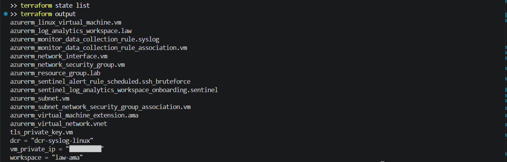
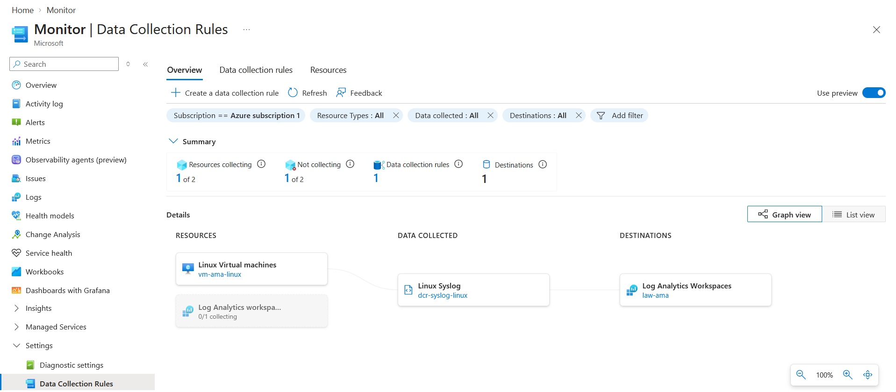
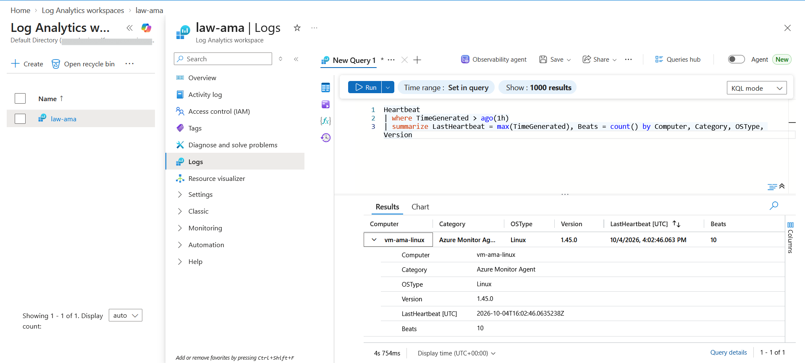
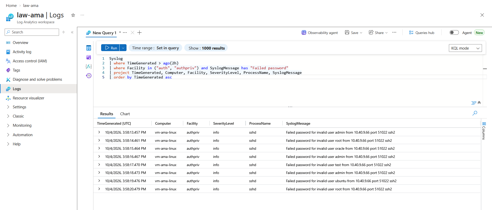
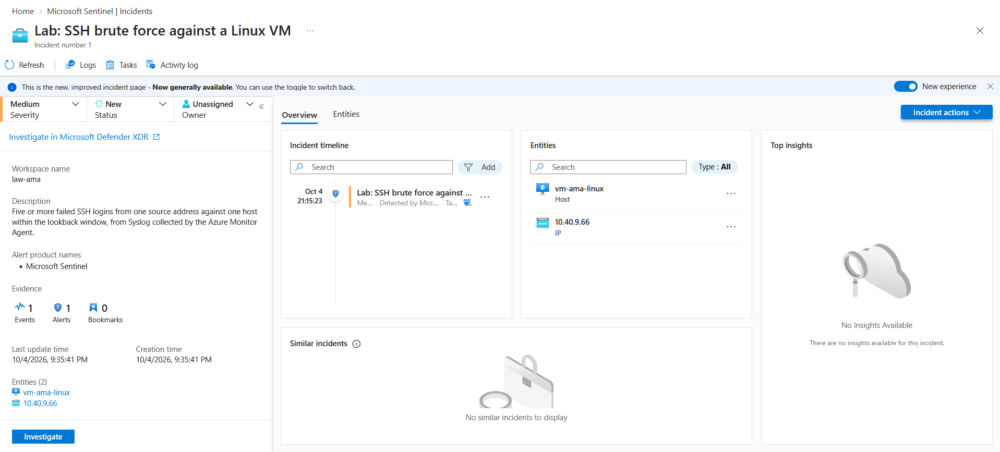

# Lab: Sentinel Data Collection with the Azure Monitor Agent (Syslog DCR and SSH Brute Force Detection)

> Platform logs like the Activity Log reach a workspace on their own. Logs from inside a machine
> do not: something has to run on the VM, read Syslog or the Windows event log, and ship it. That
> is the Azure Monitor Agent, and what it ships is decided by a Data Collection Rule. This lab
> builds a private Linux VM with the agent, a Syslog DCR that keeps authentication logs at every
> level but only system noise from Warning up, and a Sentinel rule that turns repeated failed SSH
> logins into an incident.

**Domain:** 4 (Security Posture and Monitoring)
**Services:** Azure Monitor Agent, Data Collection Rules, Microsoft Sentinel, Log Analytics, Linux Virtual Machines, Terraform
**Status:** Complete, evidenced, and torn down

---

## Objective

Collect security relevant logs from a VM with no public exposure, control what is ingested at
the source, prove the agent is reporting, and detect a brute force pattern in the collected data
with an analytics rule that produces an incident with host and IP entities.

## The problem (insecure default)

| Default | Why it is a problem |
|---|---|
| A new VM sends no guest logs anywhere | Failed logins, sudo use and service changes stay on the disk of the machine an attacker is on |
| The legacy Log Analytics agent (MMA/OMS) | Retired in 2024, configured per workspace, no per source filtering |
| Collect everything at every level | Debug and info noise from every facility drives ingestion cost with no security value |
| Filter too aggressively | Many authentication failures are logged at info level, so a Warning and above rule would drop the evidence |

## Lab environment

| Item | Value |
|---|---|
| Resource group | lab-az-ama (Central India) |
| VM | vm-ama-linux, Ubuntu 22.04, Standard_B2as_v2, private IP 10.40.1.4, no public IP, no inbound NSG rules |
| Agent | Azure Monitor Agent for Linux 1.45, authenticating with the VM's system assigned identity |
| DCR | dcr-syslog-linux, kind Linux, stream Microsoft-Syslog to law-ama |
| Workspace | law-ama, onboarded to Microsoft Sentinel |
| Analytics rule | Lab: SSH brute force against a Linux VM (scheduled, every 5 minutes, 15 minute lookback) |
| Built with | Terraform (azurerm 4.x) run from my PC, test through VM Run Command |

## What I built

| Component | Role here |
|---|---|
| `azurerm_linux_virtual_machine` with a system assigned identity | The monitored host, reachable only through the Azure control plane |
| `azurerm_virtual_machine_extension` AzureMonitorLinuxAgent | Installs AMA with automatic upgrade |
| `azurerm_monitor_data_collection_rule` | Two Syslog data sources with different facilities and minimum levels, one Log Analytics destination |
| `azurerm_monitor_data_collection_rule_association` | Binds the DCR to the VM; the agent pulls its configuration from this |
| `azurerm_sentinel_alert_rule_scheduled` | KQL over `Syslog` for five or more failed SSH passwords from one source against one host |

### Design decisions (the "why")

- **Two Syslog sources in one DCR.** `auth` and `authpriv` are collected at every level because
  sshd logs failed passwords at info. `syslog`, `user` and `daemon` are collected from Warning up.
  Filtering at the source is free; filtering after ingestion still costs the ingestion.
- **No public IP.** AMA only needs outbound HTTPS to Azure Monitor, so the VM has no inbound path
  at all. The test runs through Run Command, which goes through the Azure control plane.
- **Simulated attack, not a real one.** With no public endpoint there is nothing for a real
  attacker to hit, which is the point. The failed logins were written to the auth log with
  `logger` under the sshd tag, so they follow exactly the path a real sshd message would.
- **Detection built on extracted fields.** The rule parses the source IP and target user out of
  the message with `extract`, then summarizes per host and source. That gives clean Host and IP
  entities and a threshold that ignores a single mistyped password.
- **VM size as a variable.** Central India had no capacity for Standard_B2s at apply time. With
  the size in a variable, the apply was retried on Standard_B2as_v2 without editing the code, and
  the default was updated afterwards so the plan stays clean.

## Steps and output

```
$env:ARM_SUBSCRIPTION_ID = az account show --query id -o tsv
terraform init
terraform plan -out tfplan
terraform apply tfplan
# Error: SkuNotAvailable: Standard_B2s is currently not available in location 'CentralIndia'
terraform apply -var vm_size=Standard_B2as_v2
# Apply complete! (14 resources in state)
terraform plan -detailed-exitcode
# No changes. Your infrastructure matches the configuration.
```

**Finding: capacity, not quota.** The first apply created the network, workspace, Sentinel, DCR
and rule, then failed only on the VM with SkuNotAvailable. That is a regional capacity
restriction, which a quota increase does not fix. Everything else was already in state, so
the retry only had to create the VM, extension and association.

Confirming the agent picked up the rule, through Run Command:

```
systemctl is-active azuremonitoragent
# active
ls /etc/opt/microsoft/azuremonitoragent/config-cache/configchunks
# <one config chunk, the downloaded DCR>
```

The simulated attack, run at 15:58 UTC:

```
for u in admin root oracle admin test admin ubuntu root; do
  logger -p authpriv.info -t 'sshd[4242]' "Failed password for invalid user $u from 10.40.9.66 port 51022 ssh2"
  sleep 1
done
```

All eight messages reached the `Syslog` table within a minute or two as Facility `authpriv`,
SeverityLevel `info`, ProcessName `sshd`. The analytics rule on its next run summarized them to
one row (Computer `vm-ama-linux`, SourceIP `10.40.9.66`, eight attempts against five user
names) and created incident 1 at 16:05 UTC.

```
Syslog
| where Facility in ("auth", "authpriv")
| where SyslogMessage has "Failed password"
| extend SourceIP = extract(@"from (\d{1,3}\.\d{1,3}\.\d{1,3}\.\d{1,3})", 1, SyslogMessage)
| extend TargetUser = extract(@"for (invalid user )?(\S+) from", 2, SyslogMessage)
| summarize Attempts = count(), Users = make_set(TargetUser) by Computer, SourceIP
| where Attempts >= 5
```

**Finding: the incident did not appear in the Defender portal.** The workspace from the previous
lab had been connected to the unified Defender portal, but `law-ama` was a second workspace and
was not. The Defender portal incident queue only shows incidents from connected workspaces, so
the queue was empty while `SecurityIncident` in `law-ama` held incident 1. The incident was
worked from Microsoft Sentinel in the Azure portal instead, which showed the Host and IP entities
from the entity mapping, and it was resolved as Informational, expected activity, determination
Security testing.

## Evidence

*No sensitive identifiers appear in these images. The tenant domain and user names are masked.
The only IP addresses shown are private 10.x addresses. Resource names are retained as they are
not sensitive.*

**01. Terraform state listing every managed resource, and the outputs**


**02. The DCR graph in Azure Monitor: vm-ama-linux to Linux Syslog to law-ama**


**03. Heartbeat from the VM with category Azure Monitor Agent**


**04. The eight failed SSH logins in Syslog, authpriv at info level**


**05. The brute force incident in Sentinel (Azure portal) with the Host and IP entities**


## Configuration and identifiers (redacted)

The full build is in [`terraform/main.tf`](terraform/main.tf). State, plans and logs are excluded
by [`terraform/.gitignore`](terraform/.gitignore). The SSH key is generated by Terraform only so
password login can be disabled; it lives in state and is never output.

```hcl
resource "azurerm_monitor_data_collection_rule" "syslog" {
  name = "dcr-syslog-linux"
  kind = "Linux"

  destinations {
    log_analytics {
      name                  = "law-ama"
      workspace_resource_id = azurerm_log_analytics_workspace.law.id
    }
  }

  data_flow {
    streams      = ["Microsoft-Syslog"]
    destinations = ["law-ama"]
  }

  data_sources {
    syslog {
      name           = "auth-all-levels"
      facility_names = ["auth", "authpriv"]
      log_levels     = ["Debug", "Info", "Notice", "Warning", "Error", "Critical", "Alert", "Emergency"]
      streams        = ["Microsoft-Syslog"]
    }

    syslog {
      name           = "system-warning-up"
      facility_names = ["syslog", "user", "daemon"]
      log_levels     = ["Warning", "Error", "Critical", "Alert", "Emergency"]
      streams        = ["Microsoft-Syslog"]
    }
  }
}
```

## SC-500 concepts demonstrated

- **AMA versus the legacy agent.** The Log Analytics agent (MMA on Windows, OMS on Linux) was
  retired in August 2024. In the `Heartbeat` table AMA reports Category "Azure Monitor Agent",
  the legacy agent "Direct Agent". AMA uses managed identity and is configured by DCRs, not by
  workspace settings.
- **Data Collection Rules.** A DCR holds data sources, destinations and data flows. It is
  associated with machines (or with Azure Arc machines on premises), so one rule covers a fleet
  and one machine can have several rules.
- **Filtering and transformations.** Facility and minimum level filter at the source. A
  `transformKql` on the data flow filters or reshapes rows at ingestion time, for example to drop
  columns or mask values before they are stored.
- **Windows Security Events.** The Windows Security Events via AMA connector uses the same model
  with an event set (All, Common, Minimal or Custom XPath). Custom XPath is the cost control.
- **CEF and Syslog from appliances.** Firewalls and appliances that cannot run an agent send CEF
  or Syslog to a Linux log forwarder running AMA, which lands CEF in `CommonSecurityLog` and
  plain Syslog in `Syslog`.
- **Unified portal and multiple workspaces.** The Defender portal has one primary workspace and
  shows incidents only from workspaces connected to it under Settings, Microsoft Sentinel.
- **MITRE mapping.** Brute force is Credential Access, T1110. Tactics and techniques on a rule
  feed the MITRE coverage view in Sentinel.

## How I'd extend this

- Add a `transformKql` to the data flow that drops `user` facility rows from a noisy process,
  then compare ingestion in the `Usage` table before and after.
- Add a Windows Server VM with a second DCR using a custom XPath query for logon failures (4625)
  and new local admin group members (4732), and a matching rule.
- Turn the VM into a CEF forwarder and point a test sender at it, so `CommonSecurityLog` fills.
- Add an automation rule that runs a playbook to add the source IP to an NSG deny rule, and a
  watchlist of known scanner addresses to suppress.
- AI security angle: install AMA on a VM hosting a self hosted model endpoint and collect its
  application log through a custom text log DCR, then alert on prompt injection markers or
  sudden spikes in token usage per client.
- Use Azure Policy's built in initiative to deploy AMA and associate the DCR to every Linux VM
  in the subscription, instead of one association per VM.

## Cross links

- [Sentinel detection and response](../sentinel-detection-response/) used a platform log with no
  agent. This lab adds the agent based half of Sentinel data collection.
- [VM secure access](../../3-compute-and-ai-security/vm-secure-access/) removed public SSH with
  JIT and Bastion. This lab watches for the attack that control prevents.
- [Defender for Cloud](../defender-for-cloud/) covered workload protection plans. Its Defender for
  Servers plan protects the same kind of VM, and AMA here is the Sentinel side of that machine.

## Cleanup

```
terraform destroy
az group exists --name lab-az-ama
```

Destroy removes the DCR association, the DCR, the VM and its disk, the network, the Sentinel
rule and the workspace. Closed incidents are deleted with the workspace.

**Cost note:** the Standard_B2as_v2 VM and its disk are the only real cost, a few cents an hour.
Sentinel was in its free trial and the workspace ingested a few hundred rows. The lab ran for
under two hours, so the total was well under a dollar.
