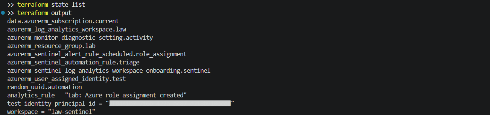
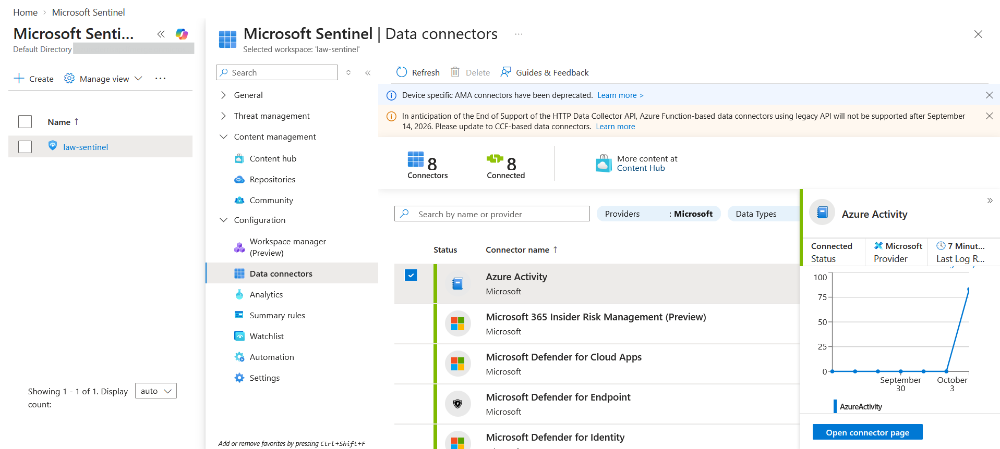
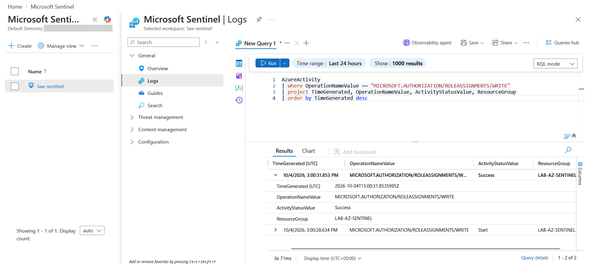
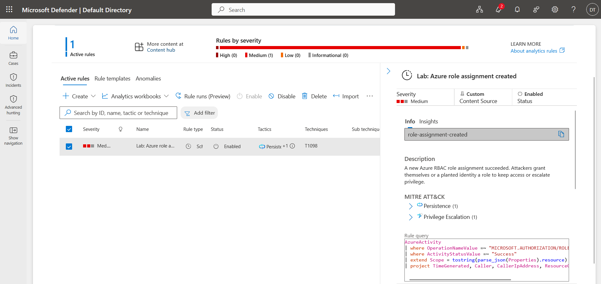
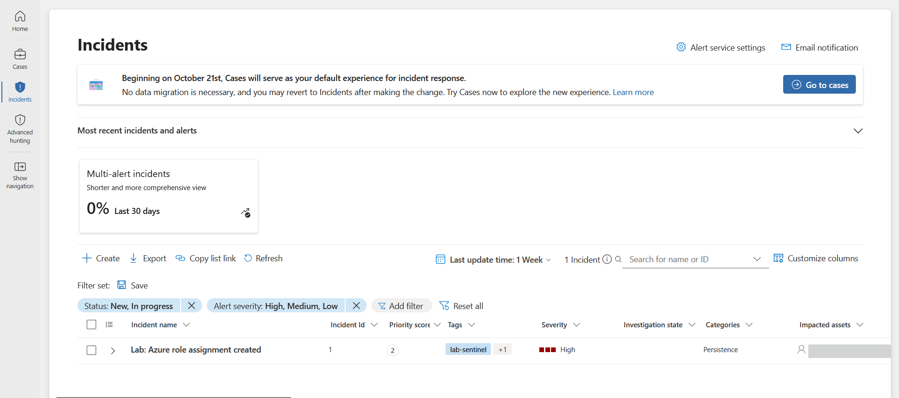
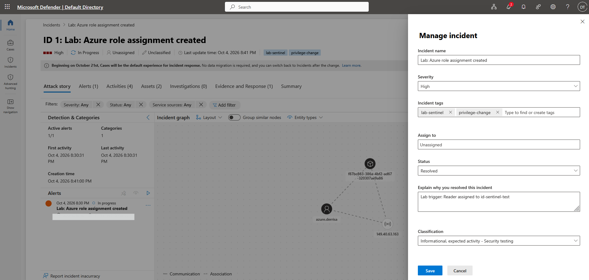

# Lab: Microsoft Sentinel Detection and Response (Activity Log, Scheduled Rule, Automation Rule)

> Defender for Cloud tells you when a resource is misconfigured or attacked. Microsoft Sentinel
> is the SIEM and SOAR layer that sits over every log source, runs your own detections and turns
> hits into incidents a SOC can work. This lab builds that pipeline with Terraform: a workspace
> onboarded to Sentinel, the subscription Activity Log streamed into it, a scheduled KQL rule that
> catches new Azure role assignments, and an automation rule that triages the resulting incident
> before an analyst ever opens it.

**Domain:** 4 (Security Posture and Monitoring)
**Services:** Microsoft Sentinel, Microsoft Defender portal, Log Analytics, Azure Monitor diagnostic settings, Azure RBAC, Terraform
**Status:** Complete, evidenced, and torn down

---

## Objective

Detect a privilege change in the subscription end to end and prove each link of the chain: the
log arrives, the detection logic matches it, the rule raises an alert, the alert becomes an
incident, automation changes that incident on creation, and an analyst investigates and closes it
with a classification.

## The problem (insecure default)

| Default | Why it is a problem |
|---|---|
| Activity Log kept only in the platform for 90 days | No correlation with other sources, no custom detection, no retention you control |
| No alerting on role assignments | An attacker with Owner or User Access Administrator can grant a planted identity access and nobody is told |
| Every alert lands at the severity the rule author chose | Analysts triage by hand, and high impact changes wait in the same queue as noise |
| Detections built by clicking in the portal | Nothing to review, version or redeploy into another workspace |

## Lab environment

| Item | Value |
|---|---|
| Resource group | lab-az-sentinel (Central India) |
| Workspace | law-sentinel, onboarded to Microsoft Sentinel and the Defender portal |
| Log source | Subscription Activity Log (Administrative, Security, Policy, Alert) through a diagnostic setting |
| Content Hub | Azure Activity solution, for the connector page and its content |
| Analytics rule | Lab: Azure role assignment created (scheduled, every 5 minutes, 15 minute lookback) |
| Automation rule | Lab: escalate role assignment incidents |
| Test principal | id-sentinel-test (user assigned managed identity) |
| Built with | Terraform (azurerm 4.x) run from my PC, investigation in the Defender portal |

## What I built

| Component | Role here |
|---|---|
| `azurerm_sentinel_log_analytics_workspace_onboarding` | Turns the workspace into a Sentinel workspace |
| `azurerm_monitor_diagnostic_setting` on the subscription | Streams the Activity Log into the `AzureActivity` table |
| `azurerm_sentinel_alert_rule_scheduled` | KQL detection for successful role assignment writes, with entity mapping, MITRE tactics and suppression |
| `azurerm_sentinel_automation_rule` | On incident creation from that rule only: raise severity to High, add tags, set status Active |
| `azurerm_user_assigned_identity` | A harmless principal to grant a role to, so the test is a real event and not a sample |

### Design decisions (the "why")

- **Diagnostic setting instead of a connector click.** The Azure Activity connector is a wrapper
  around a subscription diagnostic setting. Declaring that setting in Terraform makes the log
  source reviewable and repeatable, and the Content Hub solution is installed only for its
  connector page and content.
- **Role assignments as the detection.** Granting a role is how an attacker turns one foothold
  into lasting access (MITRE T1098, Account Manipulation). It is rare in a quiet subscription,
  so the rule has almost no noise, and the log row names who did it, from where, and on what.
- **Frequency 5 minutes, lookback 15.** The Activity Log can take several minutes to arrive. A
  lookback wider than the run interval catches late rows, and a one hour suppression stops the
  overlapping windows raising the same alert three times.
- **Automation rule, not a playbook.** Changing severity, tags and status needs no Logic App.
  Automation rules are free, run in order, and are the place to call a playbook when one is
  needed. Scoping the rule to this analytics rule's ID keeps it from touching other incidents.
- **A real trigger.** The incident comes from an actual role assignment made with the Azure CLI,
  not from a sample alert, so the whole path from log to incident is exercised.

## Steps and output

```
$env:ARM_SUBSCRIPTION_ID = az account show --query id -o tsv
az provider register -n Microsoft.SecurityInsights
terraform init
terraform plan -out tfplan
terraform apply tfplan
# Apply complete! Resources: 8 added, 0 changed, 0 destroyed.
terraform plan -detailed-exitcode
# No changes. Your infrastructure matches the configuration.
```

The Microsoft.SecurityInsights provider was not registered on the new subscription. The
configuration sets `resource_provider_registrations = "none"`, so it was registered once by hand
and the apply waited until it showed Registered.

**Finding: the workspace onboarded straight into the Defender portal.** New Sentinel workspaces
are connected to the unified Microsoft Defender portal. The data connectors page showed eight
connected connectors, not one, because the Microsoft Defender XDR connectors are attached
automatically, and the analytics rule and incident were worked from the Defender portal. The
Azure portal Sentinel blades still work for configuration.

**Finding: a quiet subscription produces no Activity Log rows.** Two hours after apply the
`AzureActivity` table was still empty because nothing had changed in the subscription. The
diagnostic setting only forwards new events, so the trigger below was also the first data.

The trigger, run at 15:00 UTC:

```
$rg  = az group show -n lab-az-sentinel --query id -o tsv
$mi = az identity show -g lab-az-sentinel -n id-sentinel-test --query principalId -o tsv
az role assignment create --assignee-object-id $mi --assignee-principal-type ServicePrincipal --role Reader --scope $rg
```

The event reached the workspace within minutes:

```
AzureActivity
| where OperationNameValue =~ "MICROSOFT.AUTHORIZATION/ROLEASSIGNMENTS/WRITE"
| project TimeGenerated, OperationNameValue, ActivityStatusValue, ResourceGroup
| order by TimeGenerated desc
# 15:00:31  MICROSOFT.AUTHORIZATION/ROLEASSIGNMENTS/WRITE  Success  LAB-AZ-SENTINEL
# 15:00:28  MICROSOFT.AUTHORIZATION/ROLEASSIGNMENTS/WRITE  Start    LAB-AZ-SENTINEL
```

The scheduled rule matched the Success row on its next run and raised a Medium alert. The
incident it created already showed **High**, the tags `lab-sentinel` and `privilege-change`, and
status Active, which is the automation rule acting at creation time. The impacted asset and
entities came from the entity mapping.

**Investigation.** The attack story graph joined the three mapped entities: the caller account,
the caller's IP address and the Azure resource of the role assignment. The incident was resolved
with the classification Informational, expected activity, determination Security testing, and
the comment "Lab trigger: Reader assigned to id-sentinel-test". The Defender portal shows the
Sentinel status Active as In progress, and its classification list replaces the Azure portal's
benign positive wording with Informational, expected activity.

## Evidence

*No sensitive identifiers appear in these images. The tenant domain, the test identity's object
ID, user names and public IP addresses are masked. Resource names are retained as they are not
sensitive.*

**01. Terraform state listing every managed resource, and the outputs**


**02. Azure Activity connector connected, with data received after the trigger**


**03. The role assignment write in AzureActivity, queried with KQL**


**04. The scheduled analytics rule in the Defender portal: custom, enabled, MITRE mapping and query**


**05. The incident after the automation rule: severity High and tagged**


**06. Attack story graph with the mapped entities, and the incident resolved as security testing**


## Configuration and identifiers (redacted)

The full build is in [`terraform/main.tf`](terraform/main.tf). State, plans and logs are excluded
by [`terraform/.gitignore`](terraform/.gitignore).

```hcl
resource "azurerm_sentinel_alert_rule_scheduled" "role_assignment" {
  display_name         = "Lab: Azure role assignment created"
  severity             = "Medium"
  tactics              = ["PrivilegeEscalation", "Persistence"]
  techniques           = ["T1098"]
  query_frequency      = "PT5M"
  query_period         = "PT15M"
  suppression_enabled  = true
  suppression_duration = "PT1H"

  entity_mapping {
    entity_type = "Account"
    field_mapping {
      identifier  = "FullName"
      column_name = "Caller"
    }
  }
}

resource "azurerm_sentinel_automation_rule" "triage" {
  triggers_on   = "Incidents"
  triggers_when = "Created"

  action_incident {
    order    = 1
    severity = "High"
    status   = "Active"
    labels   = ["privilege-change", "lab-sentinel"]
  }
}
```

## SC-500 concepts demonstrated

- **Analytics rule types.** Scheduled (KQL on a timer, used here), near real time (every minute,
  narrower query limits), Microsoft security (turns alerts from other Defender products into
  incidents), Fusion (multistage correlation) and anomaly (machine learning baselines).
- **Query frequency versus lookback.** The rule runs on the frequency and reads the lookback
  window. A lookback longer than the frequency tolerates ingestion delay, and suppression or
  alert grouping handles the overlap.
- **Entity mapping.** Mapping columns to Account, IP, Host or Azure resource entities is what
  drives the investigation graph, entity pages, UEBA and incident correlation.
- **Automation rules versus playbooks.** Automation rules triage incidents (assign, tag, change
  severity or status, close) and can run a playbook. Playbooks are Logic Apps with a Sentinel
  trigger and can call any API, which needs the Microsoft Sentinel Automation Contributor role on
  the resource group for Sentinel to run them.
- **Content Hub.** Connectors, analytics rule templates, workbooks, hunting queries and playbooks
  ship as Content Hub solutions. Installing a solution does not enable its rules.
- **Incident classification.** True positive, benign positive and false positive closures feed
  tuning. Benign positives are the reason to add exclusions or watchlists.
- **Unified SecOps.** Sentinel workspaces are managed from the Microsoft Defender portal, where
  Sentinel incidents and Defender XDR incidents share one queue.

## How I'd extend this

- Add a playbook that runs from the automation rule and removes the new role assignment, then
  posts the incident link to Teams, so containment does not wait for an analyst.
- Add a watchlist of approved automation principals and exclude it in the query, the usual way
  to cut benign positives from deployment pipelines.
- Add a near real time version of the rule for Owner and User Access Administrator only.
- Connect Defender for Cloud and build a Fusion style query that joins its alerts with role
  changes on the same resource, using the export work from the previous lab.
- AI security angle: stream Azure OpenAI or Foundry diagnostic logs into the same workspace and
  detect a key or deployment being created by an unexpected caller, or a jump in content filter
  blocks that suggests prompt injection attempts.
- Store the rule as ARM or YAML in a repository connected through Sentinel Repositories, so
  detections are deployed from source control into several workspaces.

## Cross links

- [Defender for Cloud](../defender-for-cloud/) produced the posture findings and alerts. This
  lab is the SIEM layer that correlates and acts on events like them.
- [PIM just in time admin](../../1-identity-access-governance/pim-jit-admin/) is the preventive control for the
  same risk. PIM makes privileged roles eligible instead of standing, and this rule catches any
  assignment made outside that process.
- [Function App security](../../3-compute-and-ai-security/function-app-security/) used managed
  identities as the safe default. Here a managed identity is the planted principal an attacker
  would grant access to.

## Cleanup

```
az role assignment delete --assignee $mi --role Reader --scope $rg
terraform destroy
az group exists --name lab-az-sentinel
az monitor diagnostic-settings subscription list --query "value[].name" -o tsv
```

Destroy removes the subscription diagnostic setting, the Sentinel rules and the resource group.
The role assignment is scoped to the resource group and goes with it, but deleting it first
avoids leaving an orphaned assignment if the destroy stops partway. Closed incidents are deleted with the workspace.

**Cost note:** a new Sentinel workspace has a 31 day free trial for up to 10 GB a day, and this
lab ingested a few hundred Activity Log rows. Analytics and automation rules are free. The total
was effectively nothing.
