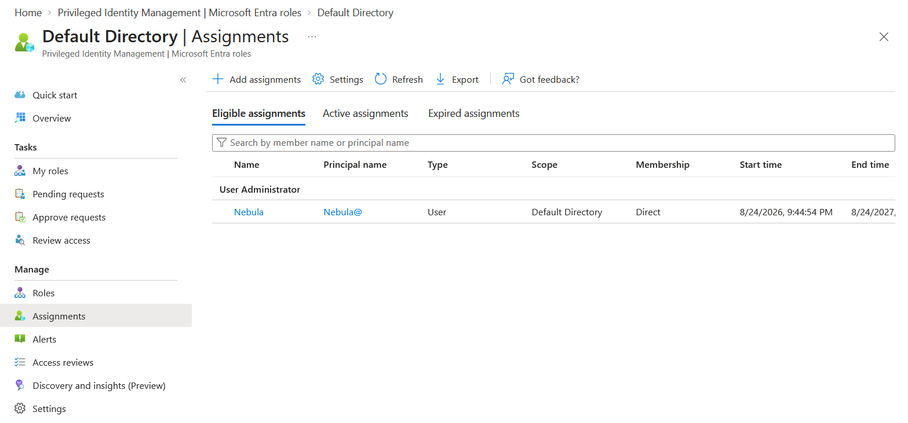
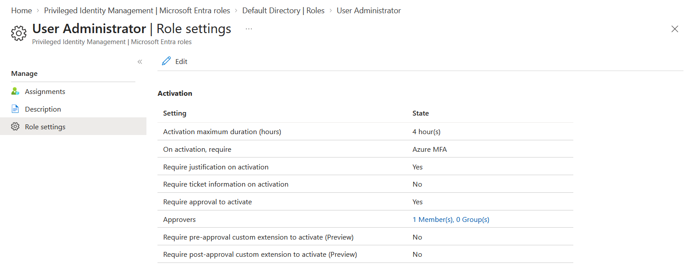
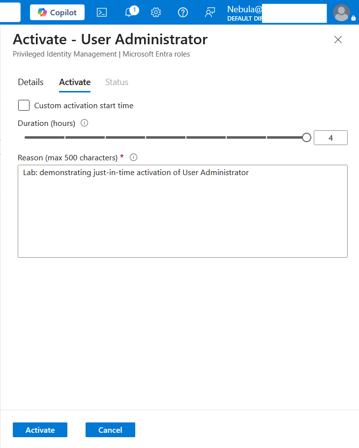
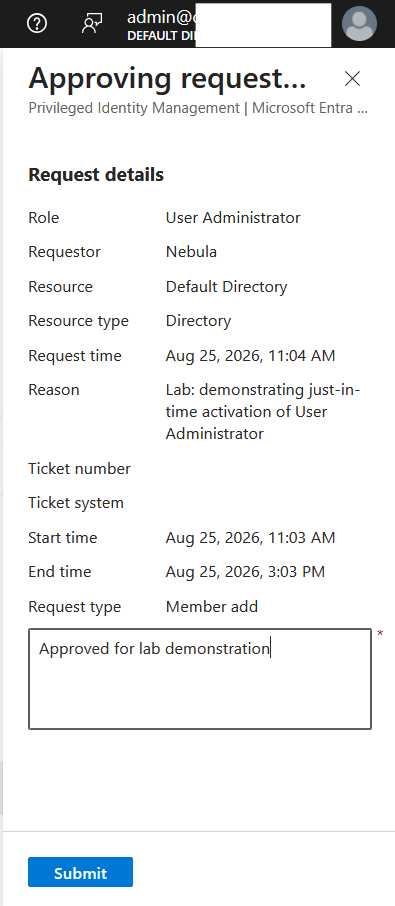

# Lab: Just-in-Time Admin with Privileged Identity Management (PIM)

> Remove standing administrative privilege by converting a permanent role assignment
> into an eligible, just-in-time assignment that must be activated with MFA,
> justification, and approval — then govern it with an access review.

**Domain:** SC-500 — Manage identity, access, and governance
**Services:** Microsoft Entra ID Governance — Privileged Identity Management (requires Entra ID P2)
**Status:** <e.g. Completed — role converted to eligible, activation tested, access review configured>

---

## Objective

Demonstrate the shift from *standing* privilege to *just-in-time* privilege. Instead of
holding an admin role permanently, the user holds it as **eligible** and must **activate**
it only when needed, for a limited time, subject to MFA, justification, and approval.

## The problem (insecure default)

A permanently assigned admin role is *standing privilege*: it is active 24/7, whether or
not the user is working. If the account is compromised at any hour, the attacker inherits
full administrative access immediately. Standing privilege maximises the attack surface
and the blast radius of a single compromised credential.

## Lab environment

| Account | Role | Part in this lab |
|---|---|---|
| Derrisa Tuscano | User Administrator | Converted to **eligible**; activates just-in-time |
| PDFMerge Administrator | Global Administrator | Manages PIM and **approves** activation requests |
| Groot / Rocket | Reader | Not used in this lab |

## What I built

Converted the User Administrator role for Derrisa from a permanent active assignment to a
time-bound eligible assignment, and configured an activation policy that enforces MFA,
justification, approval, and a short activation window.

| Setting | Value |
|---|---|
| Role | User Administrator |
| Assignment type | **Eligible** (was: Active / Permanent) |
| Eligibility duration | Time-bound: `<start>` – `<end>` (not permanent-eligible) |
| Require MFA on activation | Yes |
| Require justification | Yes |
| Require approval | Yes — approver: PDFMerge Administrator |
| Max activation duration | `<e.g. 2 hours>` |
| Notifications | On activation and approval |

### Design decisions (the "why")

- **Eligible, not active.** The role sits dormant until needed, so a compromised account
  does not automatically hold admin rights.
- **Time-bound eligibility.** The eligibility itself expires, so access does not linger
  indefinitely — access should be re-justified, not assumed.
- **Approval required.** A second person (the approver) gates activation, adding a control
  against a single compromised or rogue account.
- **Short activation window.** A 2-hour activation limits how long elevated rights exist
  even during legitimate use.

## Steps

1. Confirmed PIM is available (Entra ID P2) and that Derrisa has an MFA method registered.
2. Recorded the **before** state: Derrisa's User Administrator as Active / Permanent.
3. Added Derrisa as an **eligible** assignment for User Administrator (time-bound).
4. **Removed** the old permanent active assignment so no standing access remained.
5. Configured the role's **activation settings** (MFA, justification, approval, max duration).
6. Activated the role **just-in-time** as Derrisa, providing a justification.
7. **Approved** the activation request as PDFMerge Administrator.
8. Configured an **access review** for the role to periodically re-certify eligibility.

## Evidence

*No sensitive identifiers appear in these captures (lab personas; tenant/object IDs blurred).*

**Before — standing privilege (Active / Permanent)**

**After — converted to eligible (just-in-time)**

**Activation policy — MFA, justification, approval, max duration**

**Just-in-time activation with justification (as the eligible user)**

**Approval of the activation request (as the approver)**

**Access review configured for the role**

## Role policy definition (optional, redacted)

PIM activation rules are exportable via Microsoft Graph
(`roleManagementPolicy` / `roleManagementPolicyAssignment`). See
[`role-settings.json`](./role-settings.json) if included — tenant and object IDs
placeholdered.

## SC-500 concepts demonstrated

- **Eligible vs active assignments** — the core PIM distinction.
- **Just-in-time vs standing access** — activation replaces permanent rights.
- **Time-bound assignments** — eligibility and activation both expire.
- **Activation requirements** — MFA, justification, ticket info, and approval.
- **Approval workflow** — a second party gates elevation.
- **Access reviews** — periodic re-certification of who should stay eligible.
- **PIM scope** — this lab covers Entra roles; PIM also governs Azure resource roles
  and PIM for Groups.
- **Managing PIM** requires Global Administrator or Privileged Role Administrator.

## How I'd extend this

- Require a **ticket number** on activation for change traceability.
- Add PIM for an **Azure resource role** (e.g. a subscription Owner/Contributor) to show
  the resource-scope variant.
- Use **PIM for Groups** to make membership of a privileged group itself just-in-time.
- Pair with the Conditional Access lab: require **authentication strength** (phishing-
  resistant MFA) on privileged-role activation.

## Cleanup

PIM eligible assignments and role settings incur no direct cost (requires P2 licensing).
Assignments can be removed and the role returned to its prior state; no billable Azure
resources are created by this lab.
